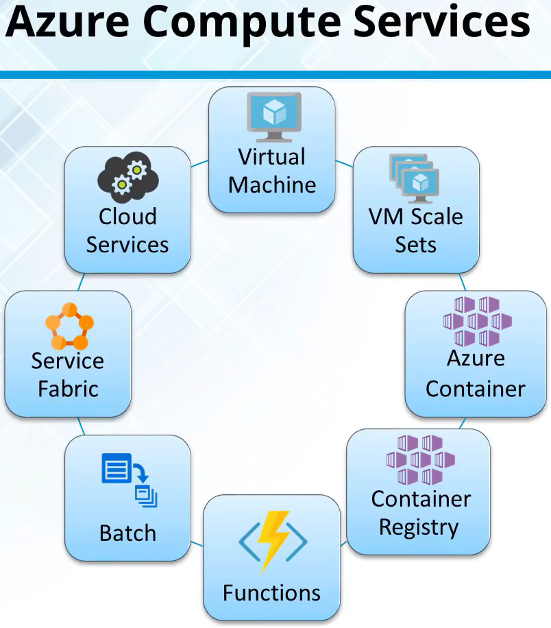
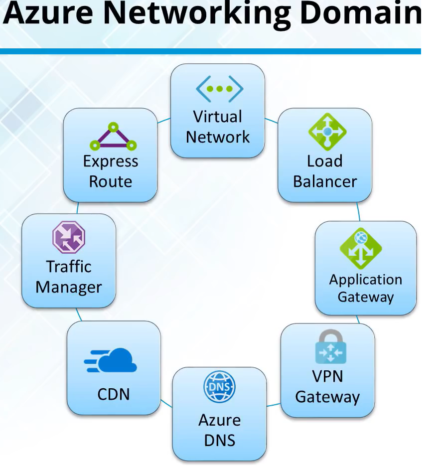
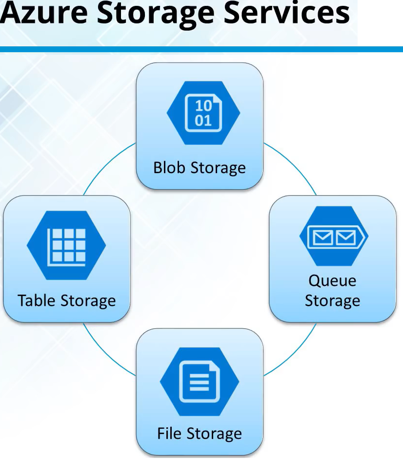
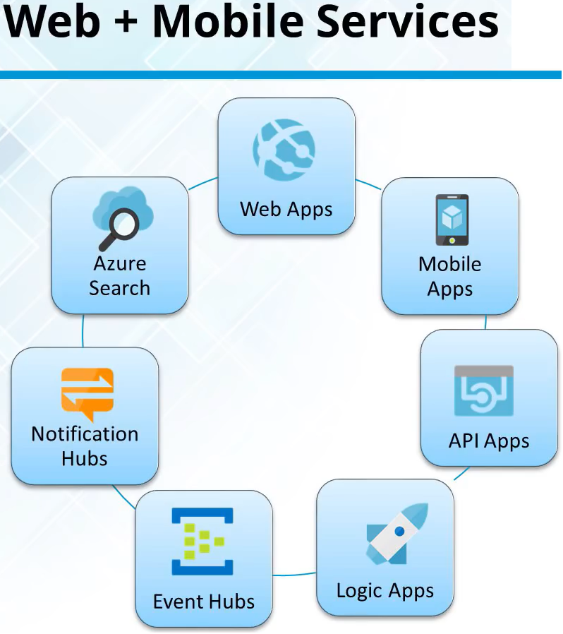

<link rel="stylesheet" href="_github-markdown.css">

# Azure
	includes Compute Services (container registry, functions, batch, servvice fabric, cloud services)
	includes Networking Services (virtual network, load balancer, application gateway, DNS, CDN, VPN Gateway)
	includes Storage Domain
	includes Web & Mobile Services

## Azure Container Registry
	Store and manage container images across all types of Azure deployments
## Functions #=serverless
	Lets you write code regardless of infrastructure and provisioning of servers,
	especially when your Functions call rate scales up
## Batch
	Scale to tens, hundreds or thousands of virtual machines
	Stage data and execute compute pipelines
## Service Fabric
	Simplify microservice-based app development and lifecycle management
	Deliver low-latency performance and efficiency at massive scale
## Cloud Services
	Focus on apps, not hardware
	Support for java, node, php, python, .net, ruby

# Azure Networking Services
	Impart scalability and security to enterprise apps using *Azure Networking* solutions
	Connect privately and securely to Cloud with *Azure ExpressRoute*
	Distribute user traffic to specific endpoints with *Azure Traffic Manager*
	Obtain unmatched availability and performance with *Azure Load Balancer*
	Tie on-premises infrastructure to Cloud with *VPN Gateway*
	

## Virtual Network
	Perform Network isolation and segmentation
	Filter and Route network traffic
## Load balancer
	Delivers high availability and network performance
	Load balance incoming internet traffic to virtual machines
	forward external traffic to a specific virtual machine
## Application Gateway
	a dedicated virtual appliance providing Application Delivery Controller (ADC) as a services
	comprised of multiple worker instances for scalability and high availability
## Azure DNS
	DNS is responsible for translating a website or service name to its IP address
	Aure DNS is a hosting service for DNS domains, providing name resolution using Azure infrastructure
## Content Delivery Network (CDN)
	CDN caches static web content at strategically placed locations to privde maximum throughput for delivering content
## VPN Gateway
	a type of virtual network gateway that sends encrypted traffic across a public connection
	use VPN gateways to send traffic between Azure virtual networks over the Microsoft network
## Traffic Manager
	Allows to control the distribution of user traffic for service endpoints, such as Azure VMs, Web Apps, and cloud services in different Data Centers
## Express Route
	Lets you extend your on-premise network into Azure over a dedicated private connection facilitated by a connectivity provider
	Establish connections to Microsoft cloud services, such as Azure, Office 365 and CRM online
	
# Azure Storage Domain
	types:
		1. blob storage (eg. VMs)
		2. files storage
		3. table storage
		4. queue storage
	with
		1. high durability
		2. high availability and
		3. high scalability
	massive scalable (terabytes-size)
	os elastic
	has auto-partitioning system that automatically load-balances your data based on traffic
	

## Blob Storage
	is a service that stores unstructured data as objects/blobs
	can store any type of text or binary
## Queue Storage
	cloud messaging between app components
	delivers asynhronous messaging
## File Storage
	offers file shares in the clould using the standard Server Message Block (SMB) Protocol
	legacy apps can use it without change
## Table Storage
	stores semi-structured NoSQL data, providing key/attribute store schemaless

# Web & Mobile Services

