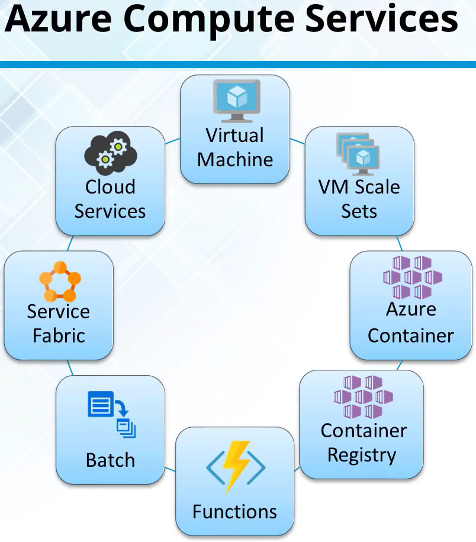
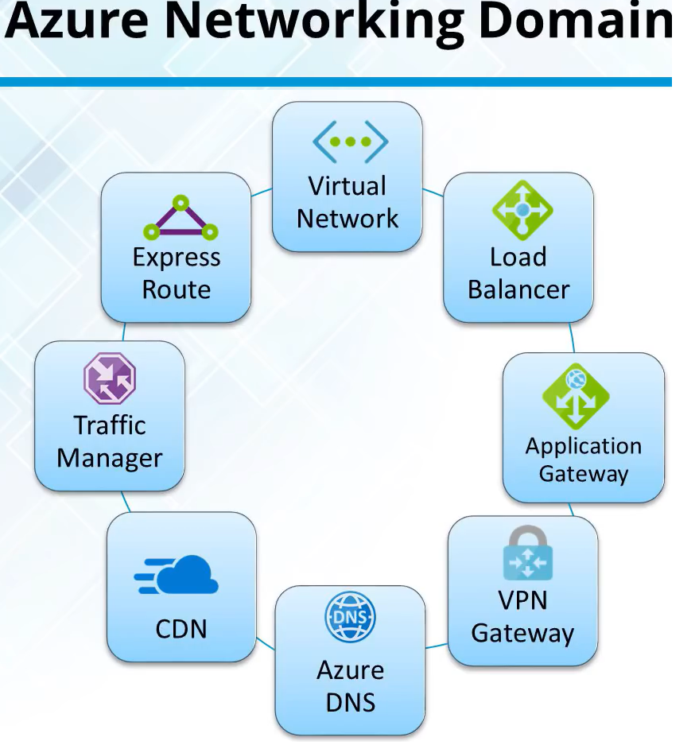
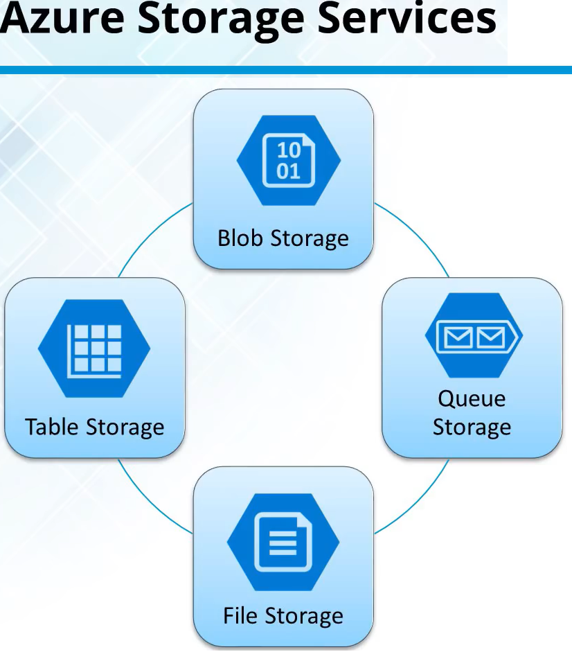
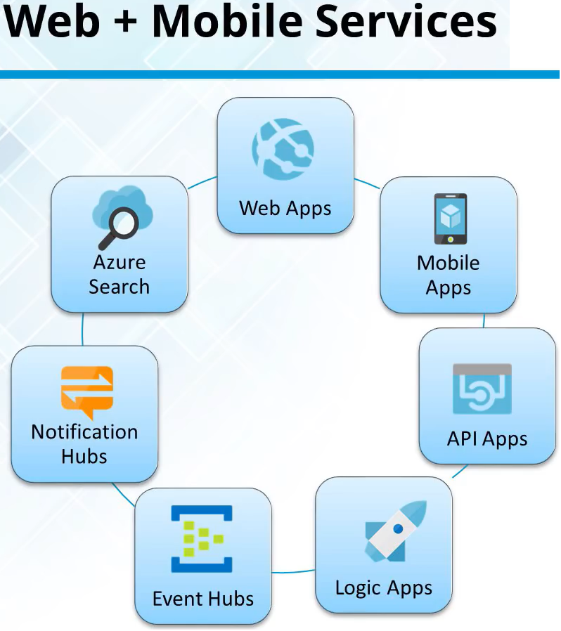
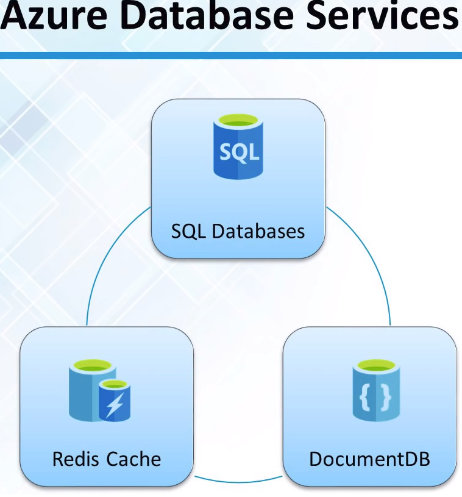
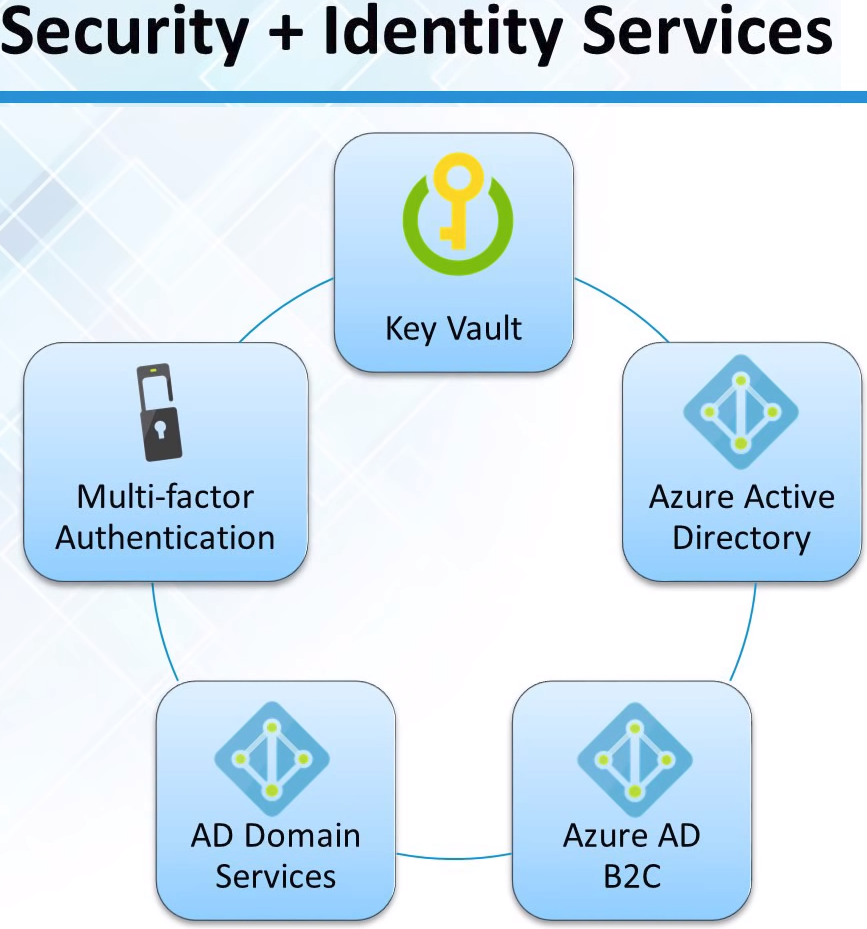

<link rel="stylesheet" href="_github-markdown.css">

# Azure
	includes Compute Services (container registry, functions, batch, servvice fabric, cloud services)
	includes Networking Services (virtual network, load balancer, application gateway, DNS, CDN, VPN Gateway)
	includes Storage Domain
	includes Web & Mobile Services
	Underlying technology: HyperV (AWS uses the Xen hypervisor)

## Azure Container Registry
	Store and manage container images across all types of Azure deployments
## Functions #=serverless
	Lets you write code regardless of infrastructure and provisioning of servers,
	especially when your Functions call rate scales up
## Batch
	Scale to tens, hundreds or thousands of virtual machines
	Stage data and execute compute pipelines
## Service Fabric
	Simplify microservice-based app development and lifecycle management
	Deliver low-latency performance and efficiency at massive scale
## Cloud Services
	Focus on apps, not hardware
	Support for java, node, php, python, .net, ruby

# Azure Networking Services
	Impart scalability and security to enterprise apps using *Azure Networking* solutions
	Connect privately and securely to Cloud with *Azure ExpressRoute*
	Distribute user traffic to specific endpoints with *Azure Traffic Manager*
	Obtain unmatched availability and performance with *Azure Load Balancer*
	Tie on-premises infrastructure to Cloud with *VPN Gateway*
	

## Virtual Network
	Perform Network isolation and segmentation
	Filter and Route network traffic
## Load balancer
	Delivers high availability and network performance
	Load balance incoming internet traffic to virtual machines
	forward external traffic to a specific virtual machine
## Application Gateway
	a dedicated virtual appliance providing Application Delivery Controller (ADC) as a services
	comprised of multiple worker instances for scalability and high availability
## Azure DNS
	DNS is responsible for translating a website or service name to its IP address
	Aure DNS is a hosting service for DNS domains, providing name resolution using Azure infrastructure
## Content Delivery Network (CDN)
	CDN caches static web content at strategically placed locations to privde maximum throughput for delivering content
## VPN Gateway
	a type of virtual network gateway that sends encrypted traffic across a public connection
	use VPN gateways to send traffic between Azure virtual networks over the Microsoft network
## Traffic Manager
	Allows to control the distribution of user traffic for service endpoints, such as Azure VMs, Web Apps, and cloud services in different Data Centers
## Express Route
	Lets you extend your on-premise network into Azure over a dedicated private connection facilitated by a connectivity provider
	Establish connections to Microsoft cloud services, such as Azure, Office 365 and CRM online
	
# Azure Storage Domain
	types:
		1. blob storage (eg. VMs)
		2. files storage
		3. table storage
		4. queue storage
	with
		1. high durability
		2. high availability and
		3. high scalability
	massive scalable (terabytes-size)
	os elastic
	has auto-partitioning system that automatically load-balances your data based on traffic
	

## Blob Storage
	is a service that stores unstructured data as objects/blobs
	can store any type of text or binary
## Queue Storage
	cloud messaging between app components
	delivers asynhronous messaging
## File Storage
	offers file shares in the clould using the standard Server Message Block (SMB) Protocol
	legacy apps can use it without change
## Table Storage
	stores semi-structured NoSQL data, providing key/attribute store schemaless

# Web & Mobile Services

## Web Apps
	build & host websites in the programming language of your choice without managing infrastructure
## Mobile Apps
	Mobile Apps in Azure App Service offer a highly scalable, globally available mobile app development platform for Enterprise developers and System Integrators
## API Apps
	API Apps in Azure App Service offer features that make it easier to develop, host and consume APIs in the cloud and on-premises
## Logic Apps
	Logic Apps provide a way to simplify and implement scalable integrations and workflows in the cloud
	it provides a visual designer to model and automate your process as a series of steps known as a workflow
## Notification Hubs
	provieds an easy-to-use, multi-platform, scaled-out push engine
## Event Hubs
	is a highly scalable data streaming platform capable of ingesting millions of events per second
	data sent to an event hub can be transformed and stored using any real-time analytics provider or batching/storage adapters
## Azure Search
	is a cloud search-as-a-service solution that delegates server and infrastructure management to MS
	leaves you with a ready-to-use service that you can populate with your data and then use to add search to your web or mobile app

# Aure Database Services

## SQL Database
	relational database service based on MS SQL Server engine
## DocumentDB
	fully managed NoSQL db service
## Redis Cache
	key-value store, can contain data structures, such as string, list, sets
	
# Enterprise Integration Services
	contain Service Bus and SQL Sesrver Stretch DB
	
## Service Bus
	is a reliable information delivery service with is a brokered, or third-party communication mechanism
	The Service Relay Service supports traditional one-way messaging, request/response messaging, and peer-to-peer messaging
## SQL Server Stretch DB
	Stretch Database migrates your cold data transparently and securely to the Azure Cloud.
	it targets transactional DBs with large amounts of cold data, typically stored in a small number of tables

# Security and Identity Services

## Multi-factor Authentication
	MFA, two-step verification
## Key Vault
	safeguards cryptographic keys and secrets and streamlines the key management process
## Active Directory
	is a multi-tenant directory and identity management service incl. multi-factor authentication, device registration
## AD Domain Services
	provides managed domain services such as domain join, group policy, LDAP, Kerberos/NTLM authentication
	is fully compatible with Windows Server Active Directory
## Azure AD B2C
	is a cloud identity management solution for consumer-facing web and mobile apps
	is highly available global service

# Monitoring and Management Services
	contains Azure Portal, Traffic Manager, ARM, Automation
## Azure Portal
	build, manage and monitor everything in a single unified console
	https://portal.azure.com/
		incl. VMs, Networks, Storage, SQL Servers, Resource Groups, App Services, SQL DBs, Traffic Maanger, ...
	Example Workflow:
		. open Portal
		. Choose App Services
		. Choose new Web App (you get a Virtual Machine and FTP address too)
		. upload your website resources via FTP
			That's it! The website is available.
		. Create a new Virtual Machine, choose an OS, choose disk type (HDD or SDD),
			credentials, assign it to a resource group,
			Choose a size(number of cores, IOPS, Disk-Size) (Basic is cheapest)
			Adjust Network
			Access it with RDP and public IP
			Size can be changed.
	Portal can open PowerShell Bash inside the browser, called Cloud Shell (like GCP)
	
## Traffic Manager
	.
## Azure Resource Manager, ARM
	enables you to repeatedly deploy your app and have confidence your resources are deployed in a consisten state.
	Manages and visualizes resources in your app
	Controls who in your organization can perform actions on the resources.
## Automation
	automates tasks using runbooks or automate configuration management using Desired State Configuration
	Further recherche keyword: OMS (Operations Management Suite, separate MS product)
# Pricing
	Pay only for what you use
		Pay as you go model
	Per Minute Billing
	You can choose reserved instances (=cheaper)
