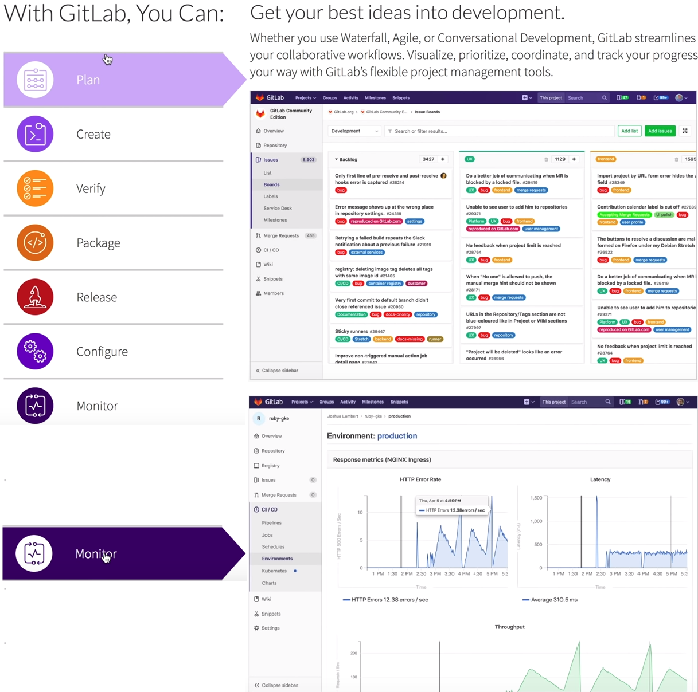

# GitLab
1. Remote Host for Git Repositories, like github & bitbucket
2. has boards with issues/features which
    1. can be tagged/labelled (similar to Scrum Board)
    2. status ('in progress') can be set
    3. assign to people
3. has repo browser
4. has (docker) container registry
5. CI/CD pipelines
6. can monitor (with Prometheus), incl performance metrics
7. strong support for DevOps, better: AutoDevOps
8. use standard git to commit into the gitlab repo
9. Operations -> Metrics & Environments & Kubernetes

## Pricing
1. Core: free
2. basic is cheap, to enterprise
    1. with extended featues, like disaster recovery
    2. kubernetes cluster monitoring
3. you can host your own GitLab!

## CI
CI pipeline in the browser! Starts right after commit.
There is also an automatically set up pipeline out-of-the-box available (incl static code analysis & security tests etc.) after merge-request executed into the master branch, different pipelines can bes started to deploy onto staging/production!
1. Click [New project]
2. type name
3. [new file] -> .gitlab-ci.yml to define the gitlab configuration build steps
```yaml
stages:
    - build
    - test
build:
    stage: build
    script:
        - echo "building..."
        - mkdir build
        - touch build/my.txt    # file will be thrown away if not in artifacts/paths!
    artifacts:
        paths:
            - build
test:
    stage: test
    script:
        - echo "test..."
        - test -f "build/my.txt"
```
4. [Commit] -> build Job will start automatically, showing the build steps (within a docker image)



