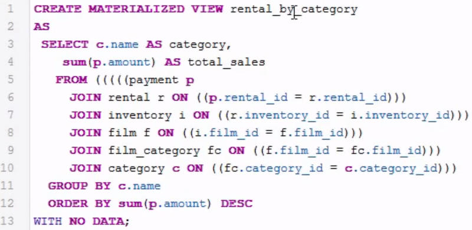
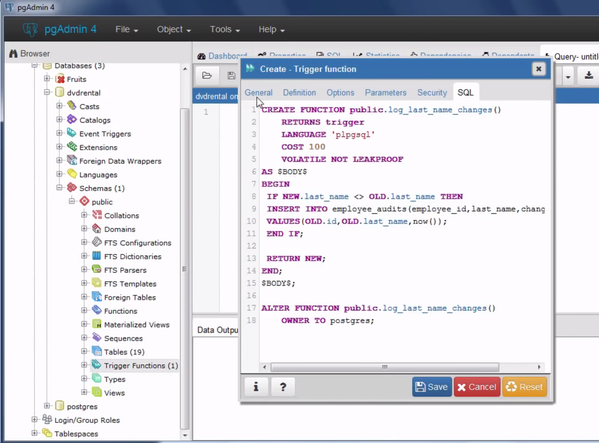
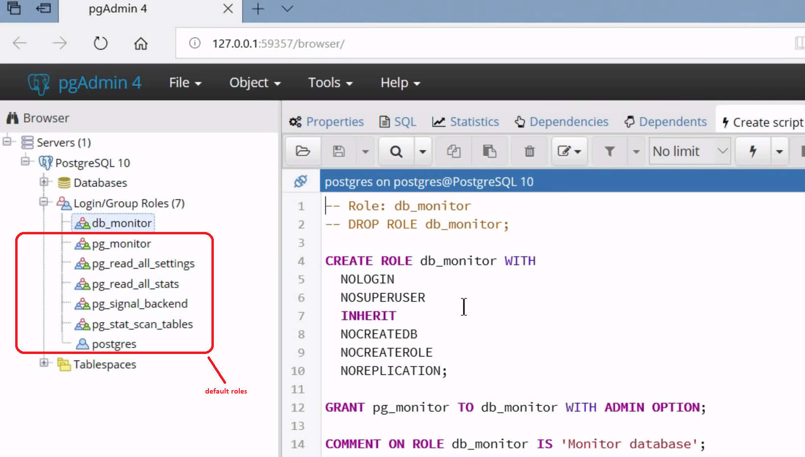
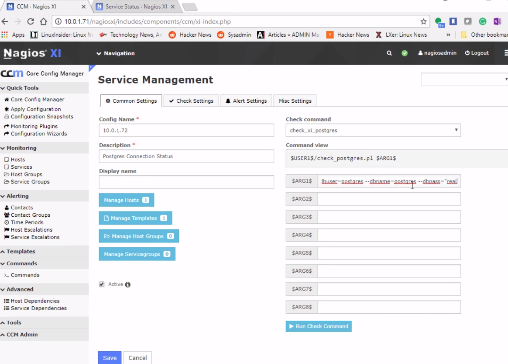

# PostgreSQL
connect to the server:
1. pgAdmin 4: http://localhost:56070/browser/ , lists Databases, Tablespaces, Login/Group Roles
2. CLI
    1. psql -U uname -h localhost
    2. pg_restore -U uname -d mydb c:\path\db.tar
3. ODBC or JDBC
4. Extras
    1. native json support
    2. native hash support & hash index resiliency
    3. extensions
    4. native table partitioning
    5. native full-text search for json & jsonb
    6. parallel query capabilities for indexes & outer joins
    7. updatable views (with large constraints)
    8. materialized views that allow you to to store result of a query physically and update the data periodically
    9. has Triggers, must be user-defined-function as action
        1. Row trigger: triggered on every changed row
        2. Statement trigger: triggered on every statement (works also on views)

CLI:
```sh
\l              # list dbs
\c mydb         # change into the db mytdb
\d              # lists tables
\d mytbl        # descript the table
\d+ mytbl       # descript the table with more details
\q              # quit
```
Basic SQL examples:
```sql
SELECT version();
CREATE DATABASE mydb;
CREATE TABLE mytbl(
    id serial PRIMARY KEY,      -- automatic numbering!!! (especially useful with TRIGGERs!)
    id INT PRIMARY KEY,
    uname VARCHAR (255) NOT NULL,
    price DECIMAL (11,2),
    group_id INT NOT NULL,
    FOREIGN KEY (group_id) REFERENCES groups(group_id)
);
SELECT distinct tbl.id, title FROM tbl INNER JOIN tbl2 ON tbl.id = tbl2.tbl_id ORDER BY title ASC;
-- uses an implicit JOIN clause (where columns with same name are joined, = NATURAL JOIN
SELECT * FROM tbl INNER JOIN tbl2 USING(customer_id); 

-- AVG aggregate function:
SELECT uname, to_char(AVG(amount), '9999D99') AS avg_amount FROM tbl INNER JOIN tbl2 ON tbl.id = tbl2.tbl_id GROUP BY tbl2.id HAVING AVG(amount) > 5 ORDER BY id;

-- materialized view is useable only after loading DATA
CREATE MATERIALIZED VIEW viewname AS query WITH [NO] DATA;
REFRESH MATERIALIZED VIEW [CONCURRENTLY] viewname; -- load data! (lock tble?: CONCURRENTLY)
CREATE UNIQUE INDEX r_cat ON viewname(cat); -- if you REFRESH with CONCURRENTLY , you have to have an INDEX!


```
#### Materialized View Example:


## Trigger:
Trigger Example (in pgAdmin 4):



```sql
-- UDF: user defined function: log_last_name_changes()
-- on the UI, subbranch of the tbl tree entry: [tablename]->Triggers 
BEGIN
    IF NEW.last_name <> OLD.last_name THEN
        INSERT INTO emp_audits(emp_id, last_name, changed_on)
        VALUES(OLD.id, OLD.last_name, now());
    END IF;
    RETURN NEW;
END;
-- use UDF when creating the TRIGGER:
CREATE TRIGGER last_name_changes
    BEFORE UPDATE
    ON emp
    FOR EACH ROW
    EXECUTE PROCEDURE log_last_name_changes()

-- changes on triggers: you change,delete,disable them:
ALTER TRIGGER last_name_changes ON employees RENAME TO log_last_name_changes;
ALTER TABLE tbl DISABLE TRIGGER triggername | ALL; -- 'ALL' removes all triggers
DROP TRIGGER [IF EXISTS] triggername ON tbl;
```
### Analytic/Window functions
they can return mulitple rows for each group
```sql
-- aggregate function returns a single value:
SELECT AVG(price) FROM products;
-- analytic/window function can return mulitple values (similar to GROUP BY)
SELECT uname, price, group_name, AVG(price) OVER (PARTITION BY group_name) FROM products INNER JOIN p_groups USING(group_id);
```
## Roles / Groups
Roles have privileges.
```sql
-- privilege = login or can-create-db
CREATE ROLE name [LOGIN|CREATEDB|CREATEROLE] [INHERIT|NOINHERIT];
CREATE ROLE uname SUPERUSER;                    -- this user can do everything
SELECT rname FROM pg_roles;
ALTER ROLE ...
GRANT rname TO uname;
GRANT rname TO rname;   -- role inheritance!
REVOKE rname FROM uname;
SET ROLE rname; -- use it to temporarily become the group role
RESET ROLE; -- restore the original privileges
DROP ROLE rname;
```


## Backup
Do backup/restore with
1. pg_dump (single db backup)
2. pg_dumpall (all db backup)
3. pgAdmin Web UI
4. psql (restores plain SQL script generated by pg_dum or pg_dumpall)
5. pg_restore (restores .tar)

> $ pg_dump -U uname -W -F t dbname > file.tar # W=prompt for pwd, F=output-format

```sql
CREATE DATABASE mydb2;  -- create a db you restore to
```
> $ pg_restore --dbname=mydb2 -U uname --verbose file.tar

## Tablespaces
1. A tablespace is a location on disk where data is stored.
2. tablespace maps a logical name to a physical location on disk
3. default tablespaces:
    1. pg_default (stores all user data)
    2. pg_global
4. common usage: place frequently used DBs onto an SSD, place archives to slower disks

```sql
CREATE TABLESPACE tsname OWNER uname LOCATION 'c:\path\path';
ALTER TABLESPACE tsname [RENAME|OWNER] TO new_name|newowner;
DROP TABLESPACE IF EXISTS tsname; -- only owner or superuser can delete (if no DBs are inside!)
```

## Setup on the CLI
```sh
postgresql-setup initdb
systemctl start postgresql
systemctl enable postgresql # autostart
psql -d template1 -c "ALTER USER postgres WITH PASSWORD 'mypwd';"
createdb newdb
psql newdb # swith to this DB
\l # lists DBs
\q # quit
firewall-cd --zone=public --add-port=5432/tcp --permanent   #open the PSQL port
firewall-cmd --reload
cd /var/lib/psql/data
# target: allow remote connection!
vi pg_hba.conf  # add new line:
    host    all     all     10.0.1.0/24     md5
vi postgresql.conf
    listen_addresses = '*'
systemctl restart postgresql
```
1. Monitor: use Nagios XI (has a Web UI to config your PSQL Server)
1. Settings: Navigation -> Configure -> Core -> Service -> Postgre Backend -> Edit
    
