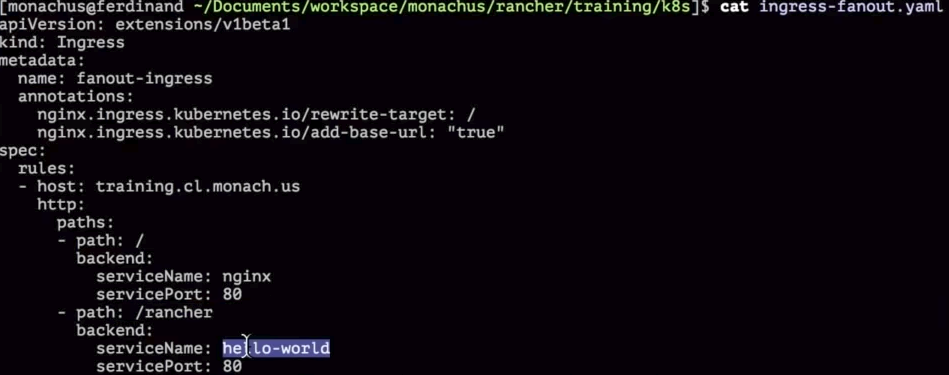

# Kubernetes & Rancher
https://rancher.com/docs/rancher/v2x/en/quick-start-guide


## k8s components
1. pods = consists one or more containers which are always scheduled together.
    1. each pod has unique IP address
    2. containers of a pod can speak to each other via localhost
    3. containers of a pod share network and storage
2. deployments = they create and update ReplicaSets, they allow to scale & rolling-update
3. services = they define a DNS entry (known only inside of the cluster) that can be used to refer to a group of pods. Types:
    1. NodePort = this type opens a port on every host in the cluster
    2. ClusterIP
    3. LoadBalancer; on AWS this type launces an ELB!
4. config map = allow storing of arbitrary config values & files; they are exposed in pods as env variables or local storage. Wtih config maps you decouple storage of configuration from pod spec. Config can be updated without pods/containers to be restarted.
5. ingress = defines how traffic outside the cluster is routed to inside the cluster. (internal implementation: often Nginx(the default ingress controller), HAProxy...). Routing can happen
    1. host-based
    2. path-based
6. replica set = defines the desired scale and state of a group of pods
    1. you have to configure the health and readiness checks!

#### Basic Pod Spec:


```sh
kubectl apply -f my.yaml && kubectl get pods    --> k8s restarts crashed containers automatically
kubectl expose deploy/nginx --type=NodePort     --> create a service and map containerPort(80) to a random port
```

#### ReplicaSet Pod Spec:


### Deployment YAML:


#### Ingress YAML:
(here: send traffic onto 'host' to the service nginx:80)


(here: path-based config to different services)



#### Config Maps


# Rancher
1. has RKE Addon (RKE = Rancher Kubernetes Engine), can launch & update k8s clusters
    1. RKE can install k8s
2. has RancherOS = very lightweight OS for running Docker Containers, very secure because everything in the OS runs as Docker Container
3. from version 2.2. supports multi-clusters with multi-cloud-providers
4. you can run RKE on RancherOS!
### Rancher Setup
can be single-node install or HA install
```sh
docker run -d --restart=unless-stopped -p 80:80 -p 443:443 -v /opt/rancher:/var/lib/rancher rancher/rancher:v2.1.5
docker logs --tail 10 -f {containername}
# rancher web UI is now running...
```
### Rancher Web UI
1. Menu: security, roles, pod security policies
    1. new clusters will inherit these settings.
    2. can set up users with access rights (->the Rancher Web UI is multi-tanent! = users don't see namespaces of the others)
2. Node Drivers: config cloud provider (gcp, aws. azure, etc.)
    1. AWS access can be set up, Rancher starts EC2's and installs RKE there
3. Menu: Catalogs: helm charts
4. [Add Cluster]
    1. [Add Namespace]
    2. [Deploy] (choose the docker image & a namespace) ->
        1. if AWS is chosen, EC2's will be launched
        2. [Launch], or
        3. [Update] //=does a rolling update

##### Rancher Web UI:


## CLI & Shell
1. Rancher also has CLI
2. Rancher also has Cloud-Shell (like GCP, in the browser)

#### Rancher Docu


### Rancher with Helm(tiller)
Docu: Installation -> HA -> Initialize Helm (intall tiller). Commands (as listed in the online docu):
```sh
kubectl -n kube-system create serviceaccount tiller
kubectl create clusterrolebinding tiller --clusterrole cluster-admin --serviceaccount=kube-system:tiller
helm init --service-account tiller
kubectl -n kube-system rollout status deploy/tiller-deploy
# now, helm just works!
```

### TODO's
1. TODO: metallb
2. TODO: F5
3. TODO: certmanager(=interfaces between the k8s-cluster and letsencrypt, triggered by Ingress-yaml annotation, certmanager automatically registers your keys with letsencrypt)
