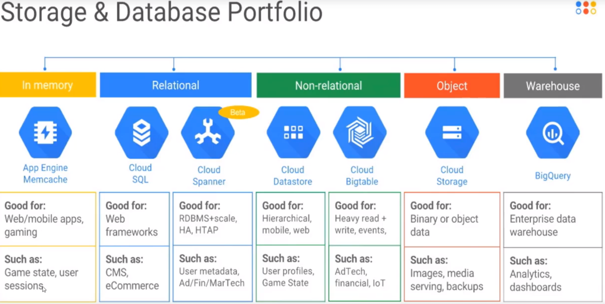
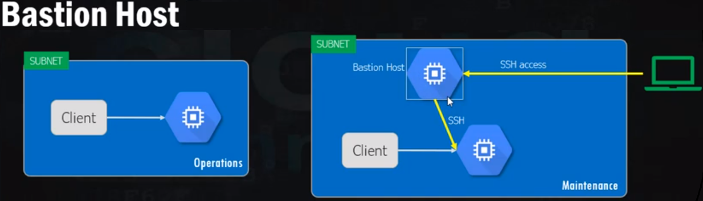
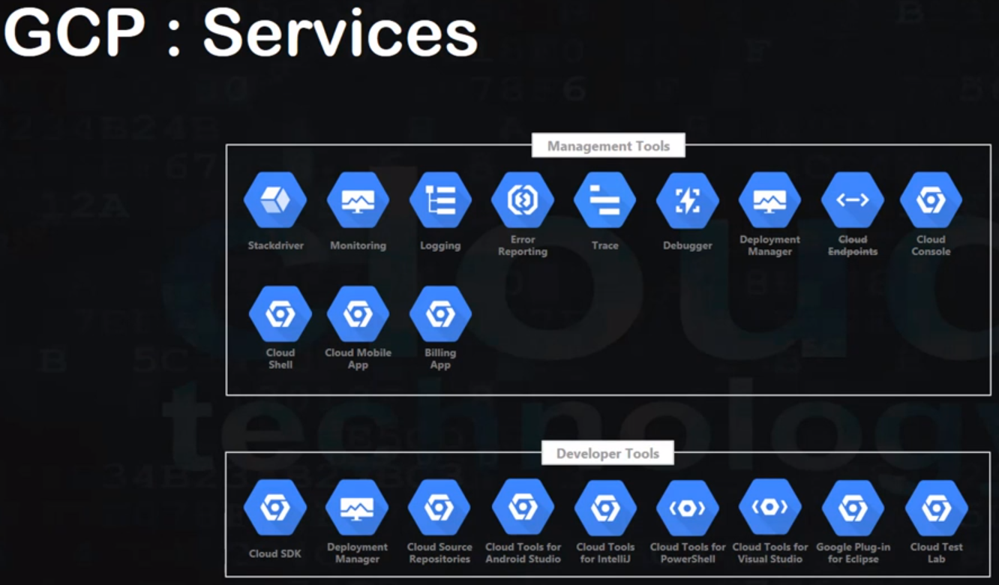
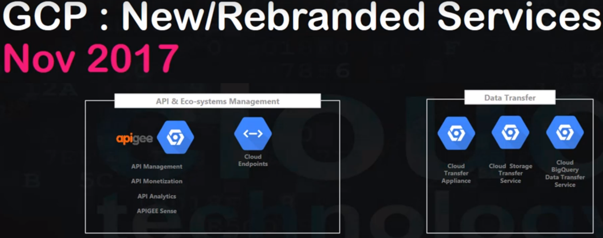
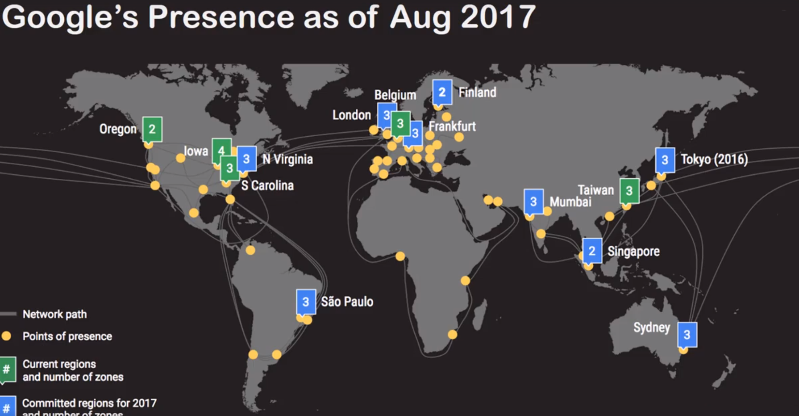

# Google Cloud Platform - GCP

1. Google Data Centers: they use renewable energy, are mostly in the northern (->cold!), security is built-in (in rest & when transferred)
2. Edge POP across the globe
3. CDN POP # content delivery network
4. Regions(Americas(4), Europe(3), Asia(3), Australia(1)) & Zones
5. Resources
    1. Global: networks
    2. Regional: static IP addresses
    3. Zonal: VMs, Disks
6. GCP project, has an ID
7. has a
    1. Console (=WebApp)
    2. CLI
    3. Client Libs

## Computing Service
can be PaaS or IaaS
1. GAE = App Engine, for web app, mobile & IoT backends, with built-in services for NoSQL, memcache, auth-API
2. GKE = Container Engine = orchestration system (-> k8s) for running containerized, Docker containers.
3. GCE = Compute Engine (IaaS) ~ VM in the Cloud
4. Cloud Function (Serverless) = will be spun up on-demand in response to events. Is event-based & event-driven.

## LoadBalancer, AutoScaling, HA
1. User -> Cloud-DNS -> Cloud Load-Balancer(LB) -> On of the (nearest) App Instances
2. LB balances based on nearest server & load & potential outage (=regional availability, based on healthchecks)

## GCP Console
1. Console shows dasboard, your projects, resources etc.
2. GCE -> VM-create -> specify name, Zone(eg asia-east1-a), CPU (and GPU), Memory(GB), Disk (& image), API-access, Firewall -> see estimated cost!
    1. can add labels
    2. external IP is assigned -> you can SSH (in the browser) ('sudo su' for root access)
    3. windows instances: set pwd -> access via RDP (web-based, chrome-extension); glcoud (Google Cloud SDK Shell) is installed

### Storage Service
1. Cloud Storage = Object Storage
2. Persistent Disk = a NAS = Block Storage (network attached storage) can be attached to VM(GCE or GKE), can **multi-reader** mounts & on-demand volume resizing
### Databases
1. Cloud SQL, RDBMS (MySQL, PostgreSQL)
2. Cloud Spanner, RDBMS (for large data amount), can scale horizontally
3. Cloud DataStore, NoSQL, DocumentDB (like Mongo)
4. Cloud BigTable, NoSQL, Column DB, horizontable petabyte scalable
### Database Services
1. Cloud Storage for Firebase
2. Firebase Realtime DB
3. BigQuery - for Data Warehouse



## Networking
1. VPC: virtual networking (incl Firewall & subnets & routes), works across regions & zones!
2. CDN (cache at edge locations) in front of GCE apps
3. Cloud Interconnect: connect on-premise datacenters to GCP
4. DNS, is programmable

### Bastion Host
1. On VM-1, delete the network tag & remove firewall checkbox & delete external IP address.
2. On VM-2: SSH into it -> SSH into the hostname of VM-1



## GCP Management Tools
1. Deployment Manager
2. Cloud Endpoints
3. Console, Dashboard, Billing
4. **StackDriver**: Monitoring, Logging, Tace(->latency reporting), Error-Reporting (some of the functions also work with AWS -> usable in multi-cloud-environments)
    1. works with agents installed on clients
5. Cloud Shell(=SSH-in-Browser)
    1. has 5 GB persistent storage
    2. terminates when your session expires
    3. bash, sh, emacs, vim, nano, gradle, make, maven, npm, nvm, php, git, mercurial, docker, ipython, mysql-client, gRPC preinstalled!
    4. GAE SDK, Google Cloud SDK, gsutil for Cloud Storage preinstalled
    5. debian system utils preinstalled
    6. java, go, python, nodeJS(use nvm to switch versions), ruby, php, .net preinstalled
    7. not all ports are open (20, 80, 443, 8080, among others are open)

```bash
gcloud init # setup your account
gcloud spanner instances list
gsutil
```

6. Cloud Mobile App (iOS, Android)
    1. can alerts
    2. has dashboard, incl. billing
    3. view health
7. Development Tools
    1. Clould SDK & CLI
        1. can run in local service emulator
        2. available for several prog. langs.
        3. gcloud to access GCP APIs
        4. gsutil for Cloud Storage buckets & objects
        5. Powershell cmdlets
        6. bq for BigQuery
        7. kubectl for k8s
    2. Deployment Manager
    3. Cloud Source Repositories:
        1. Multiple private repos possible.
        2. integrated with Cloud Diagnostic (-> so you can debug with StackDriver)
        3. github or bitbucket or google-hosted(private)
    4. Development Studios (Android, IntelliJ, Eclipse, Powershell) plugins
    5. Plugins (Maven, Gradle)
    6. Tools für Visual Studio
    7. Firebase Test lab for Android

## Big Data Solutions
1. Google BigQuery - petabyte scale Data Warehouse. Is HA & fully-managed & serverless. Uses SQL.
    1. has security & permissions
2. Google Cloud Dataflow / Apache Beam ==> for Stream/Batch Processing, ETL
    1. has horizontal auto-scaling
    2. use Apache Beam SDK with windowing support
    3. input (ingest) can be: pub/sub, datastore, avro, kafka
    4. output can be: bigquery, machine-learning, bigtable
3. Google Cloud Dataproc = Hadoop & Spark Clusters
    1. incl. automatic cluster management
    2. cluster is resizable
    3. StackDriver log/monitoring can access the cluster
4. Google Cloud Datalab = jupyter notebook based analysis & visualization of BigQuery data
    1. languages: js, python, SQL
    2. can access Google-Cloud-Machine-Learning
5. Google Cloud Pub/Sub, is serverless real-time messaging service
    1. with at-least-one delivery & exactly-once processing
    2. input: app, (smartphone-)devices, databases
6. Google Cloud Genomics

## Machine Learning
Accessible via **REST APIs** or through the Web UI.
The services are integrated with other GCP services (e.g. Dataproc, Datastorage)
1. Cloud Machine Learning (eg. for image classification)
    1. based on TensorFlow
    2. uses ipython notebook
    3. models are portable & downloadable
2. Cloud Video Intelligence API
    1. extracts metadata from vids & identifies entities
3. Cloud Vision API = image classification, is pretrained, can detect text, faces
4. Cloud Speech Recognition API = Speech to Text, knows >100 languages
    1. is context-aware
    2. with meachine learning
    3. is real-time
    4. can stream
5. Cloud Natural Language API; for text classification, recognizes infos/entities from text, incl sentiment analysis; for several languages
6. Cloud Translation API; incl language detection; knows >100 languages
    1. adjustable quota
7. Cloud Job Discovery

## Services Overview:




## Datacenters:
(connected with own fiber optic network)


