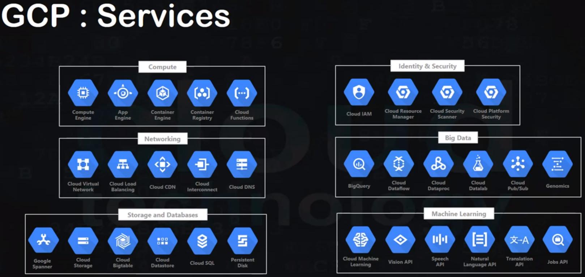

# Google Cloud Platform - GCP

1. Google Data Centers: they use renewable energy, are mostly in the northern (->cold!), security is built-in (in rest & when transferred)
2. Edge POP across the globe
3. CDN POP # content delivery network
4. Regions(Americas(4), Europe(3), Asia(3), Australia(1)) & Zones
5. Resources
    1. Global: networks
    2. Regional: static IP addresses
    3. Zonal: VMs, Disks
6. GCP project, has an ID
7. has a
    1. Console (=WebApp)
    2. CLI
    3. Client Libs

## Computing Service
can be PaaS or IaaS
1. GAE = App Engine, for web app, mobile & IoT backends, with built-in services for NoSQL, memcache, auth-API
2. GKE = Container Engine = orchestration system (-> k8s) for running containerized, Docker containers.
3. GCE = Compute Engine (IaaS) ~ VM in the Cloud
4. Cloud Function (Serverless) = will be spun up on-demand in response to events. Is event-based & event-driven.

## LoadBalancer, AutoScaling, HA
1. User -> Cloud-DNS -> Cloud Load-Balancer(LB) -> On of the (nearest) App Instances
2. LB balances based on nearest server & load & potential outage (=regional availability, based on healthchecks)

## GCP Console
1. Console shows dasboard, your projects, resources etc.
2. GCE -> VM-create -> specify name, Zone(eg asia-east1-a), CPU (and GPU), Memory(GB), Disk (& image), API-access, Firewall -> see estimated cost!
    1. can add labels
    2. external IP is assigned -> you can SSH (in the browser) ('sudo su' for root access)
    3. windows instances: set pwd -> access via RDP (web-based, chrome-extension); glcoud (Google Cloud SDK Shell) is installed

### Storage Service
1. Cloud Storage = Object Storage
2. Persistent Disk = a NAS = Block Storage (network attached storage) can be attached to VM(GCE or GKE), can **multi-reader** mounts & on-demand volume resizing
### Databases
1. Cloud SQL, RDBMS (MySQL, PostgreSQL)
2. Cloud Spanner, RDBMS (for large data amount), can scale horizontally
3. Cloud DataStore, NoSQL, DocumentDB (like Mongo)
4. Cloud BigTable, NoSQL, Column DB, horizontable petabyte scalable
### Database Services
1. Cloud Storage for Firebase
2. Firebase Realtime DB
3. BigQuery - for Data Warehouse

## Networking
1. VPC: virtual networking (incl Firewall & subnets & routes), works across regions & zones!
2. CDN (cache at edge locations) in front of GCE apps
3. Cloud Interconnect: connect on-premise datacenters to GCP
4. DNS, is programmable

### Bastion Host
1. On VM-1, delete the network tag & remove firewall checkbox & delete external IP address.
2. On VM-2: SSH into it -> SSH into the hostname of VM-1

## GCP Management Tools
1. Deployment Manager
2. Cloud Endpoints
3. Console, Shell
4. **StackDriver**: Monitoring, Logging, Tace(->latency reporting), Error-Reporting (some of the functions also work with AWS)

## Services Overview:

## Datacenters:

