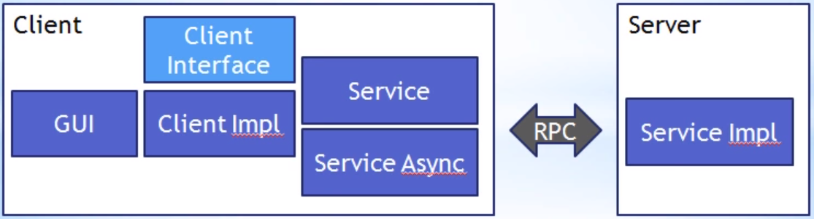

# SmartGWT
is a widget lib for GWT
1. based on GWT = Google Web Toolkit, in Java, for AJAX, compiles to HTML&JS&CSS
2. http://code.google.com/p/smartgwt/ showcases (incl Code!):
    1. https://www.smartclient.com/smartgwtee/showcase/
    2. https://www.smartclient.com/smartclient/showcase/
3. has offline-storage functions
4. SmartGWT starts supporting Selenium from version 2.2. and provides some user extensions for Selenium
5. Don’t mix classic GWT with SmartGWT. It’s just not always really compatible
6. server-side data binding code example (spanish): 
    1. http://jumanor.blogspot.com/2010/12/primeros-pasos-con-smartgwt.html
    2. http://jumanor.blogspot.com/2010/11/primeros-pasos-con-gwt-designer.html
    3. http://monicabubna.blogspot.com/2011/07/file-download-in-smartgwt.html
7. works with the GWT UI Designer (WYSIWYG Eclipse Plugin)
## Setup
### Dependencies:
1. smartgwt.jar
2. smartgwt.skins.jar
### Configuration/Styling options
1. WEB-INF/web.xml  # filters, servlets, welcome-file...
2. myapp.css
2. myapp.html
    1. eg. you can set &lt;script&gt;var isomporphicDir = "myapp/sc/";&lt;/script&gt;
    2. references CSS & compiled JS (from your java code)
### myapp.gwt.xml = GWT Config
```xml
<module rename-to='myapp'>
    <entry-point ... />
    <source path... />
    ...
    <inherits name="com.smartgwt.SmartGwt" />
```
### myapp.java
```java
public class MyApp implements EntryPoint {
    private DynamicForm mainForm; //com.smartgwt.client.widgets.form.DynamicForm
    private TextItem textItem;
    private IButton button;
    public void onModuleLoad() {
        mainForm = new DynamicForm();
        textItem = new Textitem("Name");
        button = new IButton("Click");
        button.addClickHandler(new ClickHandler() {
            @Override
            public void onClick(ClickEvent e) {
                SC.say("Hi "+textItem.getValue());
            }
        });
        mainForm.setFields(textItem/*,textItem2,textItem3*/);
        RootPanel.get().add(mainForm);
        RootPanel.get().add(button);
    }
}
```
# SmartClient
1. has smartClientSDK
2. huge web widget lib, bringing desktop-accessibility into the web
3. responsive / mobile-compliant
4. write in JS (SmartGWT is for Java)
5. server component accesses DB
6. client component = widgets
# GWT
## Custom (Composite) Widgets
Organize parts of the website with hierarchical composites of composites:
```java
public class My extends Composite implements ClickHandler {
    private VerticalPanel vP = new VerticalPanel();
    private MainView mainView;
    public My(MainView mainView) {
        initWidget(this.vP);
        this.mainView = mainView; //so you can communicate with parent-composite or MainView
        vP.add(new Image("my.png"));
        Button b = new Button("open my page 1");
        b.addClickHandler(this);
        vP.add(b);
    }
    public void openPage1() {
        this.vP.clear();
        this.vP.add(new MyPage1());
    }
    @Override
    public void onClick(ClickEvent e) {  //do this on button click
        this.openPage1();
    }
}
```
## RPC
is async by default



1. GUI: accesses client (through business specific interfaces & implementations)
2. client
```java
//my.client.service.IMyService extends RemoteService
@RemoteServiceRelativePath("myservice") //->see web.xml + EndPoint
public interface IMyService extends RemoteService {
    String myfunc(String s);
    MyData getData();
    //alternative the DataEvent based communication
}
//my.client.service.IMyServiceAsync extends RemoteService
public interface IMyServiceAsync {
    void myfunc(String s, AsyncCallback callback);
    void getData(AsyncCallback callback);
    //alternative the DataEvent based communication
}
public class MyService implements IMyServiceInt {
    private MyServiceAsync service;
    public MyService(String url) {
        this.service = GWT.create(IMyService.class);
        ServiceDefTarget endpoint = (ServiceDefTarget)this.service;
        endpoint.setServiceEntryPoint(url);
    }
    @Override
    String myfunc(String s) {
        //server is called async, get return val in callback
        this.service.myfunc(s, new MyCallback());
    }
    @Override
    void getData() {
        this.service.getData(new MyCallback());
    }
    private class MyCallback implements AsyncCallback {
        @Override
        public void onFailure(Throwable t) { }
        @Override
        public void onSuccess(Object r) {   //update GUI with response 'r'
            if(r instanceof String)
                this.myGui.updateLabel(r);
            else if(r instanceof MyData)
                this.myGui.openDataPage((MyData)r);
            else if(r instanceof DataEvent)//event contains data
                this.myGui.handleEvent((DataEvent)r);
        }
    }
}
```
3. Server
```java
//my.server.service.MyService extends RemoteServiceServlet
public class MyService extends RemoteServiceServlet implements my.client.IMyService {
    @Override
    String myfunc(String s) { return "myreturnval "+s; }
    @Override
    public MyData getData() { return new MyData(); }
    //alternative the DataEvent based communication
}
```
4. web.xml
```xml
<servlet>
    <servlet-name>myServlet</servlet-name>
    <servlet-class>my.server.MyService</servlet-class>
</servlet>
<servlet-mapping>
    <servlet-name>myServlet</servlet-name>
    <url-pattern>/myproject/myservice</url-pattern><!-- @RemoteServiceRelativePath + EndPoint-->
</servlet-mapping>
```
5. EntryPoint
```java
public class MyApp implements EntryPoint {
    public void onModuleLoad() {
        IMyService mySErvice = new MyServiceImpl(GWT.getModuleBaseURL() + "myservice");
        RootPanel.get().add(new MainView(mySErvice));
    }
```
6. Model: my.client.model.MyData , a simple POJO, has to be **Serializable**
7. Event: my.client.events.DataEvent has to be **Serializable** ,
    use subclasses in the Remote calls containing the (My)Data (not (My)Data directly) , such as
    1. DataRetrievedEvent
    2. DataUpdatedEvent
