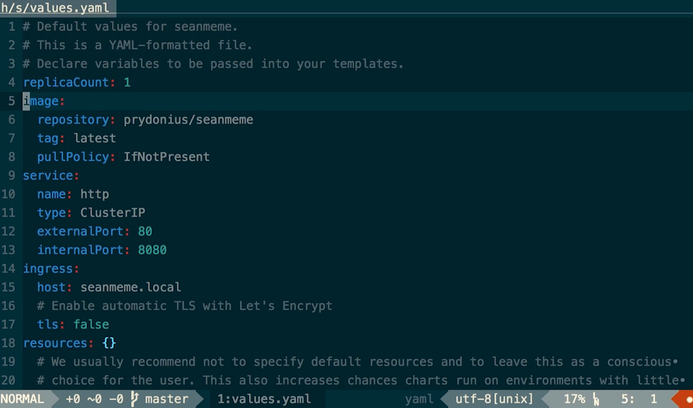

# Helm
Standard CI/CD workflow: git ->[clone]-> jenkins ->[build&test&push]-> kubernetes
### Problem of standard CI/CD workflow:
	1. your kubernetes YML references an old docker image ... how to update it?
		poor man's solution:
		 $ sed -i.bak 'me/myapp:v1.0#${imageTag}#' deployment.yaml
	2. maybe you need to run other tasks before the deployment
		e.g. db migration

	Solution: Helm:
		manages manifest files, tweaks environment variables, manages lifecycle hooks
## Chart
	Chart = package = app definition, consits of metadata, definition, config and docu
	Chart lives in chart repository = a directory containing:
```sh
	Chart.yaml
	README.md
	templates/
		NOTES.txt
		_helpers.tpl
		deployment.yaml
		service.yaml
	values.yaml
	.helmignore
```
### Example values.yaml:


### setup:
	$ helm-init.sh
	helm ->gRPC-> tiller ->kube-API-> kubernetes cluster
### call:
```sh
helm install my-app --set image.tag=${imageTag}
```
	https://kubeapps.com/ lists open-source kube apps, e.g.
	https://kubeapps.com/charts/stable/jenkins
	install it with
```sh
helm install stable/jenkins --version 0
```
### Config
#### Pipeline Stages: Build
```json
environment {
	IMAGE_NAME = 'me/myapp'
}
stage('Build') {
	agent any
	steps {
		checkout scm
		sh 'docker build -t $IMAGE_NAME:$BUILD_ID .'
	}
}
```
#### Pipeline Stages: Push
```json
stage('Image Release') {
	agent any
	when {
		expession {env.BRANCH_NAME == 'master'}			# only release master builds
	}
	steps {
		withCredentials([[$class: 'UsernamePasswordMultiBinding', credentialsId: 'dockerhub', usernameVariable: 'DOCKER_USERNAME', passwordVariable: 'DOCKER_PASSWORD']]) {
			sh '''
				docker login -u $DOCKER_USERNAME -p $DOCKER_PASSWORD
				docker push $IMAGE_NAME:$BUILD_ID
			'''
		}
	}
}
```
#### Pipeline Stages: Staging Deployment
	(same for PROD, just with changed env variables)
```json
stage('Staging Deployment') {
	...
	environment {
		RELEASE_NAME = 'me-staging'
		SERVER_HOST = 'myurl.com'
	}
	steps {
		sh '''
			. ./helm/helm-init.sh
			helm upgrade --install --namespace staging $RELEASE_NAME ./helm/me --set image.tag=$BUILD_ID,ingress.host=$SERVER_HOST
		'''
	}
}
```
```sh
helm list
```
