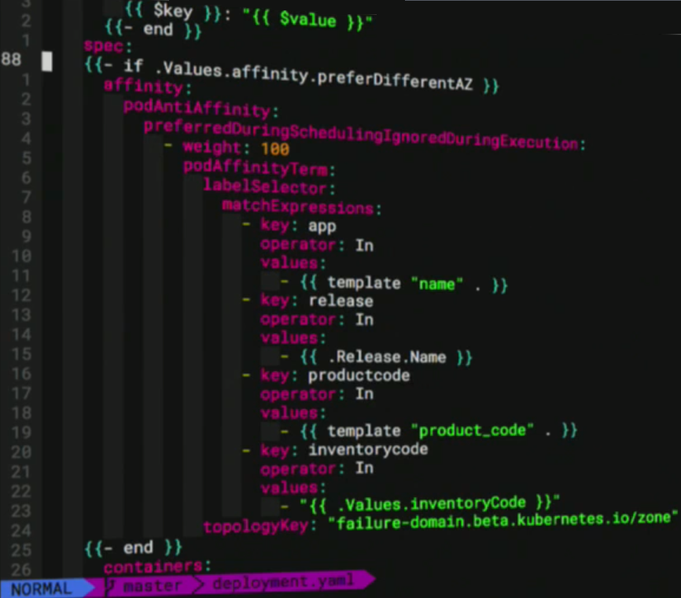
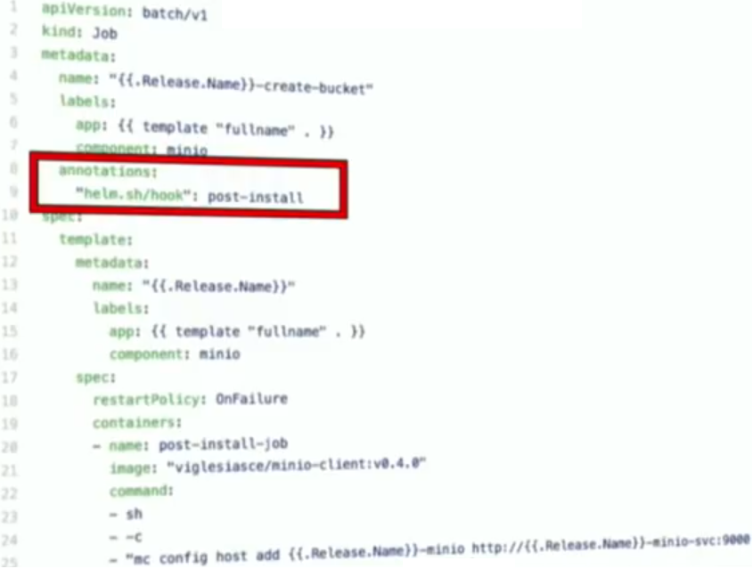

<link rel="stylesheet" href="_github-markdown.css">

# Helm for Kubernetes
	Kubernetes = k8s = deployments(in pods) & services & ingress
	A Helm chart defines a group of manifest files
	Helm = package manager for kubernetes
	packages called charts stored in one or more repositories
	Charts contain templatized k8s config
	Setup client configuration and install server-side tiller:
		$ helm init		# possibly with the wait param
	Check if tiller is available:
		$ kubectl rollout status deployment -n kube-system tiller-deploy

	helm = client, on your laptop or CI/CD system
	tiller = server in your Kubernetes cluster

## Structure of a Chart:
	myapp/
		Chart.yaml				# app name, apiVersion, appVersion, version, description etc.
		templates/
			NOTES.txt			# displays usage msg after 'helm install'
			README.md
			deployment.yaml			# manifest templates
			service.yaml
			ingress.yaml
		values.yaml
		requirements.yaml			# lists other charts, dependencies
### Usage:
```sh
helm install myapp
helm list				# lists deployed deployments
helm search				# seaches on https://github.com/kubernetes/charts
```
### Chart.yaml
```yml
name: my app
version: 1.0.0
description: my app
maintainers:
	- name: me
	  twitter: me
```
### deployment.yaml
```yml
apiVersion: extensions/v1beta1
kind: Deployment
metadata:
	name: nginx
spec:
	replicas: 3								# this is hardcoded :-(
	replicas: {{.Values.scale}}					# this is helm! :-)
	template:
		metadata:
			labels:
				app: nginx
		spec:
			containers:
			- name: nginx
			  image: nginx:1.3				# this is hardcoded :-(
			  image: nginx:{{.Values.tag}}		# this is helm!  :-)
			  ports:
			  - containerPort: 80
```
### service.yaml
```yml
kind: service
apiVersion: v1
metadata:
	name: nginxservice
spec:
	selector:
		app: nginx
	ports:
	- name: main
	  protocol: TCP
	  port: 80
	  targetPort: 80
```
### ingress.yaml
```yml
apiVersion: extensions/v1beta1
kind: Ingress
metadata:
	name: nginxingress
	annotations:
		http.port: "443"
spec:
	backend:
		serviceName: nginxservice
		servicePort: 80
```
### values.yaml
```yml
scale: 3
tag: "1.3"
```

### Templates
	helm uses the Go Templating
#### Templates use Sprig Functions:
	String functions: trime, wrap, plural ...
	Math functions: add, max, mul ...
	Date functions: now, date ...
	Default functions: default, empty, coalesce
	Encoding functions: b64enc, b64dec, checksum ...
	List functions: list, first, uniq...
	toYaml

	eg: type: {{ default: "ClusterIP" .Values.serviceType }}

### fire up helm:
mac install:
```sh
brew cask install minikube
minikube start
minikube addons enable ingress
minikube addons enable registry		# uses docker-registry inside of the minikube cluster
brew install kubectl
brew install kubernetes-helm
```
```sh
helm install myapp/						# outputs deployment-name too, use --name to set your own name
helm delete {deployment-name}
helm upgrade --set scale=3,tag="1.3" {deployment-name} myapp/
helm rollback {deployment-name} 1
# search kubeapps.com	# uses monocular = helm chart repository incl. UI = open source project
helm search jenkins
# creates deployment, services, secret, config maps, persisten volume claim
# 'stable' is the repo name
helm install --name cd stable/jenkins
# or
helm install --name cd -f override.yaml stable/jenkins

helm status
helm status istio
# access the jenkins UI:
minikube service cd-jenkins

```
### helm uses the Kubernetes plugin for Jenkins
	Spins up Jenkins slave as Kubernetes pod on demand
	Pod template defines containers that should exist in pod
		JNLP agent is always one of them (JNLP = Jenkins Slave Agent, a container)
		Enables re-use of existing Docker images (e.g maven, golang or docker)
	Template can define other configuration for the pod/containters
		Environment variables
		Mount from secret, config map or volume

	Pod templates can be defined in Jenkins configuration or declaratively as part of a
	Jenkins pipeline either in the job definition or in version control as a Jenkinsfile
#### Example Jenkinsfile (simple):

```js
podTemplate(label: 'mypod', inheritFrom: 'default',
	containers: [
		containerTemplate(name: 'maven', image: 'maven', ttyEnabled: true, command: 'cat')
	]) {
		node('mypod') {
			stage ('Extract') { checkout scm }
			stage ('Build') { container ('maven') { mvn package } }
		}
	}
```

	In the above cfg, I name the pod 'mypod', and the node() entry has to specify the same name

### Find password and open Jenkins UI:
```sh
printf $(kubectl get secret --namespace default cd-jenkins -o jsonpath="{.data.jenkins-admin-password}" | base64 --decode);echo
minikube service cd-jenkins
```

### Use the Jenkins UI to create a new Job
	1. Choose 'Create new Job', enter a name
	2. Choose 'Pipeline' -> [OK]
	3. Choose Tab 'Build Triggers' -> 'Pipeline' -> Enter script or use from SCM
		(example: https://github.com/davidcurrie/index2018 with Jenkinsfile, Dockerfile, overrides.yaml)
		[Save]
		[Buld now]
		downloads docker images & runs them ('kubectl get pods' to see started jenkins master & slave pods)

#### Example Jenkinsfile (advanced):
```js
podTemplate(label: 'mypod', inheritFrom:'default',
	containers: [
		// with this I build my go app
		containerTemplate(name:'golang', image:'golang:1.10-alpine', ttyEnabled: true, command: 'cat'),
		// with this I build & push my docker image
		containerTemplate(name:'docker', image:'docker:18.02', ttyEnabled: true, command: 'cat'),
		containerTemplate(name: 'helm', image:'ibmcom/k8s-helm:v2.6.0', ttyEnabled: true, command: 'cat')
	],
	volumes: [
		// this way I can use my docker engine on the host to build my image
		postPathVolume(hostPath: '/var/run/docker.sock',
		mountPath: '/var/run/docker.sock')
	]
) {
	node('mypod') {
		def commitId
		stage('Extract') {
			checkout scm
			commitId = sh(script: 'git rev-parse --short HEAD', returnStdout: true).trim()
		}
		stage('Build') {
			container('golang') {
				// ...and a Dockerfile COPY will copy the binary into the image
				sh 'CGO_ENABLED=0 GOOS=linux go build -a -installsuffix cgo -o main .'
			}
		}
		def repository
		stage('Docker') {
			container('Docker') {
				def registryIp = sh(script: 'getent hosts registry.kube-system | awk \'{ print $1 ; exit }\'', return Stdout: true).trim()
				repository = "${registryIp}:8080/myapp"
				sh "docker build -t ${repository}:${commitId} ."
				sh "docker push ${repository}:${commitId}"
			}
		}
		stage('Deploy') {
			container('helm') {
				sh "/helm init --client-only --skip-refresh"
				sh "/helm upgrade --install --wait --set image.repository=${repository},image.tag=${commitId} my"
			}
		}
	}
}
```

### Create your own Helm charts
```sh
helm create my			# creates a new helm chart
```
----------
	my/
		Chart.yaml		# name, version, ...
		values.yaml		# default values for the template placeholders
		charts/			# can contain subcharts
		templates/
			NOTES.txt	# displays usage msg after 'helm install'
			_helpers.tpl
			deployment.yaml
			ingress.yaml
			service.yaml
----------
	Example values:
#### values.yaml
```yaml
image:
	repository: nginx
	tag: stable
	pullPolicy: IfNotPresent
service:
	type: ClusterIP
	port: 80
ingress:
	enabled: true
	annotations: {}
	# kubernetes.io/ingress.class: nginx
	# kubernetes.io/tls-acme: "true"
	path: /
	hosts:
		- my.192.168.99.100.nip.io
	tls: []
	# - secretName: chart-example-tls
	#	hosts:
	#	- chart-example.local
resources: {}

```
#### deployment.yaml
```yaml
spec:
	containers:
	- name: {{ .Chart.Name }}
	  image: "{{ .Values.image.repository }}:{{ .Values.image.tag }}"
	imagePullPolicy: {{ .Values.image.pullPolicy }}
```

### Overriding chart values
	Variables can be overridden at install time
	As command line parameters:
		$ helm install my --set image.tag=1.13
	and/or via a file:
		$ helm install my --values overrides.yaml		# --values or -f

### Installing charts in a pipeline
	Charts can be kept in a separate repository or stored alongside the app source code
	Create a Docker image containing the Helm client
	Deploy tiller independently and use
		$ helm init --client-only
		Kubernetes configuration automatically available in the pod
	To perform an install or upgrade, use
		$ helm upgrade --install ...
		^ if not exists in the cluster,  create it, otherwise update it with the latest values
	Use overrides to define image to deploy
	The --wait option can be used to wait for pods to start

## Advanced Helm
	Ensure Helm chart is well formed:
		$ helm lint --strict ...
	Verify successfull deployment (run after you installed your app)
		$ helm test ...
		Executes and tests exit code for pods annotated with 'helm.sh/hook': test-success or test-failure
	Specify sub-charts in charts/ directory or requirements.yaml
		e.g. to satisfy a DB dependency
		requirements.yaml = points to the chart to be a sub-chart of my chart
	Hooks for lifecycle events, eg. pre/post install/upgrade
		e.g. DB upgrade

### Jenkins helm chart customization
	Example settings:
	Master.InstallPlugins - list of Jenkins plugins to install when the Jenkins container starts up
	Master/Agent.image - Docker image for master/slave
	Master.InitScripts - list of Jenkins init scripts
	Master.Jobs - Jenkins XML job configs
	Agent.Cpu/Memory - resource constraints for agent
	Master.CustomConfigMap - allows a parent chart to override the entire Jenkins config via override_config_map template

### Gotchas
	Poor Jenkins performance with network storage
	Jenkins slave pods may get re-used if long-lived
	Lack of access control for Helm
		Enable SSL and deploy tiller per namespace with RBAC
			(RBAC= Role-Based Access Control via Active Directory groups)
	Don't use latest tag with images
		if the config doesn't change, Kubernetes won't see it as an update
	Use AlwaysPullImages admission controller
	helm --wait only requires minimum pod count to be satisfied
		for replicas=1 and maxAvailable=1 that is zero!

### Microservice Builder and Microclimate
	(https://microclimate-dev2ops.github.io)
	Microservice Builder provides a dev-ops pipeline based on the community Jenkins chart and adding:
		Opinionated Jenkins library
		Docker images (Jenkins Master & Slave) per-built with plugins and adding AMD & Power support
		GitHub org and oauth plugins
	Microclimate provides a containerized development environment capable of running locally or on Kubernetes
		Generates starter templates for Java (Spring or MicroProfile), Node and Swift containing app source, Dockerfie, Helm Chart, ...
		Rapid iterative build/run/test in a containerized environment
		Option to use a web based or local IDE
### GitHub Resources:
#### Other IBM Helm Charts
	https://github.com/IBM/charts/tree/master/stable
#### Basic example
	incl. running tests, build app, push to registry, deploy image using webservice chart:
	https://github.com/r0fls/hello-kubecon
#### Helm Charts Repo:
	https://github.com/kubernetes/charts
	the centralized repo hosting community curated helm charts
	the default repo configured in helm (eg. used by $ helm search)

# Examples of advanced helm-prepared k8s yaml files:
You can specify labels to identify & group easy:
#### deployment.yaml


#### service.yaml


#### ingress.yaml


#### values.yaml


### templates/deployment.yaml
	incl. advanced template code {{ - if ... }} {{- end }} and {{ include ... }}
	incl. logic: if replicaCount is 1, set rollingUpdate.maxUnavailable to 0
	  (to avoid having no pod running during the update)
	incl. possibility to set AWS IAM Role
	incl. workaround for version-specific Kubernetes Bug (.Capabilities.KubeVersion.Major...)


	Example of Pod-Affinity configuration:


	Example of Jaeger configuration (jaeger agent added as a sidecar):
	 incl. fluentd for log collection and forwarding
	 incl. including custom YAML {{ toYaml .Values.tolerations | indent 8 }}
	 	often done for .Values.nodeSelector or .Values.tolerations or .Values.sentinel


#### templates/service.yaml
	incl. Prometheus settings
	incl. {{ range ... }}


#### templates/ingress.yaml
	the whole content is embedded in a condition!
	incl. health check & security group & subnets configuration for the load balancer
	(alb = load balancer on AWS)


#### templates/hpa.yaml
	hpa = Horizontal Pod Autoscaler
	scale based CPU utilization & on min and max Replicas


#### templates/pdb.yaml
	pdb = Pod Disruption Budget
	configures the max unavailable nodes during a maintenance
	all-wrapping condition: .Release.IsInstall = it is an initial installation
	 (because a pdb is immutable => create only on initial install)


#### requirements.yaml
	lists dependencies of your chart
	 (you can (de-)activate dependencies with condition setting (not displayed here)), eg:
	 condition: minio.enabled


## Tricks
#### Starter Templates
	use helm create with starter templates! Subdirs of
	~/.helm/starters/
	are the templates

#### Update deployments on config change
	every time the config file changes, it will roll out a new deployment
	because of that annotation change
	this is automatic config-map update


#### Use Hooks
	Hook Types: before or after:
		Install, Delete, Upgrade, Rollback

	metadata:
		annotations:
			"helm.sh/hook": post-install
			"helm.sh/hook": test-success



	You can runs bash scripts as test:


#### Namespace your helper templates


## related Applications:
#### Prometheus
#### Jaeger
	~ distributed tracing, like zipkin
#### Istio, a microservice platform (=service mesh)
	plugins into kubernetes natively via platform adapters
	features: traffic management, policy enformcement, metrics, logs, traces, security
	Istio = Pilot + Envoy + Mixer(=policy engine) + Initializer + dotviz
	Intall:
```sh
helm install --name istio incubator/istio --devel --namespace istio-system --set istio.release=0.2.12,initializer.enabled=true

helm upgrade istio incubator/istio --devel --namespace istio-system --set istio.release=0.2.12,initializer.enabled=true,istio.install=true

# lists the created pods after install
kubectl get pods -n istio-system
# triggers the istiö-initializer, puts in an istio-sidecar
kubectl apply -f myapp.yaml
```
	this creates a new kubernetes namespace 'istio-system' with the following pods & services:
		egress
		ingress
		grafana
		initializer
		mixer
		pilot
		prometheus
		servicegraph
		zipkin = distributed tracing
		dotviz = shows the dependency graph

	HTTP Services (Mixer exposes these (pluggable) services):
		/dotviz
		/istio-dashboard 	# graphana
		:9411/			# zipkin UI


