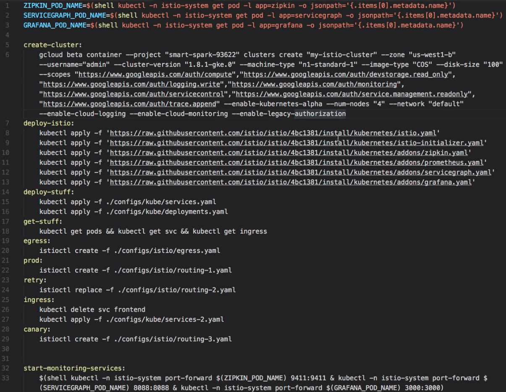

# Istio
1. Docker = Container
2. Kubernetes = Container orchestrating system.
3. Istio = Service Mesh, manages & monitors services.
    1. Istio has dashboard (grafana), showing errors too
    2. by default blocks your app calling external URLs (configurable, see egress.yaml below)
    3. Istio has service-graph (dotviz)
    4. use zipkin (or jaeger) to trace, showing communication between pods, showing how long the requests take
        1. so you can see which service is slow
        1. keep & forward the trace headers to be able to use distributed-tracing
            1. (header-propagation, see below)
    5. Istio has prometheus for graphing (like grafana)
    6. Istio has circuit-breaker (=shuts down pods if too much errors to let it cool off)

## Workflow on GCP:
1. create Docker container, push into registry on GCP
2. create k8s cluster through the GCP UI
3. go to GCP Container Registry, find your pushed docker container
4. go to Cloud Shell
```sh
gcloud container clusters get-credentials my-cluster --zone us-west1-b --project myproject
 > Fetching cluster endpoint and auth data..
 > kubeconfig entry generated for m-cluster..
kubectl get nodes # lists running nodes
kubectl create namespace myns
 > namespace myns created
kubectl run myd --image=gcr.io/me/myapp:1.0 --namespace=myns
 > deployment myd created
kubectl get deployments --namespace=myns # lists deployment
kubectl get pods --namespace=myns
kubectl expose deployment myd --target-port=3000 --port=80 --type=LoadBalancer --namespace=myns
 > service myd exposed
kubectl get svc --namespace=myns # puts out the external ip -> you can put it into the browser!
kubectl scale deployment myd --replicas=5 --namespace=myns
kubectl get pods --namespace=myns # lists 5 replicas, are used round-robin
.
# kubectl with YAML
kubectl apply -f ./myservices.yaml
sed -e 's~<PROJECT_ID>~myapp~g' ./myservices.yaml | kubectl apply -f -
# lists pods & services & loadbalancer(with external ip)
kubectl get pods && kubectl get svc && kubectl get ingress
```

### Istio configuration - egress.yaml
you can unblock external URLs
```yaml
kind: EgressRule
metadata:
    name: my
    namespace: default
spec:
    destination:
        service: myurl.com
    ports:
    - port: 80
      protocol: http
    - port: 443
      protocol: https
```
> $ istioctl create -f ./egress.yaml

### Istio configuration - routing.yaml
forward 'middleware' always to 'prod':


istio-cfg with retry policy:
> $ istioctl replace -f ./routing-2.yaml


### Istio Scripting on GCP


### K8s Cluster creation on GCP
(incl. autoscaling option on the UI)


### put environment variables in your deployments.yaml, services.yaml
(on GCP, with automatic DNS resolution, so you dont need to use IPs)


### trace headers necessary for distributed-tracing with istio:
called header-propagation ('open census' can do that automatically)


header-specific traffic control:
(tester can set the header in postman)
(with header-propagation, you can control the communication in the middle of your stack)


### Example:
    1. https://github.com/thesandlord/Istio101

### Deploy istio:
istio runs inside k8s! --> deployment is just running kubectl apply -f ...
(istio uses his own namespace inside k8s)



### Use Istio Ingress
1. by using ingress of istio, istio can detect failures and retry/forward-to-another-pod:
    the metadata-annotations element causes to use istio,
    saying send all paths (/.*) to service named 'frontend'
2. so, the frontend service has no more external IP address, but a 'istio-ingress' with an external IP is launched
    1. see kubectl get svc && kubectl get ingress


