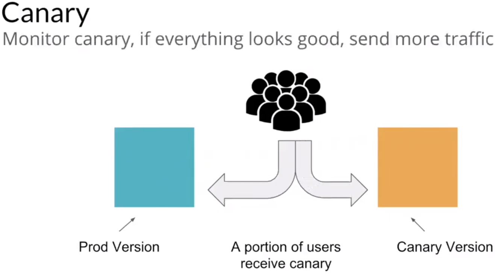
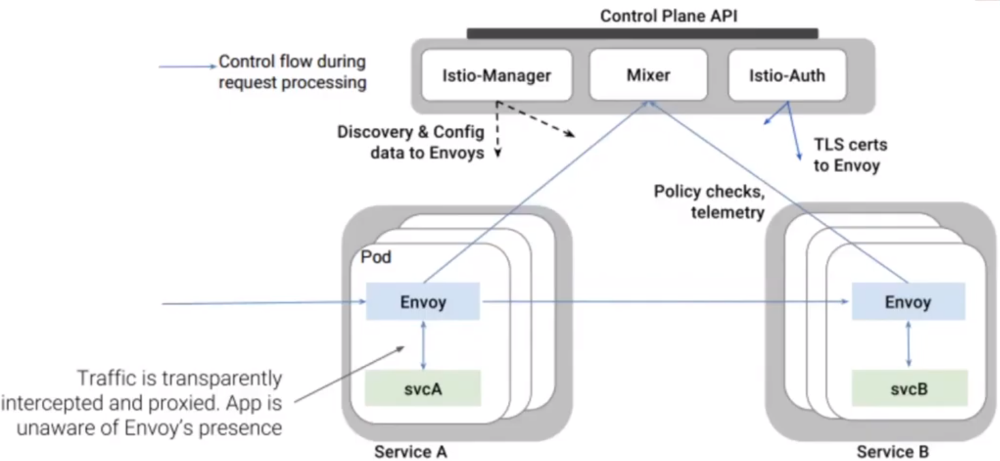
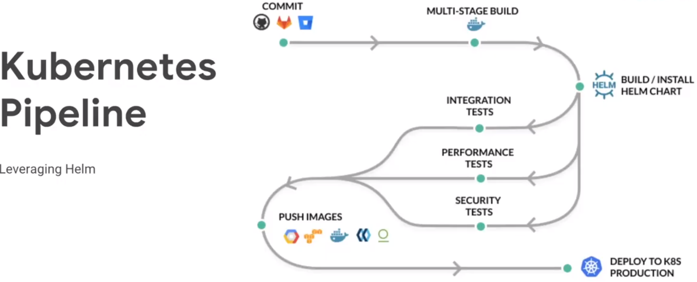
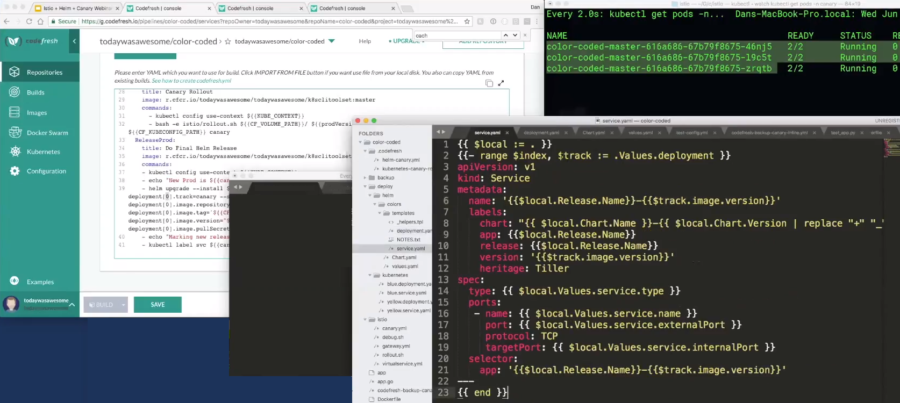
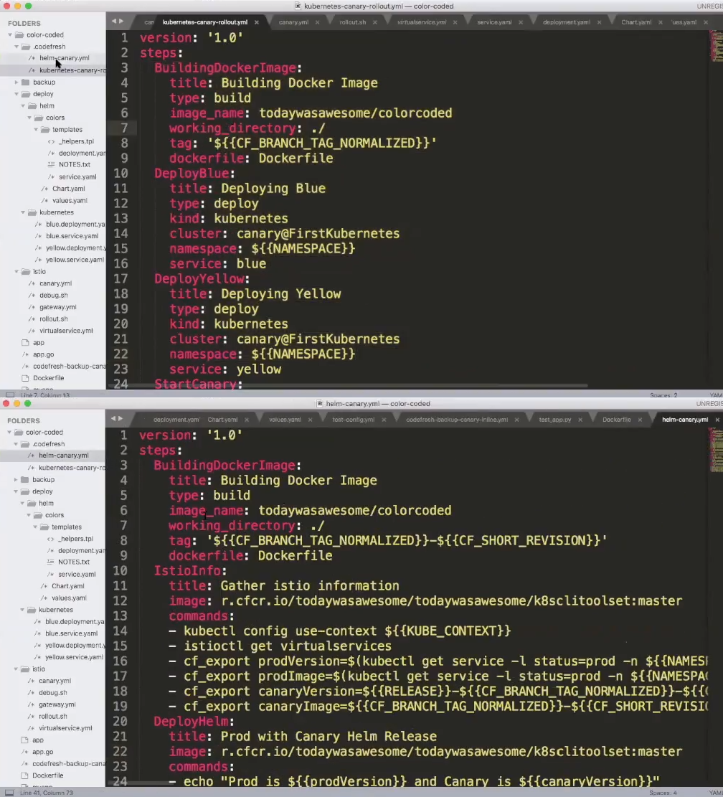

# Canary Deployment with Helm & Istio
1. Canary = new version of your app given a percentage of traffic (if it works, 100% of the traffic will be given to this new version)
2. use Helm to execute a (canary) release.
3. Helm and Istio do not know each other, by default (solution could be: codefresh (non-free SaaS offering)).
4. Example
    1. https://www.reddit.com/r/devops/comments/9392ky/visualizing_a_canary_rollout_using_istio_helm/
    2. https://github.com/todaywasawesome/color-coded
5. Alternative: blue-green deployment (hard switch instead of partial redirect). Example/description
    1. https://codefresh.io/kubernetes-tutorial/blue-green-deploy/

### What is Canary?

### What are the building blocks of Istio?

### How does a normal build- & deployment pipeline look like with k8s?

### In a helm chart, how can I save my local context in a variable to use it within a loop?

### How does a k8s & Helm configuration for canary deployment look?
1. canary rollot k8s release steps (top of the pic)
2. pipeline wit helm (bottom of the pic)

