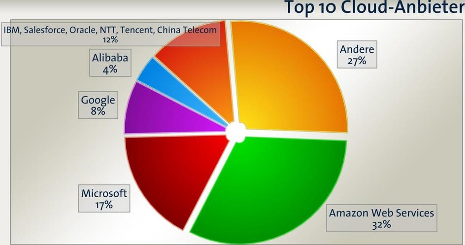
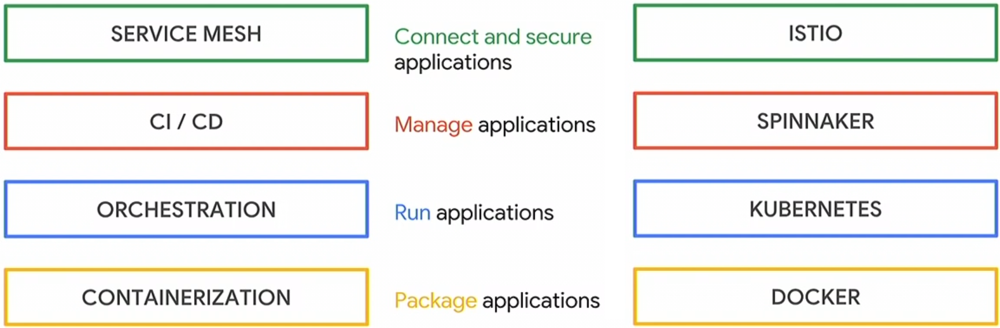
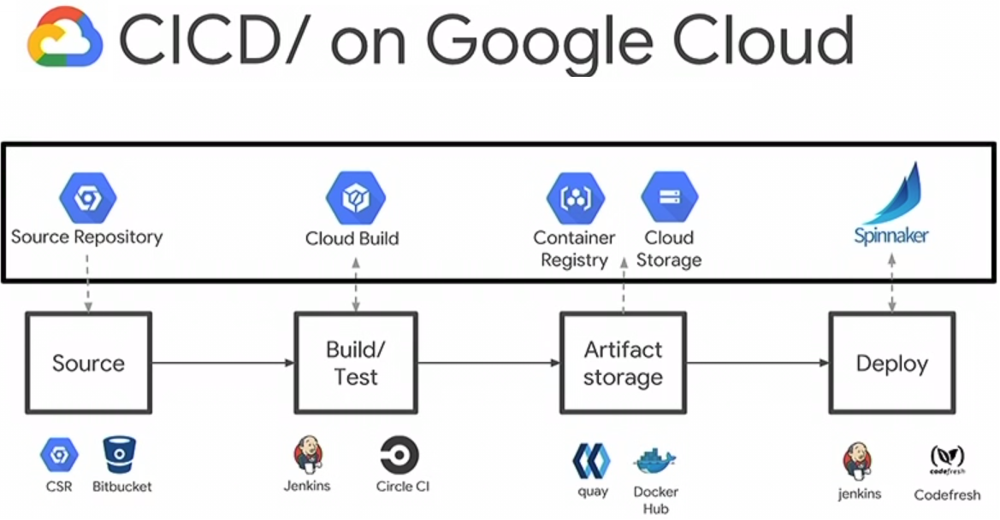
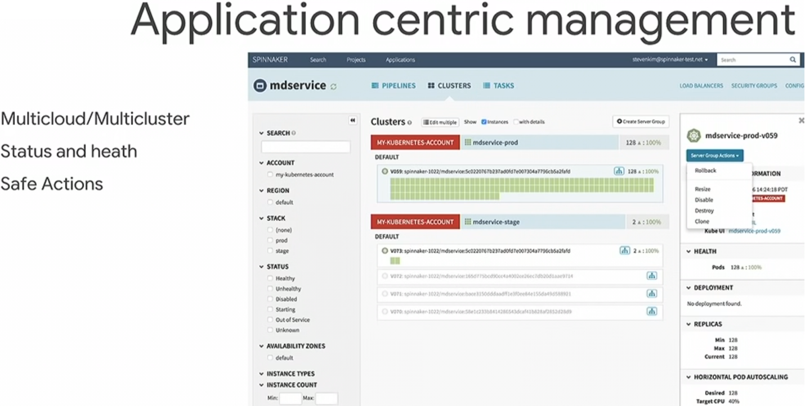
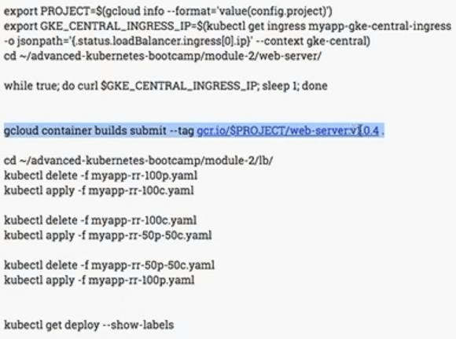
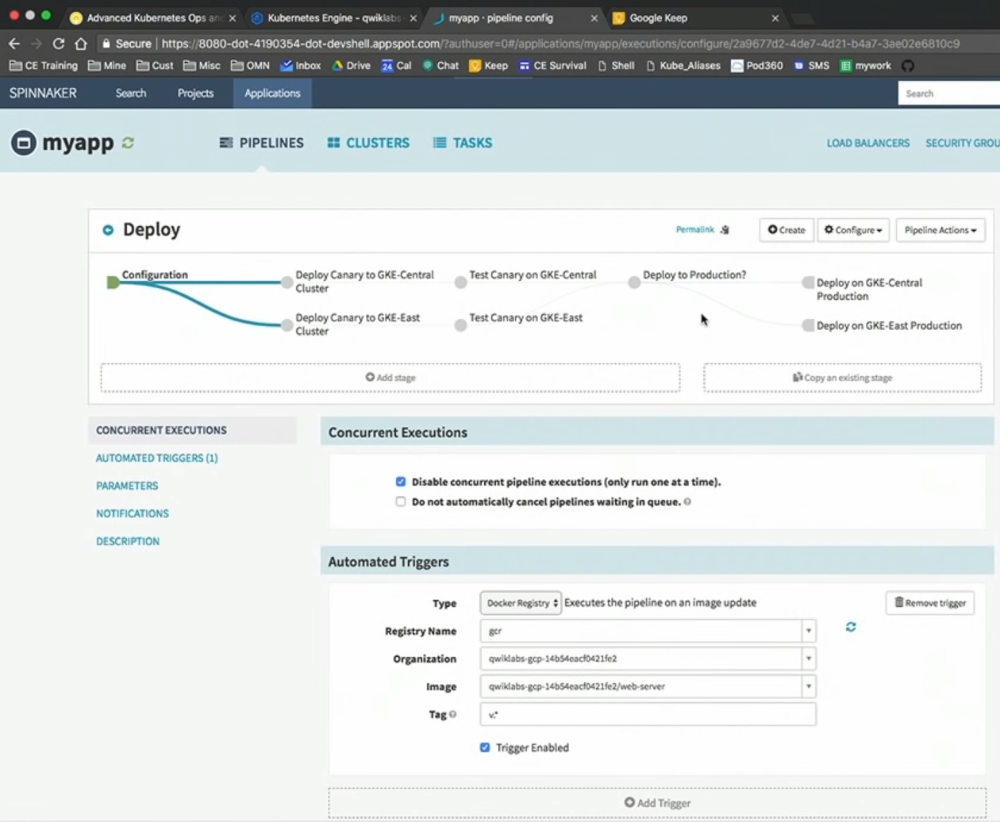
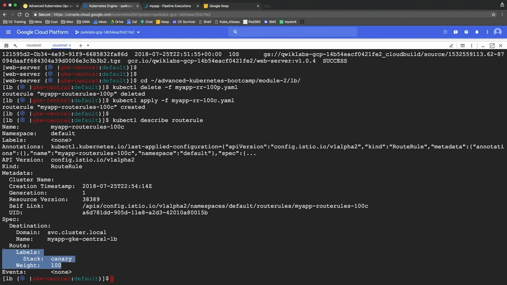
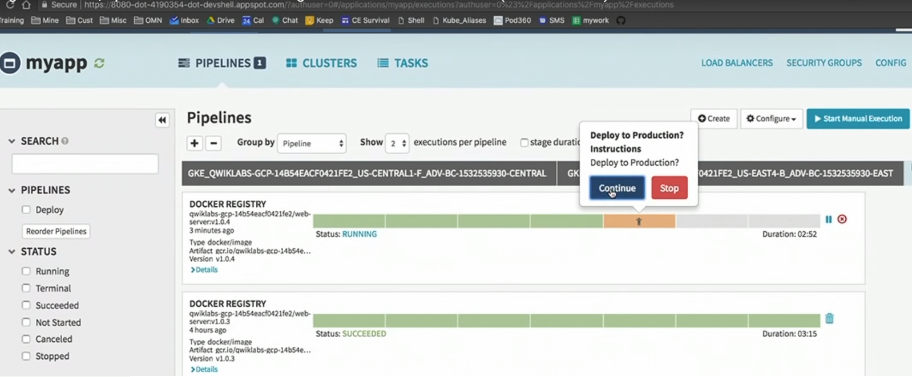

# Multicloud
1. Advice: use multiple cloud, -> no vendor lock-in!
2. Solution: use Kubernetes & Spinnaker & Istio

## Spinnaker
Spinnaker = from netflix, multi-cloud CD platform, maintains pipelines
1. knows deployment strategies
    1. blue/green (switch a load-balancer)
    2. rolling
    3. canary (score 2 deployments)
2. can trigger pipelines (after code change)

## Istio
Istio = defines service mesh incl.
1. routing
2. security(mutual-tls,policies,rate-limiting)
3. telemetry(distributed-tracing)
4. resilience(retries, healthcheck, circuit-breaker)

### Istio components:
1. Proxy in the pod (=envoy)
2. Pilot: maintains the routing rules, configures the Envoy proxies
3. Mixer: collects telemetry data and exposes this data to other services (Prometheus, InfluxDB, ...), envorces quota & policy
4. Citadel: does security: mutual encryption, like a Certificate Authority (CA), distributes certificates

## Envoy
1. Envoy is a proxy
2. Configured with Aggregated Discovery Services (ADS)
3. part of Istio

## With this architecture:
1. you can orchestrate several GCP Clusters

## Cloud Market:

## Cluster building blocks:

## CI/CD on GCP

## Spinnaker UI
1. "mdservice" is the app name
2. in the middle: 2 clusters, with namespace 'default' (the green boxes are the pods)

## Commands in this Setup:
1. cmd: glcoud container builds submit ...
2. Spinnaker pipeline triggered

### Spinnaker pipeline:
1. Spinnaker pipeline with 2 roads
2. does tests automatically
3. prod deployment has to be started manually

## Use kubectl on GCP with Spinnaker
By changing the route rule you can manually route traffic to the new deployment

## Manual Prod Deployment launch:

