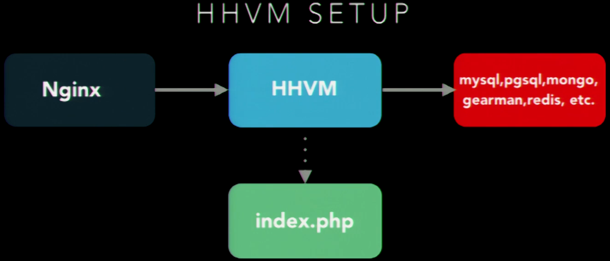

# HHVM JIT
    HHVM = JIT Compiler = HipHop VM (successor of HPHPC = cross-compiler php->C++)
    HHVM is running facebook, baidu, wikipedia, Box.net, Slack, ...
        can speed up drupal, mediawiki, wordpress, Zend too!
    'Hack' (= hacklang.org = PHP-fork of facebook) is also using HHVM
    Hack knows type-hinting, generics, async functions, annotations, no global vars, no variable variables
    Current version: 2.0 : https://github.com/facebook/hhvm
    HHVM = Region Descriptor -> HHIR -> VASM -> Machine Code
    Runs everywhere where fast CGI runs


```sh
sudo apt-get install hhvm   # = on ubuntu
```

### Nginx config

```js
server {
    server_name _;
    root /var/www;
    index index.php;
    location ~ \.php$ {
        fastcgi_pass unix:/var/run/hhvm.sock;
        fastcgi_index index.php;
        fastcgi_param SCRIPT_FILENAME /var/www$fastcgi_script_name;
        include fastcgi_param;
    }
}
```
#### Setting possibilities:
```ini
hhvm.server.file_socket = /var/run/hhvm.sock
hhvm.server.type = fastcgi
hhvm.server.source_root = /var/www      # = DocumentRoot
hhvm.log.level = Error
hhvm.log_user_log_file = true
hhvm.log.file = /var/log/hhvm-error.log
hhvm.log.access.0.file = /var/log/hhvm-access.log
hhvm.log.access.0.format = %h %l %u %t \"%r\" %>s %b
```
```sh
# start it
hhvm -m daemon -c /etc/hhvm/hhvm.ini -u www-data
```

# Hacklang
1. runs through the same hhvm, is strongly typed (but these are gone at runtime (=type erasure))
2. Editors: Atom, eclipse, sublime, Nuclide(based on Atom), (maybe phpStorm)
3. you cannot mix hack with HTML
    if you want embed html, use xhp
4. start each file with <?hh , no closing tag
5. modes:
    1. partial mode: strong types not enforced, can mix with php
    2. strict mode: enforced complete hack, you cannot have top-level code!
    3. //stict mode: comment to change mode
    4. declarations mode (decl): type-hints trusted but not required:
        <?hh //decl
6. you can ignore errors by marking code as //UNSAFE (until the end of the current block)
7. Type hints (like php 7)>: we have int, float, string, class, interface, and advanced types:
    1. mixed (like php, anything)
    2. vector (numerical contiguously indexed arrays)
    3. map (typed both keys and values) associative array
    4. set
    5. tuples: fixed size set of typed values
    6. pair
    7. void: for functions with no return value
    8. this: always refers to $this
    9. nullable types: prefix '?': ?int or ?DateTime. Example:

```php
<?hh
class DBAdapter {
    public function connect(?string $dsn): ?\PDO
    {
        //$dsn may be null
        //may return \PDO instance or null on error
    }
}
```

8. Soft Types: you can denote a type-failure should not error, just noice (eg. in the log). Syntax: @int or @\DateTime  Example:
```php
<?hh
class Calc {
    public function add(@int $a, @int $b) : @int
    {
        //both params may not be ints
        //may not return an int
    }
}
$calc = new Calc();
$calc->add("1","2");
```

9. Custom Types = type aliases or opaque types
(only used for static analysis!)

```php
<?hh //strict
type HTTPStatusCode = int;

class HTTPStatus {
    const HTTPStatusCode OK = 200;  # automatic conversion!
    const HTTPStatusCode FOUND = 302;
    const HTTPStatusCode NOTFOUND = 404;
    protected Map<HTTPStatusCode, string> $status = Map {
        self::OK = "OK",
        self::FOUND = "Found",
        self::NOTFOUND = "notfound",
    };
    public function send(HTTPStatusCode $code): bool
    {
        if(isset($this->status[$code])) {
            header('HTTP/1.1 '.$this->status[$code]);
            return true;
        }
        return false;
    }
}
//later...
$status->send(HTTPStatus::NOTFOUND);
```
10. Opaque types

    No Automatic conversion from int!
```php
newtype HTTPStatusCode = int;
```

11. Constructor property assignment

    Just like in TypeScript!
```php
<?hh //strict
class A {
    public function __construct(
        private int $left,
        private int $right
    ): void {}
    public function get() : int {
        return $this->left + $this->right;
    }
}
```
11. Collections:

Arrays, tuples, pairs, vectors, maps, sets, immutable variants
```php
<?hh //strict
array   # untyped, only allowed in partial mode
array<[type]>
array<[type1], [type2]> # typed keys with typed values
function a() : array<int> {
    return array(1,2);
}
// tuples
function t() : (int, int, string) {
    return tuple(1,2, "a");
}
// pairs
function p() : Pair<string, string> {
    return Pair {"",""};
}
//vectors
function v() : Vector<string> {
    return Vector {"",""};
}
//maps
function m() : Map<string, string> {
    return Map {"" => ""};
}
//immutable can be: prefix 'Imm', vectors, map, set: (pairs are immutable out-of-the-box)
function m() : ImmMap<string, string> {
    $map = ImmMap {"a" => ""};
    $map["m"] = ""; //ERROR!
}

```

12. Shapes
```php
<?hh //strict
newtype R = shape(
    'headers' => Map<string, string>,
    'body' => ?string
);
```
13. anonymous functions & XHP

like closures but inherit parent scope
```php
<?hh //strict
$fna = $args ==> expression;
$fnb = ($a1, $a2) ==> {
    expression; return ...;
};
$list = <ul/>;  # XHP = XML fragments as expressions, like Reacts JSX
array_walk($items, $item ==> $list->appendchild(<li>{$item}</li>));
echo $list;
```

14. XHP-Bootstrap:
```xml
print
 <bootstrap:dropdown>
    <bootstrap:button>
        ...
 </bootstrap:dropdown>
```

15. Hack advanced features

    1. async MySQL|memcache|curl
    2. annotations
    3. enums
    4. memoize
    5. generics
    6. static analyzer recognizes null check of can-be-null variables:
```php
function f() : string {
    ?string v = someotherfunction();
    if(v !== null) {
        return v;   # v cannot be null here, static analyzer knows that
    }
    return 'default';
}
```

#### Gotchas of Hack:
PHP-iterated collections can be modified (because the iterator works on a copy). Hack-collections are objects (=reference types) ==> errors when modified during iteration!

### hh_client
1. does static analysis
2. starts hh_server if necessary
3. retrieves the results of the static analysis from hh_server
4. displays them in the CLI
5. integrates with IDEs

### CLI

```sh
hh_client check --refactor # rewrites files!
hackificator .  # changes the opening tag from PHP to hack
hh_server --convert ./ ./ # adds soft type hints

# this removes the invalid types
# paths from log should match paths on the disk
hack_remove_soft_types --delete_from_log hhvm.log
# harden all the left over types
hack_remove_soft_types --harden FILE
# run it over all files in a dir:
find ./ type f -name '*.php' -exec hack_remove_soft_types --harden '{}' ';'
```
