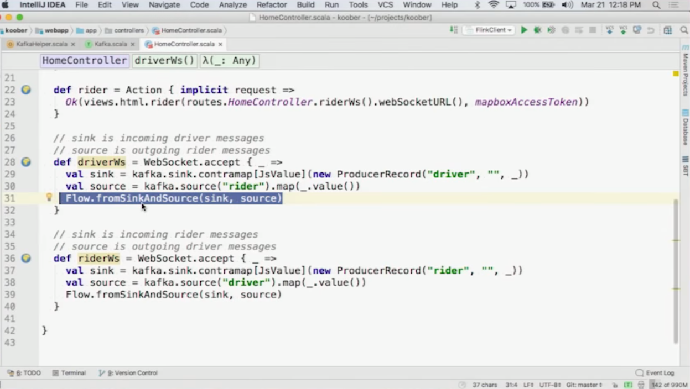

# Apache Kafka
    = Is a messaging system; from LinkedIn
    = Event Ledger, distributed and redundant
    = a distributed commit log
    = uses messaging system semantics
    = Clustering is Core, horizontally distributed across Nodes
    = has durability and ordering guarantees (within a partition)
    = uses Zookeeper to keep track of the state of the cluster & leader
    = can serve real-time processing engines, like Flink (flink has out-of-the-box support for kafka)
### Pieces of Kafka
1. Producers: writes to broker into a topic of a partition
2. Consumers: read from broker, the consumer asks (=pull)
    1. can queries by Start-Offset
    2. consumers can form consumer-groups, so that message consumption is load-balanced across all consumers in the group
3. Events
4. Topics, its replication factor can be specified
5. Partition (they are replicated); ordering is guaranteed only for a partition
6. Broker = a Node in the cluster(= leader + followers)
7. Connectors
8. Cluster = sum of Brokers and a Zookeeper. Producers push, consumers pull
9. Zookeeper is used for service discovery (=broker node discovery)
10. Partioner: def: Round-Robin, if you dont specify in code.
    1. Based on Key-Hash
    2. = Utils.toPositive(Utils.nurmur2(keyBytes)) % numPartitions;
         1. can be problematic if numPartitions changes
         2. can be problematic, as Hashing seldomly returns same results for different key bytes
         3. Utils = org.apache.kafka.common.utils.*;?

### Use Cases
    ETL(Extract, Transform, Load)/CDC(=Change Data Capture)
    Data Pipelines (producers feed in, consumers use it)
    Big Data Ingest
### CLI
```sh
# these .sh files are provided in kafka download
bin/zookeeper-server-start.sh config/zookeeper.properties
bin/kafka-server-start.sh config/server.properties

bin/kafka-topics.sh --create --zookeeper localhost:2181 --replication-factor 1 partitions 1 --topic topicname

# this producer allows to write to console the msgs to be published
bin/kafka-console-producer.sh --broker-list localhost:9092 --topic topicname
> {"k1":"val","k2":"val"}

# this consumer writes published msgs to console
kafka-console-consumer --bootstrap-server localhost:9092 --topic topicname --from-beginning

```
### Delivery Guarantees
#### Producer
1. Async (no guarantee, ordering can be lost)
2. committed to leader
3. committed to leader and quorum(=majority of the cluster) (slowest & most secure)
#### Consumer
1. at-least-once delivery (default) (redelivery can occur)
2. at-most-once delivery
3. effectively-once delivery
4. exactly once (maybe)

## Records  = Events = Messages
1. Key + Value + Timestamp
2. Immutable
3. Append Only
4. persisted to disk by kafka (->durability)
## Advanced stuff
1. Heroku Kafka = kafka in the cloud, incl Zookeeper
    1. (you have to use SSL on Heroku)
2. Log Compaction = ignore duplicate events(=has the same key) when writing to disk
3. Disk not heap = use disk and spare heap for caching
4. pagecache to socket = move data from disk to network fast (on nix*)
5. balanced partitions & leaders (rebalances leader if necessary, automatic rebalancing)
6. producer and consumer quotas
7. use akka streams (=reactive Streams) -> reactive Kafka (https://github.com/akka/reactive-kafka)
    1. source/sink stream programming
    2. can backpressure in case of spikes
## Clients
1. JVM
2. clients consume pull based
3. kafka needs a 
    1. Serializer to write records, for key and for value
    2. Deserializer to read records
3. Serializer: json(=large) or avro or protobuf etc

```java
//producer
class Producer {
    public void send(ProducerData<K,V> producerData);
}
//consumer
class SimpleConsumer {
    public ByteBufferMessageSet fetch(FetchRequest request);
    public long[] getOffsetsBefore(String topic, int partition, long...
}
interface ConsumerConnector {
    public Map<String, List<KafkaStream>> createmessageStreams(Map<String, ...
}
```
### Rective API:
    Example: https://github.com/jamesward/koober (in scala)
```scala
val src = Source.repeat("12");
val snk = Sink.foreach(println)
val flw = source to sink
flow.run()
```



### Spring-Kafka
    Spring-Boot supports Spring-Kafka:
```xml
<dependency>
    <groupId>org.springframework.kafka</groupId>
    <artifactid>spring-kafka</artifactid>
 </dependency>
<dependency><!-- add this if you use json serialization (or avro, or protobuf...) -->
    <groupId>com.fasterxml.jackson.core</groupId>
    <artifactid>jackson-databind</artifactid>
    <version>2.6.7</version>
 </dependency> 
```
```java
public class MyProducer {
    @Autowired
    KafkaTemplate<String, Model> kafkaTemplate; //'Model' is a POJO
    public void f()
    {
        kafkaTemplate.send("topicname", new Model("val")); //=publish message!
    }
}
@EnableKafka //only needed for Consumer
@Configuration
public class KafkaCfg {
//cfg for a producer
    @Bean
    public ProducerFactory<String, Model> produerFactory() {
        Map<String, Object> cfg = new HashMap<>();
        cfg.put(ProducerConfig.BOOTSTRAP_SERVERS_CONFIG, "127.0.0.1:9092");
        cfg.put(ProducerConfig.KEY_SERIALIZER_CLASS_CONFIG, StringSerializer.class);
        cfg.put(ProducerConfig.VALUE_SERIALIZER_CLASS_CONFIG, JsonSerializer.class);

        return new DefaultKafkaProducerFactory(cfg);
    }
    @Bean
    public Kafkatemplate<String, Model> kafkatemplate() {
        return new KafkaTemplate<String, Model>(producerFactory());
    }
//cfg for a consumer
//  consume a string value
    @Bean
    public ConsumerFactory<String, String> consumerFactory() {
        Map<String, Object> cfg = new HashMap<>();
        cfg.put(ProducerConfig.BOOTSTRAP_SERVERS_CONFIG, "127.0.0.1:9092");
        cfg.put(ProducerConfig.GROUP_ID_CONFIG, "group_id");
        cfg.put(ProducerConfig.KEY_SERIALIZER_CLASS_CONFIG, StringSerializer.class);
        cfg.put(ProducerConfig.VALUE_SERIALIZER_CLASS_CONFIG, StringSerializer.class);

        return new DefaultKafkaConsumerFactory<>(cfg);
    }
    @Bean
    public ConcurrentKafkaListenerContainerFactory<String, String> kafkaListenerContainerFactor() {
        ConcurrentKafkaListenerContainerFactory<String, String> factory = new ConcurrentKafkaListenerContainerFactory();
        factory.setConsumerFactory(consumerFactory());
        returen factory;
    }
//  consume a model value
    @Bean
    public ConsumerFactory<String, Model> modelConsumerFactory() {
        Map<String, Object> cfg = new HashMap<>();
        cfg.put(ProducerConfig.BOOTSTRAP_SERVERS_CONFIG, "127.0.0.1:9092");
        cfg.put(ProducerConfig.GROUP_ID_CONFIG, "group_id_json");
        cfg.put(ProducerConfig.KEY_SERIALIZER_CLASS_CONFIG, StringSerializer.class);
        cfg.put(ProducerConfig.VALUE_SERIALIZER_CLASS_CONFIG, JsonSerializer.class);

        return new DefaultKafkaConsumerFactory<>(cfg, new StringDeserializer(), new JsonDeserializer<>(Model.class));
    }
    @Bean
    public ConcurrentKafkaListenerContainerFactory<String, Model> modelKafkaListenerContainerFactor() {
        ConcurrentKafkaListenerContainerFactory<String, Model> factory = new ConcurrentKafkaListenerContainerFactory();
        factory.setConsumerFactory(modelConsumerFactory());
        returen factory;
    }
}
@Service
public class MyConsumer {
    @KafkaListener(topics="topicname", group="group_id")
    public void consumeStringMsg(String msg) {
        //handle msg
    }
    @KafkaListener(topics="topicname", group="group_id_json", containerFactory="modelKafkaListenerFactory")
    public void consumeJsonMsg(Model model) {
        //handle msg
    }
}
```
## Configuration
### Broker Cfg
Example entries:
1. broker.id
2. log.dirs
3. zookeeper.connect
4. delete.topic.enable # true/false
5. auto.create.topics.enable # create the topic automatically, 
6. default.replication.factor # default:1
7. num.partitions # default:1
8. log.retention.ms # default retention period: 7 days
9. log.retention.bytes
10. max.in.flight.request.per.connection # def: 5
    1. controls how many msgs you can send without receiving a response
    2. Use sync send or the value max.in.flight.request.per.connection=1 if ordering is important!

## Scala / java
Use sbt to build! (also possible for .java!)
### build.sbt
```scala
name := "t"
    scalaVersion := "2.11.8"
    libraryDependencies ++= Seq(
        "org.apache.kafka" % "kafka-clients" % "1.0.0"
    )
```
### Producer in plain java
```java
import org.apache.kafka.clients.producer.*;
public class SimpleProducer {
    public static void main(String[] args) throws Exception
    {
        Properties p = new Properties();
        p.put("bootstrap.servers","localhost:9092,localhost:9093"/*list of brokers*/);
        p.put("key.serializer", "org.apache.kafka.common.serialization.StringSerializer");
        p.put("value.serializer", "org.apache.kafka.common.serialization.StringSerializer");
        Producer<String, String> producer = new KafkaProducer<>(p);
        ProducerRecord<String, String> r = new ProducerRecord<>("topicname", "value");
        //*fire-and-forget* call
        producer.send(record);//handles batches & retries
        //*async* call, limited by 'max.in.flight.request.per.connection'! ordering can be lost!
        producer.send(record, new MyProducerCallback());
        try
        {
            //*sync* call
            producer.send(record).get();
        }catch(Exception e) { }
        finally { producer.close(); }
    }
    class MyProducerCallback implements Callback {
        @Override
        public void onCompletion(Recordmetadata r, Exception e) { }
    }
}
```
```sh
sbt compile
sbt run
```
### Consumer in plain java
```java
bool manualCommit = true/false;
Properties p = new Properties();
p.put("bootstrap.servers","localhost:9092,localhost:9093"/*list of brokers*/);
p.put("group.id","groupname");  //kafka creates the group if necessary, not necessary but advisable
p.put("key.deserializer", "org.apache.kafka.common.serialization.StringSerializer");
p.put("value.deserializer", "org.apache.kafka.common.serialization.StringSerializer");
//p.put("enable.auto.commit", "false");//manualCommit? if you want to commit manually!
KafkaConsumer<String, String> c = new KafkaConsumer<>(p);
ConsumerRebalanceListener rb = new MyConsumerRebalanceListener(c); //manualCommit? optional!
c.subscribe(Arrays.asList(topicname), rb);//wildcards are supported!
while(true) {
    ConsumerRecords<String, String> rs = c.poll(100/*timeout*/); //handle heartbeats too
    for(ConsumerRecord<String, String> r : rs) {
        r.value();
        //rb.addOffset(r.topic(, r.partition(), r.offset())); //manualCommit? special handling (not kafka)
    }
    //c.commitAsync();//or c.commitSync();      //manualCommit?
    //c.commitSync(rb.getCurrentOffset());      //manualCommit?
}
```

### Custom partitioner
```java
    ...Producer sets Properties p
    p.put("partitioner.class", "MyPartitioner");
    p.put("speed.sensor.name", "TSS");  //custom property, not kafka!

public class MyPartitioner implementes Partitioner {
    public void configure(Map<String, ?> cfg) {
        cfg.get("speed.sensor.name").toString();    //get custom prop!
    }
    public void close() { }
    public int partition(String topicname, Object key, byte[] keyBytes, Object value, byte[] valueBytes, Cluster cluster) {
        List<PartitionInfo> ps = cluster.partitionsForTopic(topicname);
        ...
        return 42;
    }
}
```
### Custom De-/Serializer
    (not so optimal because of possible future versions, better to use Avro or similar)
```java

    in Producer/Consumer: Properties p...
    p.put("value.serializer", "MySerializer");
    p.put("value.deserializer", "MySerializer");

public class MySerializer implements Serializer<Model> {
    @Override
    public void configure(Map<String, ?> cfg, boolean isKey) { }
    @Override
    public void close() { }
    @Override
    public byte[] serialize(String topicname, Model m) {
        ByteBuffer b = ByteBuffer.allocate(4 + 4 + m.name.length + 4 + m.othermember.length);
        b.putInt(m.getId());
        b.putInt(m.name.length);
        b.put(m.name.getBytes("UTF8"));
        b.putInt(m.othermember.length);
        b.put(m.othermember.getBytes("UTF8"));
        return b.array();
    }
}
public class MyDeSerializer implements Deserializer<Model> {
    @Override
    public void configure(Map<String, ?> cfg, boolean isKey) { }
    @Override
    public void close() { }
    @Override
    public Model deserialize(String topicname, byte[] m) {
        ByteBuffer b = ByteBuffer.wrap(data);
        int id = b.getInt();
        int size = b.getInt();
        byte[] bmember = new byte[size];
        String member = new String(bmember, "UTF8");
        return new Model(id, member);
    }
}
```
## Configuration
Set these like
```java
Properties p = new Properties();
p.put("value.serializer", "MySerializer");
//or better load .properties file from disk
p.load(new FileInputStream("my.properties")); //in try-catch!
```
Important configuration keys:
1. "acks"
    1. 0 = no Acknowledgement, fast, no retries
    2. 1 = leader responds,
    3. all = all the live replicas receive the msg, slow
2. "retries" = how many times should be retried in case of error
3. "max.in.flight.request.per.connection"
    1. Use sync send or the value max.in.flight.request.per.connection=1 if ordering is important!
4. "enable.auto.commit" # def: true, if false, you have to commit manually the offset
5. "auto.commit.interval.ms" # def: 5secs

## Consumer-Group
    A Consumer-Group reads a single Topic in prallel, the group will be fed by the partitions of the topic (possibly in parallel).
    Possible problem of duplicated read! (=exactyl once processing)


## Offset
    Current offset, Committed offset
    Manual Commit can be sync or async:
        consumer.commitSync() / consumer.commitAsync()
        or
        consumer.commitSync(rebalanceListener.getCurrentOffset());
```java
...
p.put("enable.auto.commit", "false");
c = new KafkaConsumer<>(p);
TopicPartition p0 = new TopicPartition(topicname, 0);
TopicPartition p1 = new TopicPartition(topicname, 0);
c.assign(Arrays.asList(p0,p1));//c wants to read these partitions
c.seek(p0, getoffsetFromDB(p0));//set the offset position for the partition 0
c.seek(p1, getoffsetFromDB(p0));

```

### Custom Rebalance Listener:
for manual offset-commit with custom logic
```java
public MyConsumerRebalanceListener implements ConsumerRebalanceListener {
    private KafkaConsumer consumer;
    private Map<TopicPartition, OffsetAndMetadata> currentOffsets = new HashMap();

    MyConsumerRebalanceListener(KafkaConsumer c) { this.consumer = c; }

    public void addOffset(String topic, int parti, long offset) {
        currentOffsets.put(new TopicPartition(topic, parti), new OffsetAndMetadata(offset, "Commit"));
    }

    @Override
    public void onPartitionsRevoked(Collections<TopicPartition partis) { }
    @Override
    public void onPartitionsAssigned(Collections<TopicPartition partis) {
        consumer.commitSync(currentOffsets);
        currentOffsets.clear();
     }
}
```
