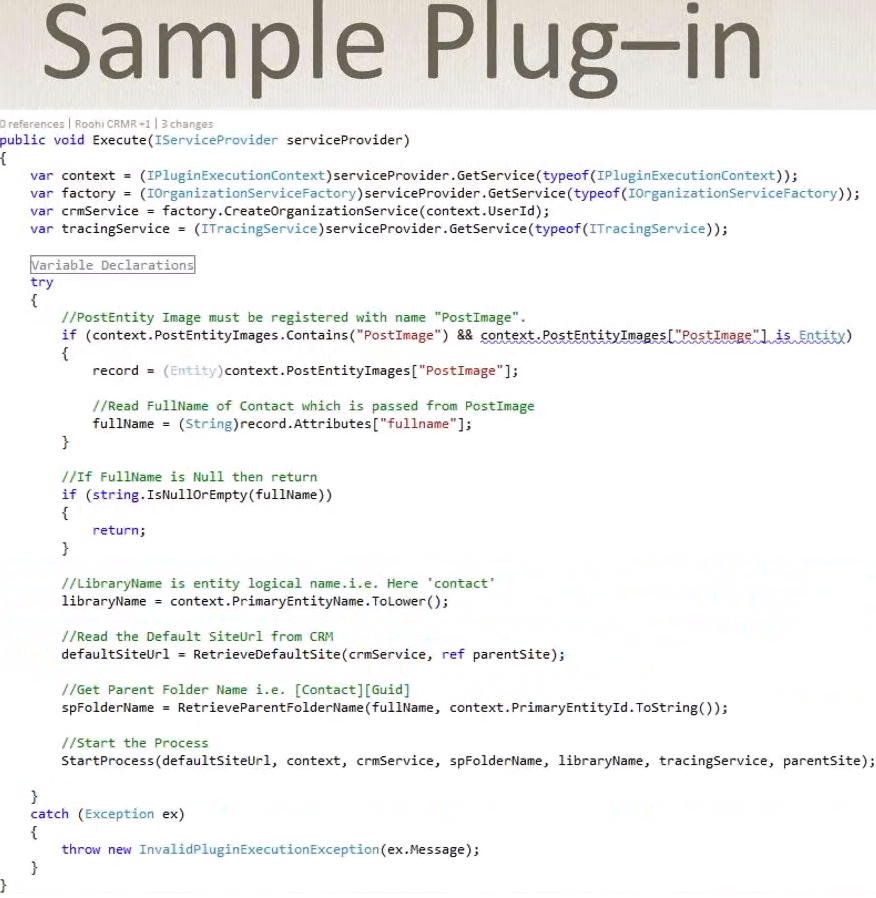

# Microsoft Dynamics CRM 365
    = CRM & ERP
	Shows metrics, like 'Open Opportunities' and
		its action history, and
		its social insights
	Shows accounts (=contacts to other companies) and its opportunities.
	Shows Activities & Call Reports (=notes of the meeting)
	Creates documents based on (word-)templates (eg. proposal)
    Can visualize the business outcomes (charts incl drilldowns), incl excel-export.
    Supports forecasts.
    Has Mobile Apps.
    In the cloud or on-premise.
    Competitors:
        Salesforce
        SAP
        Oracle

## Environment Components
    Dynamics 365 for Sales
    Dynamics 365 for Customer Service
    Dynamics 365 for Field Service
    Dynamics 365 for Project Service Automation
    Dynamics 365 for for Operations (former: AX)
    Dynamics 365 for Financials
    Dynamics GP
    Dynamics NAV
    Dynamics SL

## seamless integration with other MS products
	like Outlook-Addons to convert email into opportunity
    Word-Templates
    Excel-Reports
    Power BI can visualize CRM data, shown in dashboards.

## Opportunity
Opportunity is displayed with a progress bar (steps of the sales process), dates, revenues, stakeholders. A product of the product-catalog can be assigned to it.

## Is programmable/customizable
    You can create new entities (beside existing entities like account, address, appointment...)
        (you find them in "Extensions")
    You can define charts & dashboards, reports

## Custom Plugin:
1. Tools
    1. VS
    2. VS Plugin Templates
    3. Dynamics CRM SDK
2. Result: a .NET DLL, is registered in the system, is triggered by events in the system
3. entities of the system send messages (on-created, modified, etc.)
4. you can do work sync or asynchronous
5. stages
    1. pre-event; pre-validation: raised before the core operation, before db transactions started
    2. pre-event; pre-operation
    3. main operation - no custom plugins can be registered here
    4. post-event; post-operation (but still within the main db transaction)
6. Plug-in assemblies may be stored:
    1. in DB
    2. on-disk (on-premise)
    3. global assembly cache (on-premise)
7. when you register a plugin, you specify the entity, event handlers, stage-of-execution, execution-mode(sync/async), user-context
8. Suggestged Solution structure:
```
    solution -> plugin-projects
```
```
    solution ->
        folder (entities) -> 
            folder (account) -> 
                plugin project ->
                    (name eg. account_precreate_sync, account_preupdate_sync)
```
### Required Assemblies:
    Microsoft.Xrm.Sdk.dll
    Microsoft.Crm.Sdk.Proxy.dll     # contains Messages too
    System.Runtime.Serialization
    System.ServiceModel

    All assemblies must be signed, otherwise registration will fail

### Plug-In API

```csharp
public class MyPlugin : IPlugin
{
    private string _secInfo;
    private string _unsecInfo;
    public MyPlugin(string secureInfo, string unsecureInfo) {
        _secInfo = secureInfo;
        _unsecInfo = unsecureInfo;
    }
    public void Execute(IServiceProvider serviceProvider)
    {
        //ctx has input/output params, mode, message, userid, entity, stage...
        var ctx = (IPluginExecutionContext)serviceProvider.GetService(typeof(IPluginExecutionContext));
        var fctr = (IOrganizationServiceFactor)serviceProvider.GetService(typeof(IOrganizationServiceFactor));
        //you can create/get/del records with crmSrv
        var crmSrv = factory.CreateOrganizationService(context.userId);

        //input params:
        if( ctx.InputParameters.Contains("Target") &&
            ctx.InputParameters["Target"] is Entity)
        {
            //if you change the entity to be saved in a pre-plugin, this will be saved in the db
            var e = (Entity)ctx.InputParameters["Target"];
        }

        //ctx members:
            //ctx.PostEntityImages
            //ctx.PrimaryEntityName
    }
}
```

## Example PlugIn Code:


