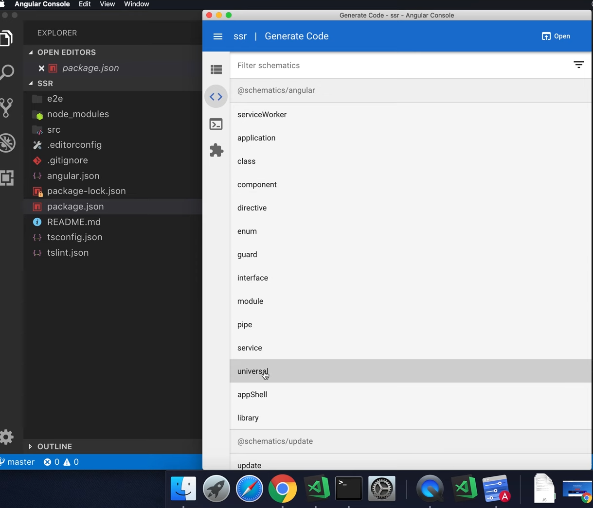
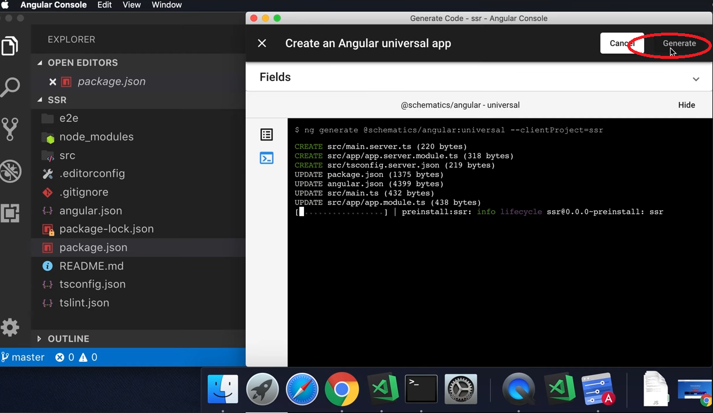
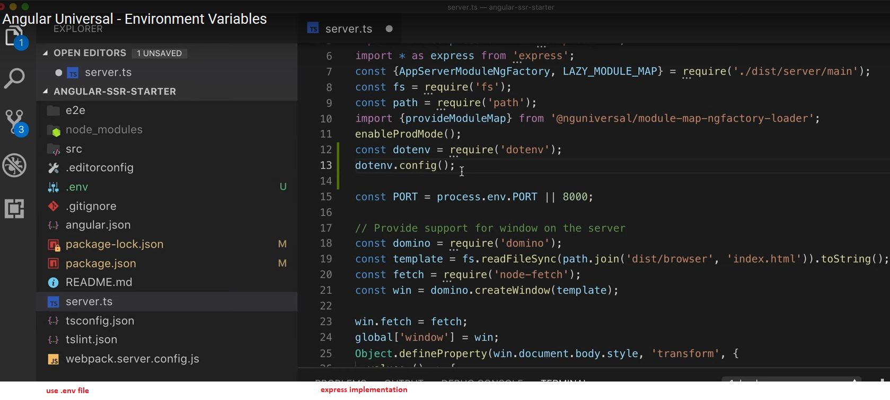
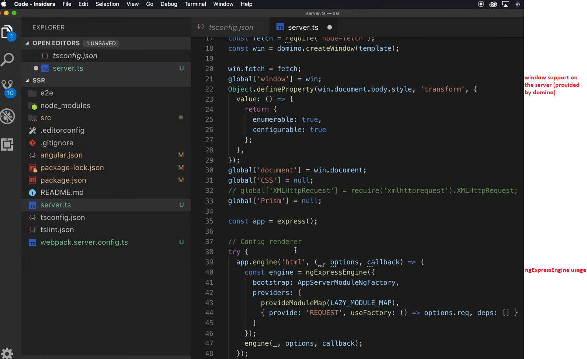
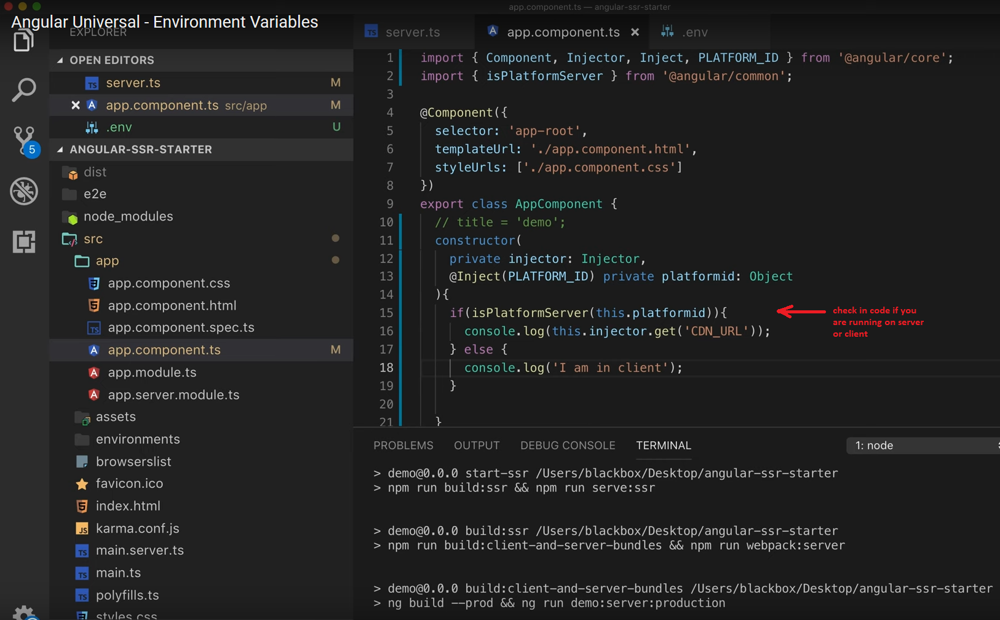

# Angular SSR / Universal

## create NG2+ project (with the CLI, as usual)

## Use Angular Console to convert to Universal project.
	Changed / New files:
	angular.json - new builder for ssr build
	package.json - new angular packages
	main.ts
	tsconfig.server.json (new file)
	app.server.module.ts
	main.server.ts
### Angular Console:

### Angular Console generates SSR code:

	
		
## install server-side support:
	$ npm i @nguniversal/express-engine --save
	$ npm i @nguniversal/module-map-ngfactory-loader --save	# lazy loading support
	$ npm i ts-loader --save-dev
	$ npm i node-fetch --save
	$ npm i compression --save

## implement server (example: https://github.com/kalyan11021980/angular-ssr-starter)
### webpack.server.config.js (with tsc (ts2js), ts-loader)
### server.ts with
	ngExpressEngine				# from @nguniversal/express-engine
	AppServerModuleNgFactory	# from ./dist/sesrver/main	created by the ng-ssr build
	provideModuleMap			# from @nguniversal/module-map-ngfactory-loader
	domino						# 'window' support on the server side
	compression					# use: app.use(compression());
	
### server.ts:

### server.ts:

### Client side determinates if SSR rendered:

	
### package.json: add new build type:
	"serve:ssr":"node dist/server.js"
	"webpack:server":"webpack --config webpack.server.config.js --progress --colors"
	"build:client-and-server-bundles":"ng build --prod && ng run ssr:server:production"	# 'ssr' is the project name (projects/ssr) in angular.js
	"bulid:ssr":npm run build:client-and-server-bundles && npm run webpack:server
	"start-ssr":"npm run build:ssr && npm run serve:ssr"

### build & run:
	$ npm run start-ssr
