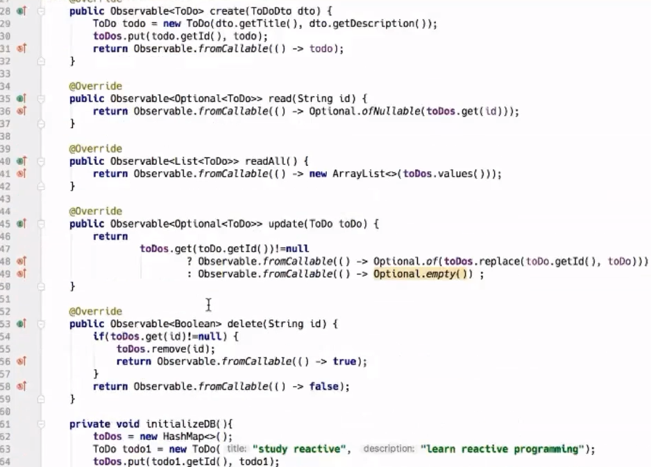

# ReactiveJ & RxJava2

### Reactive Programming
1. is Async & Non-Blocking, works with Callback(data)
2. JSR340 : Servlet 3.1. Specification, implementing non-blocking handling
    1. the older Servlet 3.0 Spec is partly async
3. advantages: less cpu/mem/time/instances/money usage!

### ReactiveJ
used best with J8. Uses
1. jetty 9: embedded reactive server. is non-blocking, starting with version 9.x, so optimal for microservices
2. gson (json2java)
3. jaxb (xml2java)
pom.xml
```xml
<dependency>
    <groupId>com.github.alessandroargentieri</groupId>
    <artifactId>ReactiveJ</artifactId>
    <version>1.0.3</version>
</dependency>
<dependency>
    <groupId>io.reactivex.rxjava2</groupId>
    <artifactId>rxjava</artifactId>
    <version>2.1.1</version>
</dependency>
```

### RxJava: io.reactivex
io.reactivex.Observable

### ReactiveJ (**without** RxJava2)
```java
//endpoints
public class MyEP extends Endpoints /*from ReactiveJ*/ {
    MyDao _dao = new NormalBlockingDaoImpl();
    //impl. CRUD actions: create, read, readAll, update, delete
    //this anno is just & only for description purposes
    @Api(path = "/api/v1/create", method="POST", consumes="application/json", produces="application/json", description="my")
    Action create = (HttpServletRequest req, HttpServletResponse res) -> {

        // this is a blocking implementation :-(

        //create: 
        Dto dto = (Dto)getDataFromJsonBodyRequest(req, Dto.class);
        Dao dao = _dao.create(dto);
        toJsonResponse(req, res, new ResponseDto(200/*status*/, dao)); //a ReactiveJ function

        /*  look here(or below) for the non-blocking impl:
        Observable.just(req)
                    .map(req -> (Dto)getDataFromJsonBodyRequest(req, Dto.class))
                    .flatMap(dto -> _dao.create(dto))
                    .subscribe(dto -> toJsonResponse(req, res, new ResponseDto(200/*status*/, dao)));
        */

        //read example:
        String id = getPathVariables(req).get("id");//get {id}
        Optional<Dao> odao = _dao.read(id);
        toJsonResponse(req, res, new ResponseDto(odao.isPresent() ?  200 : 404, odao.isPresent() ? odao.get() : "not found"));
    };

    public MyEP() {
        setEndpoint("/api/v1/delete/{id}"/*path*/, create); //example path & action
        //...other endpoints: create, read, readAll, update, delete
    }
}
//main
public static void main(String[] args) throws Exception {
    //use with postman: http://localhost:8888/api/v1/create & json body
    new ReactiveJ().port(8888).endpoints(new MyEP()).endpoints(new MyOtherEP()).start();
}
```
### ReactiveJ **with** RxJava2
```java
//endpoints
public class MyEP extends Endpoints /*from ReactiveJ*/ {
    MyDao _dao = new NonBlockingDaoImplReturningObservable(); //impl: see pic below
    //impl. CRUD actions: create, read, readAll, update, delete
    //this anno is just & only for description purposes
    @Api(path = "/api/v1/create", method="POST", consumes="application/json", produces="application/json", description="my")
    Action create = (HttpServletRequest req, HttpServletResponse res) -> {

        // this is a non-blocking implementation :-)

        //create: 
        Observable.just(req)
            .map(req -> (Dto)getDataFromJsonBodyRequest(req, Dto.class))
            .flatMap(dto -> _dao.create(dto))   //use .flatMap (not .map) because .create returns an observable
            .subscribe(dto -> toJsonResponse(req, res, new ResponseDto(200/*status*/, dao)));
        //read
        Observable.just(req)
            .map(req2 -> getPathVariables(req2).get("id"))
            .flatMap(id -> _dao.read(id))
            .subscribe(odao -> toJsonResponse(req, res, new ResponseDto(odao.isPresent() ? 200 : 404, odao.isPresent() ? odao.get() : "not found")));
        //readAll
        Observable.just(req)
            .flatMap(req2 -> _dao.readAll())
            .subscribe(daos -> toJsonResponse(req, res, new ResponseDto(200, daos)),
                      error -> toJsonResponse(req, res, new ResponseDto(200, error)));
        //update
        Observable.just(req)
            .map(req -> (Dto)getDataFromJsonBodyRequest(req, Dto.class))
            .flatMap(odto -> _dao.update(dto))
            .subscribe(odto -> toJsonResponse(req, res, new ResponseDto(200/*status*/, odao.isPresent() ? odao.get() : "not updated")));
        //del
        Observable.just(req)
            .map(req2 -> getPathVariables(req2).get("id"))
            .flatMap(id -> _dao.delete(id))
            .subscribe(re -> toJsonResponse(req, res, new ResponseDto(re ? 200 : 404, re ? "ok" : "not found")));
    };

    public MyEP() {
        setEndpoint("/api/v1/delete/{id}"/*path*/, create); //example path & action
        //...other endpoints: create, read, readAll, update, delete
    }
}
```

### Example reactive CRUD implementation


#### Example:
https://github.com/alessandroargentieri/reactive-crud-todo-app & https://github.com/alessandroargentieri/ReactiveJ


