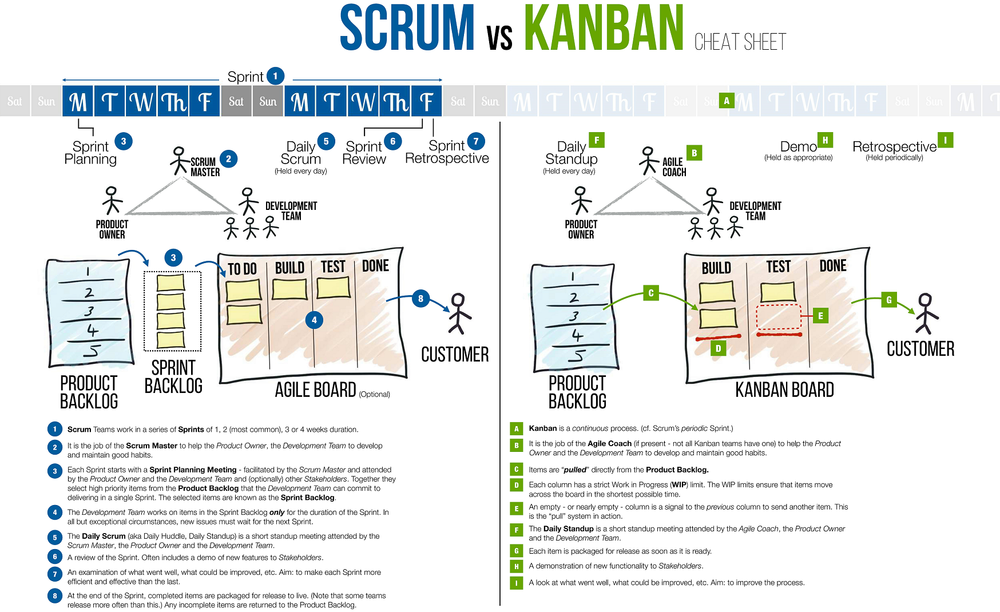

<link rel="stylesheet" href="_github-markdown.css">

# Scrum

	Waterfall = plan -> build -> test -> review -> deploy
	Waterfall is not agile enough
	Scrum = ~3week(plan + build + test + review) = potentiall shippable product
	Scrum = Sum of Sprints
	Sprint = incremental releases
		= 1 - 3 week

# 3 Roles
## Product Owner
	Defines the features
## Scrum Master
	Servant Leader to the Team
	Protects the Team and the Process
## Team

# 3 Artifacts
## Product Backlog
	Product Owner creates a prioritized list of features = user stories.
	This document changes with every sprint.

## User Stories
	Describes a feature set, with the Schema
		As a ___
		I need ___
		So that ___
	These will go to the Backlog and estimated.

## Burndown Chart
	Show the progress during the sprint.

# 3 Ceremonies
## Sprint Planning
	Discuss user stories and estimate their relative sizes.
	*Planning Poker* helps to estimate the size!

## Daily Scrum
	Brief stand-up meeting, the team discusses what they have completed, what they are working on and possible blocking points.
	Clarify: what can we do to solve blocking points?
	*Agile Board* visizalizes progress of the items.

## Sprint Review
	A retrospective, occurs at the end of the sprint.
	The team demonstrates the completed work to the Product Owner.
	Discuss what they can do to improve the process going forward.
	*Done Pile* ~= list of completed items at the end of the Sprint.

# Workflow:
	1. Start with the Product Backlog
		where the Product Owner builds a list of the bright ideas and features
		The Product Owner prioritizes the list and brings the top items to the team.
	2. Sprint planning
		Product Owner and Scrum Master discusses the top priority user stories.
		Discuss what can go into the next sprint.
	3. Maintain the Sprint Backlog
		List the user stories which are committed to for the next sprint.
	4. Sprint = 1 - 3 week time box
		with Daily Stand-up
	5. Output = potentially shippable product
	6. Sprint Review & Retrospective meeting
		The Team shows the product to the Product Owner
		What can be done to improve the process?
	
	Repeat this workflow for each Sprint.

# Kanban
	has also Backlog
	has Kanban Board (~Agile Board)
	has daily Stand-up
	has Done Pile
## Kanban's specialities of Scrum:
	There is no Sprint, no Sprint Planning, not necessarily Retrospective!
	Card of the Board flow accross the board continuously!
	No specific release day, it is up to the team to decide when to package for a release.
		(in practice, the release slightly more often than in pure Scrum)
## Kanban Board
	has often more items on the board than a Scrum-Board, because not only tasks of the current sprint are on it.
### Danger:
	1. lost effective transition from backlog to dev
	2. hard limit on WIP, too much WIP
### Solution to limit WIP:
	1. Build a Board which allows only max. 5 items in a column.
	2. talk about the work, face-to-face where possible
	3. release often
	4. regular demos to stakeholders

