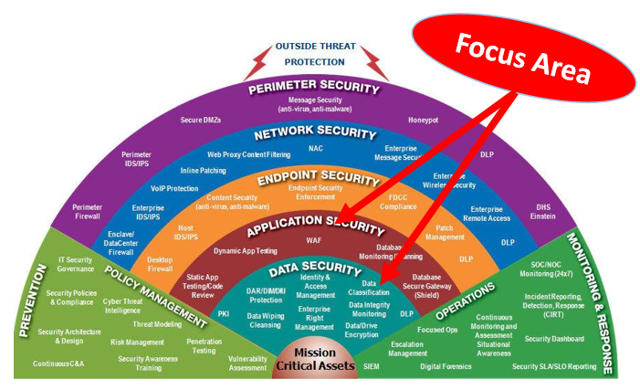

# Security Testing

Focused vulnerabilities: see  Open Web Application Security Project (OWASP) Top 10 (https://www.owasp.org/index.php/OWASP_Top_Ten_Cheat_Sheet)

Solution: not just DevOps, but SecDevOps (~AppSec)(https://docs.newrelic.com/docs/integrations/integrations-sdk/getting-started/intro-infrastructure-integrations-sdk)

Cloud Solution for SecDevOps (for a fee): New Relic

## Tools for SecDevOps
1. Rapid7 Nexpose: scan their systems for vulnerabilities (https://www.rapid7.com/products/nexpose/)
2. Suricata: This open source tool can help detect threats against your networks (https://suricata-ids.org/)
3. Claire: scan for vulnerabilities in Docker containers (https://coreos.com/clair/docs/latest/)
4. Snyk: check open source code libraries for known issues (https://snyk.io/)
5. Stethoscope: provide visibility into hardware security (https://github.com/Netflix/Stethoscope)
6. HackerOne (https://www.hackerone.com/)

## ISO
ISO/IEC 27001 documents Informationssicherheits-Managementsystems (ISMS)

## 1. First line of defense: Simple Checks at development/commit time:
1. grep for eval()
2. githook rejects commit if grep finds security hole
3. grep for concatenated SQL strings
4. grep for shell/exec
5. grep for AWS API keys

## 2. Second line of defense: on the server
1. implement on-receive hook on the code hosting machine
2. implement in the CI/CD pipeline
3. alert on sensitive file changes (eg. in encryption wrappers, auth code)
    1. can be done by simply hashing the files
    2. if you go further, allow only edit by security team
4. check for out-of-date dependencies (NodeJS has libs for this), analyze newly added dependencies (nr. of downloads etc)
    1. Node.JS: NSP, Greenkeeper.io
    2. Python: requires.io, pip --outdated
    3. Go: govend

#### CI/CD tools: Automatically run arbitrary checks on newly pushed code:
1. https://github.com/Netflix/Scumblr
2. https://github.com/salesforce/Providence

## 3. Last line of defense: Commercial static analysis tools (=SAST)

## 4. Dynamic Analysis
1. take care: often, such tools have trouble on complex/dynamic-language apps (eg. JS-heavy apps)
2. ensure security policies are enforced, eg.
    1. every new service only uses TLS with strong ciphers
    2. check headers (strong CSP), secure/httponly cookie flags
3. mozilla has automated security baseline scan for all newly deployed apps
    1. https://jvehent.github.io/continuous-security-talk ->
        1. COMMON WEBAPP VULNERABILITIES:
        2. Mozilla Web Security Guidelines: wiki.mozilla.org/Security/Guidelines/Web_Security
        3. OWASP ZAP Scanning: github.com/zaproxy/ZAP-Baseline-Scan
4. ZAP EXAMPLE IN CIRCLECI
```yaml
test:
  override:
    - docker run mozilla/cutefox &

    # pull down the ZAP docker container
    - docker pull owasp/zap2docker-weekly

    # Run ZAP against the application
    ->
        docker run -t owasp/zap2docker-weekly zap-baseline.py 
        -t http://172.17.0.2:8080/

    # Shut down the application container
    ->
        docker kill 
        $(docker ps |grep mozilla/cutefox 
        | awk '{print $1}')
```

## 5. use Mozilla Devops Tools
1. Managing secrets (https://github.com/mozilla/sops) to prevent leaks
    1. Problem: secrets in cleartext files have a bad tendency to leak
    2. Solution: SOPS - encrypt all credentials, decrypt at provisioning
2. Configuring good TLS on endpoints (https://github.com/mozilla/tls-observatory)
3. Disabling users that have left the company (https://github.com/mozilla-services/userplex)
4. Building crypto services so services don't have to manage keys (https://github.com/mozilla-services/autograph)
5. Test security groups with https://github.com/mozilla/build-fwunit

## 6. Infrastructure & Monitoring
1. eg. check SSH into servers -> Wipe and reprovision (should be easy if you use infrastructure-as-code via puppet, chef, terraform...)
2. manage secrets
    1. via puppets hiera-eyaml, chefs encrypted data bags...
    2. hashicop's vault
3. gitrob (https://github.com/michenricksen/gitrob) checks for secrets in github repos
4. use Netflix/RepoKid: observes apps & automatically removes not-needed AWS permissions
5. use Netflix/Chaos Monkey: randomly shuts down AWS instances

## 7. Detecting Attacks
1. override runtime environment to detect code injection
    1. override alert();
    2. override file-write, shell-exec
2. monitor security-tool-specific user agents
    1. sqlmap/1.0-dev.--- (http://sqlmap.org)
3. monitor access to access tokens, or copied login pages

#### Parts of Security:


#### Stages of Security Testing:


#### Kinds of Penetration Tests:


#### Penetration Tests - Workflow:

