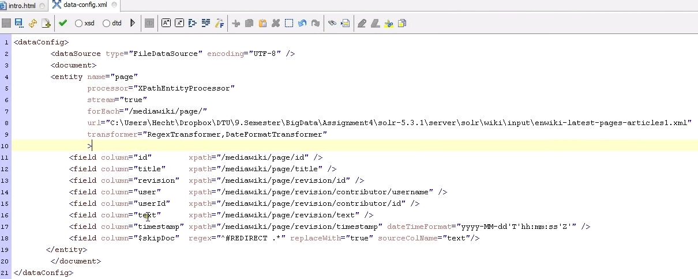

# Solr

1. engine = lucene
2. java web server based app with http interface
3. a 'core' is an index (create it in localhost:8983/ -> Core Admin (or on the CLI))

> $ bin/solr start # default port: 8983

> $ bin/solr create -c indexname

> $ bin/solr stop -all

## Config: %INDEX%/conf/schema.xml
schema.xml defines field types, incl. dynamic fields
```xml
<field name="name" type="string" indexed="true" stored="true" required="true" multiValued="false">
<!-- stored=true must be if you wanna hightlight/show value! -->
<copyField source="*" dest="_text_">
<uniqueKey>id</uniqueKey>
...
<dynamicField name="*_i" type="int" indexed="true" stored="true" />
```
## Config: %INDEX%/conf/solrconfig.xml
solrconfig.xml defines lucene index params, request handler mappings, cache & plugins
Add DataImportHandler:
```xml
<schemaFactory class="ClassicIndexSchemaFactory" /><!-- instead of ManagedIndexSchemaFactory -->
...
<lib dir="${solr.install.dir:../../../..}/dist/" regex="solr-dataimporthandler-.*\.jar" />
...
<requestHandler name="dihupdate" class="org.apache.solr.handler.dataimport.DataImportHandler" startup="lazy">
    <lst name="defaults">
        <str name="config">data-config.xml</str>
    </lst>
</requestHandler>
```
#### data-config.xml


full-import | delta-import | without param: status
> $ curl http://my:8983/solr/indexname/dihupdate?command=full-import

## indexing
indexing = post an XML
```xml
<add><doc>
    <field name="name">content</field>
```

## data import handler
indexing via pull mechanism, from DB or http-get or xml

## indexing binary documents
1. ExtractingRequestHandler, aka "Solr Cell"
2. MS Office, PDF, etc (with tika)
> $ curl 'http:/my:8983/solr/update/extract?literal.id=doc1&commit=true' -F "myfile=@my.pdf"

## Search:
> $ http://my:8983/solr/select?q=query&start=50&rows=20&fq=filter+query&facet=on&facet.field=category&sort=dist(2,point1,point2)%20desc&wt
1. wt (=writer type) defines the return type: json, xml, php, ruby, python
2. query parser:
    1. &deftype=lucene (default)
        1. q=title:saint* AND zipcode:[80000 TO 90000]
    2. &deftype=dismax
        1. q=ipod +shuffle -touch

## Advanced features:
1. spell checking (did you mean)
2. highlighting
3. more like this
    1. q=saint&mlt=true&mlt.fl=title

## Client Side lib: SolrJS (jQuery-extension)

## APIs
1. http GET/POST
2. JSON
3. SolrJ (java)
4. ruby,python,php,c#
5. integrations: drupal,rails,grails etc.

## Security
No security available

## Scaling:
### master/slave
1. index & configuration replication
2. load balanced queries
3. supported OOTB
### sharding
1. for massive indexes
2. relevancy per index and merged
3. some features not supported
