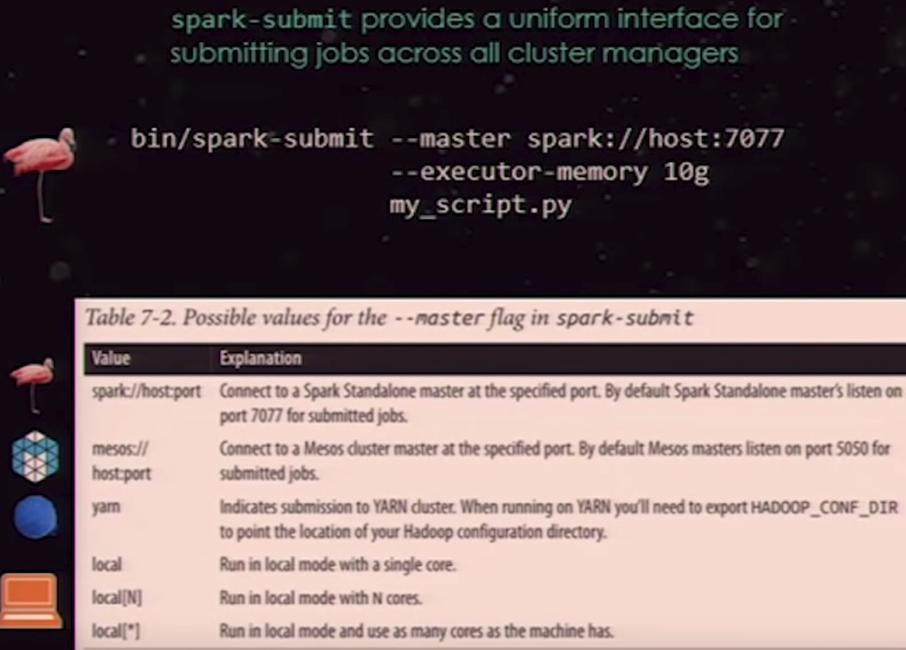
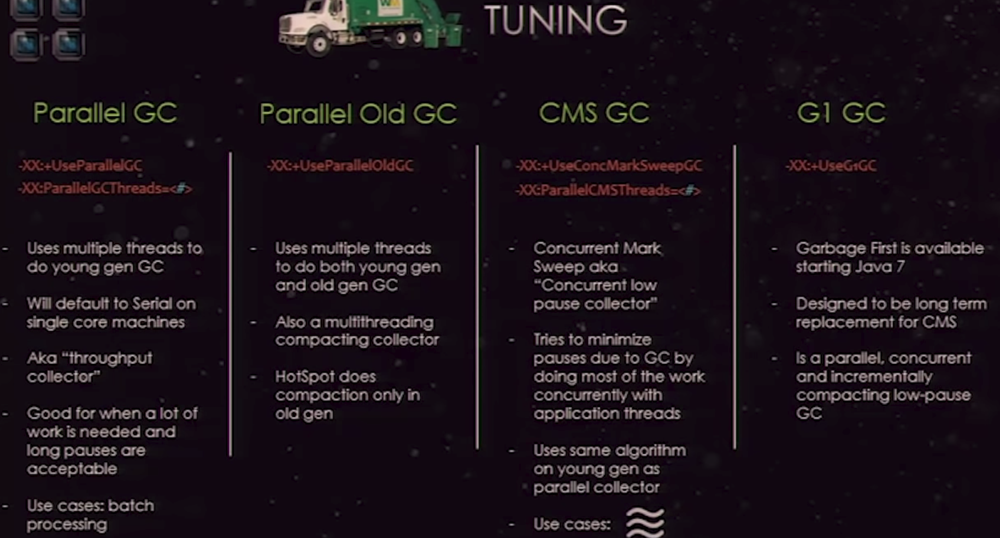

# Apache Spark
	Spark = a scala app (https://github.com/apache/spark/), with APIs in java, scala, python, r
		= distributed high performance computation engine
		= a lot faster than the traditional MapReduce of Hadoop, because in-memory as far as possible
		= has a Spark UI (web)
	Spark = Spark-SQL & Streaming & MLlib & GraphX
	https://spark-packages.org/	 = 3rd party libs
## Terms
	RDD = Resilient Distributed Dataset
		is Immutable in memory object
		is lazy & type-safe
		has partitions. more partitions -> more parallelism
	DataFrame = RDD with Schema and Optimizer
		but we lost type-safety in comparison with RDD
		cannot lambdas
	DataSet = type-safe AND has Optimizer AND can lambdas!
		(available from Spark v. 1.6)
	DAG = Directed Acyclic Graph
		= A flow control of RDDs through Transformations from Source, ending with Actions
	Transformations = change an RDD 
		e.g Map, ReduceByKey, GroupByKey, JoinByKey, SparkSQL
	Actions = lazy loaded process will be started after defining all the planned actions
		eg. Count, Take, Foreach
	DataBricks Notebook = Web based UI
	MLlib can classification, max,min,variance,correlation(eg. pearson), random forest
### Distributed Data Source is recommended, like
	hdfs/yarn
	s3
	dbfs
	hive (Spark-SQL can read hive!)
	Hadoop Input Format (eg. MongoDB, RDBMS, HBase, Neo4J, Cassandra)
## Components
	Driver Program = SparkShell or your app
		has SparkContext
	Cluster Manager coordinates the Worker Nodes
		(default from Spark or yarn)
	Worder Node with Executor and Cache and Tasks
## Flume Java
	Approach, where I write code like single-threaded, but executed on the cluster behind the scenes
### Word Count in Scala & Spark
	val conf = new SparkConf().setMaster("local[2]")
	val conf = new SparkConf().setMaster("local[2]").setAppName("my").set("spark.executor.memory", "3g")
	val sc = new SparkContext(conf)
	val lines = sc.textFile(path, 2)			# Transformation, executed in the Driver
	val words = lines.flatMap(_.split(" "))		# Transformation (split executed on workers)
	val pairs = words.map(word => (word, 1))	# behind the scenes, RDDs are used (map executed on workers)
	val wordCounts = pairs.reduceByKey(_ + _)
	val localValues = wordCounts.take(100)		# here is the code executed on the cluster!
	localValues.foreach(r => println(r))
### Shell
	./spark-shell --master local[1]		# allocate just 1 thread(=task), this is a scala shell, context is available as sc, session as spark
	./spark-shell --master local[12]	# use 12 threads, if you have 6 cores
	./spark-shell --master local[*]		# start with as many threads as there are cores (not the best, most of the time you should choose twice-core-count)
	./spark-submit --master --name "my" local[12] myapp.jar
	./spark-submit --master spark://host1:12345,host2:12345 --name "my" myapp.jar
	> val textFile = sc.textFile("r.md")	# an RDD is created with this line
	> textFile.count()					# this is an Action, returns the items in RDD
	> textFile.first()					# returns the first item
	> l = textFile.filter(line => line.contains("Spark"))	# a new RDD is created
	> l.count()
	> input.toDebugString	# display the lineage of an RDD, shows the transformation stages from the input until the RDD at the end
	> counts.toDebugString	# output RDD graph: ShuffledRDD - MappedRDD - FilteredRDD - HadoopRDD

### RDD usage example in Scala
	val rdd = sc.textFile("hdfs:/user/w.gz")	# take care: it is hard to parallelize GZIP -> you have to partition!
	val parsedRDD = rdd.flatMap { line =>
		line.split("""\s+""") match {
			case Array(project, _, numR, _) => Some((project, numR))
			case _ => None
		}
	}
	parsedRDD.filter { case (project, numR) => project == "en" }.
		reduceByKey(_ + _).
		take(100).
		foreach { case (project, numR) => println(s"$project: $numR") }

	// take care: the below version of the above is not as efficient!
	// please filter first, then reduce
	parsedRDD.reduceByKey(_ + _).
		filter { case (project, numR) => project == "en" }.
		take(100).
		foreach { case (project, numR) => println(s"$project: $numR") }

	//convert RDD to DataFrame, having columns "project" & "numR"
	val df = parsedRDD.toDF("project", "numR")
	df.groupBy($"page").
		agg(sum($"numR").as("count")).
		limit(100).
		show(100)

	//does the same with the SQL API
	df.registerTempTable("edits")
	sqlContext.sql("SELECT project, sum(numR) as count FROM edits LIMIT 100").show(100)

	// please filter first, then reduce
	//spark optimizes this automatically, sometimes in the DataFrame SQL query plan
	//	(RDD has no such optimizer)
	users.join(events, users("id") === events("uid"))
		.filter(events("date") > "2015-01-01")

	//DataFrame, as you see, is not type safe
	df.collect().map { row =>
		val project = row(0).asInstanceOf[String]
		val numR = row(1).asInstanceOf(Long)
	}

	//use Dataset from JSON input
	val df = sqlContext.read.json("p.json")
	case class P(name: String, age: Long)
	val ds = Dataset[P] = df.as[P]

	//API with RDD
	val lines = sc.textFile("hdfs://path/t.txt")
	val words = lines.flatMap(_.split("""\s+""")).filter(_.nonEmpty)
	val counts = words.groupBy(_.toLowerCase).map { case (w, all) => (w, all.size) }
	
	//API with DataSet
	val lines = sqlContext.read.text("hdfs://path/t.txt").as[String]
	val words = lines.flatMap(_.split("""\s+""")).filter(_.nonEmpty)  # is more effective, because of the Optimizer
	val count = words.groupBy(_.toLowerCase).count()

	rdd.setName("my").cache().count()	# cache (on nodes)! DS also can be cached
	
	ds.filter(e => (e.project == "en") && (!e.pageTitle.contains(":") && (!e.pageTitle.startsWith("."))).
		groupBy(_.pageTitle).
		reduce { (e1, e2) =>
			e1.copy(e1.project, e1.pageTitle, e1.numR + e2.numR)
		}.
		mape(_._2).
		toDF.				#convert DS back to DF
		orderBy($("numR".desc).
		as[Edit].
		take(100).
		foreach { e =>
			println(s"${e.pageTitle}: ${e.numR}")
		}
		
## Advanced API
	rdd = sc.parallelize(["a","b","c"])
	rdd = sc.textFile("/path")
	cleanedrdd = rdd.coalesce(2)					# specify the nr. of partitions
	rdd.collect()|.rdd.count()						# now execute the DAG!
	rdd.saveToCassandra()
	rdd = sc.cassandraTable("keyspace","table").select("col-1", "col-3").where("col-5 = ?", "blue")
	rdd.persist(MEMORY_ONLY or MEMORY_ONLY_SER, MEMORY_AND_DISK, MEMORY_AND_DISK_SER, DISK_ONLY, MEMORY_ONLY_2, MEMORY_AND_DISK_2, OFF_HEAP)
	rdd.persist(MEMORY_ONLY) == rdd.cache()			# cache is persist-into-memory
	rdd.unpersist()	# remove from memory
	# this is fast, because no shuffle(no *ByKey-calls) -> this DAG has just 1 Stage!
	sc.textFile("t.txt").map(mapFunc).flatMap(myFun).filter(fFunc).count()

### Broadcast variables
	send a large read-only lookup table to all the nodes, or send a large feature vector in a ML algorithm to all nodes
	they let keep a read-only variable cached on each machine rather than shipping a copy of it with tasks.
	Uses the bittorrent protocol (peer-to-peer, instead of the slow http protocol)
	Example: give every node a copy of a large input dataset efficiently
	val broadcastVar = sc.broadcast(Array(1,2,3))	# scala
	broadcastVar = sc.broadcast(list(range(1,4))	# python
	broadcastVar.value

### Accumulators
	they count events that occur during job execution for debugging purposes.
	they are variables that can only be added to through an associative operation
	they are used to implement counters and sums, efficiently in parallel
	Example:
		how many lines of the input file were blank?
		how many corrupt records were in the input dataset?
	scala:
		val accum = sc.accumulator(0)
		sc.parallelize(Array(1,2,3)).foreach(x => accum += x)
		accum.value
	python:
		accum = sc.accumulator(0)
		rdd = sc.parallelize([1,2,3])
		def f(x):
			global accum
			accum += x
		rdd.foreach(f)
		accum.value
	
### Tachion: TODO!

### python
	from pyspark.sql import SQLContext, Row
	array = map(lambda x: Row(key="k_%04d" % x, value = x), range(1, 5001))
	largeSchemaRDD = sqlContext.inferSchema(sc.parallelize(array))
	largeSchemaRDD.registerTempTable("largeTable")
	display(sqlContext.sql("select * from largeTable"))		# IPython has display
	
## Run types
	1. locally
		cfg: conf/spark-env.sh on each worker, with
			-SPARK_LOCAL_DIRS(comma-separated list of SSDs to be used to persist RDDs or temporary data)
			-SPARK_WORKER_CORES [def: ALL] # of corese to allow Spark apps to use on the machine
			-SPARK_WORKER_INSTANCE: [default: 1] nr of worker instances to run on each machine
			-SPARK_WORKER_MEMORY: [def: total-ram - 1 GB] memory to allow Spark apps to use on the machine
			-SPARK_DAEMON_MEMORY [def: 512 MB]
		 "spark.cores.max": max amount of CPU cores to request for the app from across the cluster
		 "spark.executor.memory": memory for each executor (a worker machine can have several executors of several tasks)
		./spark-submit --master --name "my" local[12] myapp.jar
	2. standalone scheduler	# cassandra
	3. yarn (yet another resource negotiation) with client or cluster mode
		- driver = client, which starts/uses the cluster
		- resource manager is the ~master, having scheduler and apps-master
			can become highly-available via Zookeeper
		- node manager is a worker node, having
			app-master
			container's having spark executor
		yarn settings:
			--num-executors
			--executor-memory: ram for each executor
			--executor-cores: cpu cores for each executor
			Dynamic Allocation: live change nr of executors
				spark.dynamicAllocation.enabled
				spark.dynamicAllocation.minExecutors
				spark.dynamicAllocation.maxExecutors
				spark.dynamicAllocation.sustainedSchedulerBacklogTimeout
				spark.dynamicAllocation.schedulerBacklogTimeout
				spark.dynamicAllocation.executorIdleTimeout
		UI: yarn resource manager UI: port: 8088
		CMD: (client-mode)
		./spark-submit --class org.apache.spark.examples.SparkPi --deploy-mode client --master yarn /opt/cloudera/parcels/jars/spark-examples.jar 10
	4. Mesos, with master and slaves
		./spark-submit with --master mesos://...
	
### Types of RDD
	HadoopRDD, FilteredRDD, SchemaRDD, UnionRDD, JdbcRDD, JsonRDD, EdgeRDD, CassandraRDD, GeoRDD, EsSpark, ...
	type(myrdd)
	
	RDD operation types - lineage dependencies:
	A. narrow dependencies, narrow transformations
		1. map, filter - 1:1 operation
		2. union
		3. join with inputs co-partitioned
	B. wide dependencies, wide transformations;	Requires shuffle! - expensive!
		0. coalesce (repartition just calls coalesce)
		1. groupByKey, combineByKey
		2. join with inputs not co-partitioned
		3. transformations that use "numPartitions" like distinct will probably shuffle
			def distinct(numPartitions: Int)(implicit ord: Ordering[T] = null): RDD[T] =
				map(x => (x, null)).reduceByKey((x, y) => x, numPartitions).map(_._1)
				
	
### Configuration
	0. defaults
	1. CMD params
	2. spark-env.sh
	3. in your code
	
	Recommended:
		max. 75% of machine memory for spark
		min. executor heap size should be 8 GB
		max. executor heap size depends, maybe ca. 40 GB
			(GC can take too long if heap too large)
			
	Use kryo as serializer (faster than the standard JVM serializer)
		conf.set("spark.serializer", "org.apache.spark.serializer.KryoSerializer")
		BUT: Kryo does not support all types out-of-the-box!
		conf.registerKryoClasses(Seq(classOf[MyClass1], classOf[MyClass2])
		"spark.kryoserializer.buffer.mb" [def: 2] needs to be large enough to hold the largest object to be serialized
		(PySpark: always pickle is used to serialize)
		
	Tune GC of JVM: use parallel, parallel-old, cms or G1:

### Spark  UI
	port: 4040 / 7080 / 7081	# driver, master and worker have UIs
	lists running workers & apps, incl details and (RDD-)Storage
	lists worker running jobs running stages running tasks
	
## Lifecycle of a Spark Program:
	1. create input RDD from external data or parallelize a collection in your driver program
	2. lazily transform to new RDDs (eg. .filter() or .map())
		transform functions are eg.:
			map(), flatMap, filter, sample, union, intersection, distinct, groupByKey, reduceByKey, pipe,
			coalesce, join, sortByKey, cogroup, partitionBy ...
	3. ask Spark to .cache() intermediate RDDs that will need to be reused
	4. launch actions such as .count() and .collect() to kick of the parallel computation
		action functions are eg.:
			reduce(), collect, count, first, take, takeSample, saveToCassandra, takeOrdered, saveAsTextFile,
			countBykey, foreach()
