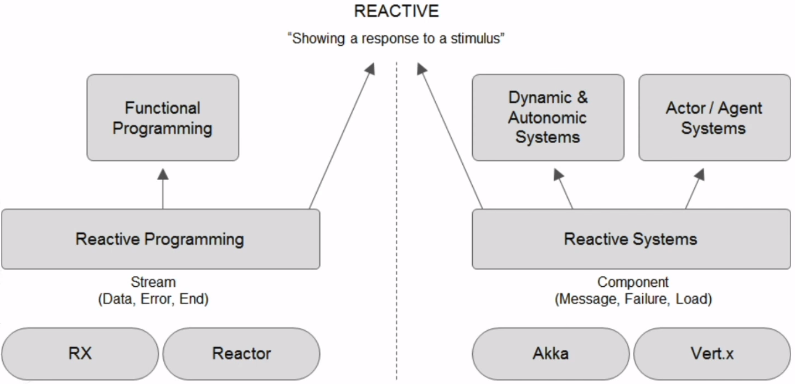
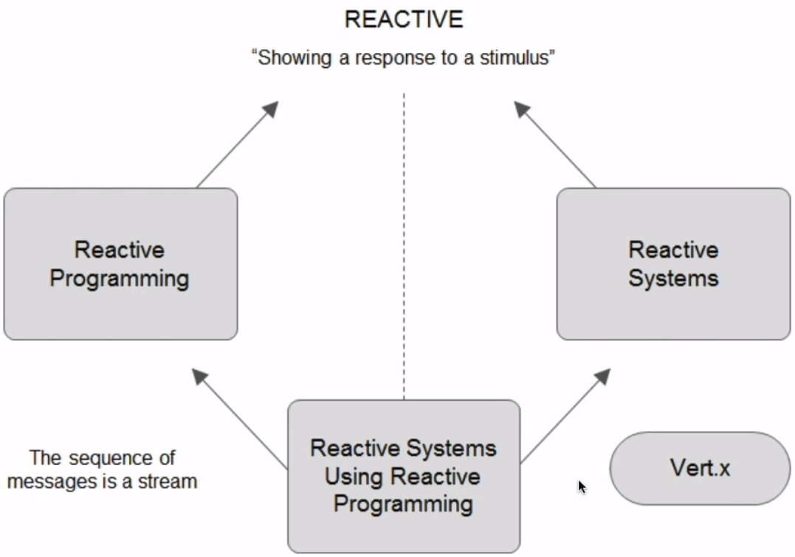
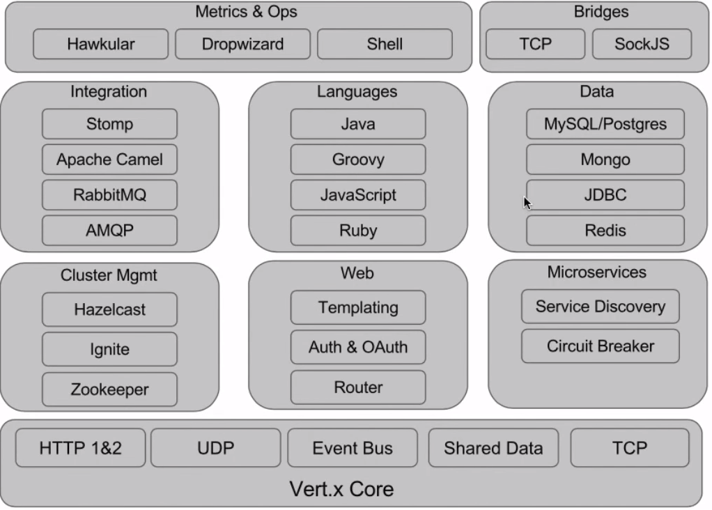

# vert.x - Reactive Microservices on the JVM
    Reactive Systems are responsive, elastic, message-driven(async, only in-memory), resilient
    The Idea is from NodeJS :-) , but partly better (often can use more-than-one core!)
    Interaction uses vertx.EventBus works within or across JVMs
    web: http://vertx.io/
    Is polyglot: java, js, groovy, ruby... (everything running on the JVM)
    Is Event-Driven, has Event-Loop(using only one thread) like NodeJS
    Management and Monitoring built-in (eg. JMX)
    Not durable (if you need, you have to use a 3rd party client (for Kafka or RabbitMQ))
    Use on Java-8 (because you will use a lot of lambdas!)

## most basic Example:
#### in Java
```java
import io.vertx.core.Vertx;
import io.vertx.ext.web.Route;
public class My extends io.vertx.core.AbstractVerticle {
    @Override
    public void start() throws Exception {
        vertx.createHttpserver().requestHandler(req -> req.response().end("hi")).listen(8888);
    }
}
```
#### in JS (running on Nashorn (->JVM))
```js
vertx.createHttpServer().requestHandler(function (req) {
    rq.response.end("hi");
}).listen(8888);
```

### Build & Run
```sh
# mvn plugin generates a default vertx app
mvn io.fabric8:vertx-maven-plugin:1.0.5:setup
    -DprojectGroupId=io.vertx.microservice
    -DprojectArtifactId=my
    -Dverticle.io=my.My
    -Ddependencies=web
mvn compile vertx:run -Dvertx.runArgs="-cluster -Djava.net.preferIPv4Stack=true"

# Alternative: vertx CLI can run from java/js/... source!
vertx run My.java
vertx run My.js -cluster -Djava.net.preferIPv4Stack=true
# Alternative: plain java cli call:
java -jar target/my-1.0-SNAPSHOT.jar --cluster -Djava.net.preferIPv4Stack=true
```

## Example 2:
```java
public class My extends AbstractVerticle {
    @Override
    public void start() throws Exception {
        Router r = Router.router(vertx);
        //GET: use .end because we dont stream
        router.get("/api/a:param").handler(ctx -> ctx.response().end(myLongRunningFunc()));
        //GET: if you block, you have to do that explicitely (alternative for blocking calls: use Worker vertical)
        router.get("/api/b:param").blockingHandler(this::myLongRunningBlockingFunc, false);

        //POST
        router.post("/throw").handler(request -> { throw new RuntimeException("ohh no");});

        //serve static resources
        router.route("/static/*").handler(StaticHandler.create("static"));

        //simple:
        //vertx.createHttpserver().requestHandler(router::accept).listen(8888);
        //advanced:
        vertx.createHttpserver().requestHandler(router::accept).listen(8888, result -> {
            if(result.succeeded())
                future.complete();
            else
                future.fail(result.cause());
        });
    }
    private void myLongRunningBlockingFunc(RoutingContext ctx) {
        //...
        String param = ctx.pathParam("param");
        JsonObject j = new JsonObject().put("msg", param);
        ctx.response().putHeader(Httpheaders.CONTENT_TYPE, "application/json").end(json.encore());
        //ctx.response().end(myResult);
    }
    private String myLongRunningFunc() {
        //...
        return myResult;
    }
}
```

## Publisher / Consumer
#### in Java
```java
public class MyPublisher extends io.vertx.core.AbstractVerticle {
    @Override
    public void start() throws Exception {
        vertx.setPeriodic(1111/*delay*/, id -> {
            //...
            vertx.eventBus().publish("my-feed"/*address*/, "msg");
        });
    }
}
public class MyConsumer extends io.vertx.core.AbstractVerticle {
    @Override
    public void start() throws Exception {
        vertx.eventBus().consumer("my-feed"/*address*/).handler(this::consume);
    }
    private void consume(Message<String> msg) {
        String sMsg = msg.body();
    }
}
```
#### in Ruby
```ruby
#Publisher
eb = $vertx.event_bus()
$vertx.set_periodic(1111) { |v|
    eb.publish("my-feed", "hi")
}

#Consumer
eb = $vertx.event_bus()
eb.consumer("my-feed") { |msg|
    puts "#{msg.body()}"
}
```

### Building Blocks:
#### Maven
```xml
<dependency>
    <groupId>io.vertx</groupId>
    <artifactId>vertx-web</artifactId>
    <version>3.5.1</version>
```
#### Java
```java
public class My {
    public static void main(String[] args) {
        Vertx vertx = Vertx.vertx();
        HttpServer s = vertx.createHttpServer();

        Router rCanOnlyGET = Router.router(vertx).route().method(HttpMethod.GET);
        Router r = Router.router(vertx);

        //accepts all request types (GET, POST...)
        Route handler1 = r.route("/").handler(routingContext -> {
            HttpServerResponse res = routingContext.response();
            if(bStream) {
                res.setchunked(true);//if you stream!
                res.write("response");
                //wait 1 sec until next
                routingContext.vertx().setTimer(1111, tid -> routingContext.next());
            } else {
                //direct response:
                res.putHeader("content-type","text/plain");
                res.end("response!");
            }
        });
        //second handler for the same route!
        Route handler2 = r.route("/").handler(routingContext -> {
            HttpServerResponse res = routingContext.response();
            res.setchunked(true);
            res.write("response 2");
            res.end();
        });

        //POST
        Route handler3 = r.post("/post/:param")
            .consumes("*/json") //accepts only json
            .handler(routingContext -> {
                res.putHeader("content-type","text/plain");
                res.end("response! " + routingcontext.request().getParam("param"));
        });

        s.requestHandler(router::accept).listen(8091);
    }
}
```
## Event Bus
    Distributed Event Bus allows communication across JVMs or complete machines.
    Both request/response and publish/subscribe
    All Vert.x instances have access to the event bus
    Verticles interact using messages
    Events/Messages are received by Handlers
```java
public class My {
    public static void main(String... args) {
        Vertx v = Vertx.vertx();
        v.deployVerticle(new MyEchoVerticle());
        v.deployVerticle(new MyWebVerticle());
    }
}
public class MyEchoVerticle extends io.vertx.core.AbstractVerticle {
    @Override
    public void start() {
        vertx.eventBus().consumer("my-feed", msg -> {
            JsonObject j = (JsonObject)msg.body();
            j.put("k2","v2");
            msg.reply(j);
        })
    }
}
public class MyWebVerticle extends io.vertx.core.AbstractVerticle {
    @Override
    public void start() {
        vertx.createHttpServer().requestHandler(req -> {
            JsonOjbect msg = new JsonObject().put("k1","v1");

            vertx.eventBus().send("my-feed", msg , reply-> {
                JsonObject j = (JsonObject)reply.body();
                j.put("k3","v3");
                req.response().end(j.encodePrettily());
            });
        });

        //alternative:
        vertx.createHttpServer().requestHandler(new RequestHandler()).listen(8888);
    }
    private class RequestHandler implements Handler<HttpServerRequest> {
        @Override
        public void handle(HttpServerRequest r) {
            //vert.x has RxJava API too!
            //RxJava to combine observables
            Observable<Message<String>> reply1 = vertx.eventBus().sendObservable("feed1", "msg1");
            Observable<Message<String>> reply2 = vertx.eventBus().sendObservable("feed2", "msg2");

            Observable.zip(reply1, reply2, (Message res1, Message res2) -> res1.body() +" & "+ res2.body())
                .subscribe(combinedResult -> vertx.eventBus().sendObservable("feed3", combinedResult)
                .subscribe(reply3 -> request.response().end(reply3.body())));

            //the same as one-liner:
            vertx.eventBux().sendObservable("feed1","msg1")
                .zipWith(vertx.eventBus().sendObservable("feed1","msg1"),
                (Message res1, Message res2) -> res1.body() +" & "+ res2.body())
                .subscribe(combinedResult -> vertx.eventBus().sendObservable("feed3", combinedResult)
                .subscribe(reply3 -> request.response().end(reply3.body())));
        }
    }
}
```

### EventBus into the Browser
```java
public class My {
    public static void main(String... args) {
        VertxOptions o = new VertxOptions().setClustered(true).setClusterHost("localhost");
        Vertx.clusteredVertx(o, resultHandler -> {
            Vertx v  = resultHandler.result();
            v.deployVerticle(new SockJSEventBusBridge());
            v.deployVerticle(new MyPeriodicVerticle());
            v.deployVerticle("js/my.js");
        });
    }
}
public class SockJSEventBusBridge extends io.vertx.core.AbstractVerticle {
    @Override
    public void start() {
        Router r = Router.route(vertx);
        BridgeOptions o = new BridgeOptions().addOutboundPermitted(new PermittedOptions().setAddress("feed"));
        r.route("/eventbus/*").handler(SockJSHandler.create(vertx).bridge(o));
        r.route().handler(StaticHandler.create("static"));
        vertx.createHttpServer().requestHandler(r::accept).listen(8888);
    }
}
public class MyPeriodicVerticle extends io.vertx.core.AbstractVerticle {
    @Override
    public void start() {
        vertx.setPeriodic(1111, t -> 
        vertx.eventBus().publish("feed", "msg-from-java"));
    }
}
```
#### js/my.js
```js
vertx.setPeriodic(1111, function(id) {vertx.eventBus().publish("feed", "msg-from-js"); });
```

#### html for the browser, incl. client-side JS
```html
<script src="sockjs.js">
<script src="vertx-eventbus.js">
<script>
var eb = new EventBus("http://localhost:8888/eventbus");
eb.onopen = function() {
    eb.registerHandler("feed", function(err, msg) {
        alert(msg.body);
    }
}
</script>
```

## Microservices
    Microservice = small, runs in its own process, is distributed, is independent
    Microservice ~ Vert.x module
    Deployment tooling: https://github.com/msoute/vertx-deploy-tools
        Controlled from Jenkins

### Examples
    https://github.com/bertjan/vertx3-examples
    https://github.com/vert-x3/vertx-examples

## Advanced stuff
### ServiveDiscovery
```java
ServiceDiscovery discovery = ServiceDiscovery.create(vertx);
HttpEndpoint.rxGetWebClient(discovery,
        rec -> rec.getName().endsWith("my") // This method is a filter to select the service
    )
    .flatMap(client ->
        // We have retrieved the WebClient, use it to call the service
        client.get("/").as(BodyCodec.string()).rxSend()
    )
    .subscribe(response -> System.out.println(response.body()));
```
```java
@Override
public void start()
{
    Router router = Router.router(vertx);
    router.get("/").handler(this::my);
    // Create the service discovery instance
    ServiceDiscovery.create(vertx, discovery -> {
        // Look for an HTTP endpoint named "my" // you can also filter on 'label'
        Single<WebClient> single = HttpEndpoint.rxGetWebClient(discovery, rec -> rec.getName().equals("my"), new JsonObject().put("keepAlive", false));
        single.subscribe(client -> {
                // the configured client to call the microservice
                this.myClient = client;
                vertx.createHttpServer().requestHandler(router::accept).listen(8080);
            },
            err -> System.out.println("Oh no, no service")
        );
    });
}
```
```java
//publish a service:
ServiceDiscovery discovery = ServiceDiscovery.create(vertx);
vertx.createHttpServer()
    .requestHandler(req -> req.response().end("my"))
    .rxListen(8083)
    .flatMap(
    // Once the HTTP server is started (we are ready to serve), we publish the service.
    server -> {
        // We create a record describing the service and its location (for HTTP endpoint)
        Record record = HttpEndpoint.createRecord(
            "my",                   // the name of the service
            "localhost",            // the host
            server.actualPort(),    // the port
            "/"                     // the root of the endpoint
        );
        // We publish the service
        return discovery.rxPublish(record);
    }
 ).subscribe(rec -> System.out.println("Service published"));
```
#### CI/CD pipeline can be built with
1. jenkins
2. fabric8.io

### Circuit Breaker
**NOTE** : "Failing is OK, Waiting is not!"
```java
CircuitBreakerOptions options = new CircuitBreakerOptions()
    .setMaxFailures(5)              // Number of failures before switching to the 'open' state
    .setTimeout(5000)               // Time before attempting to reset the circuit breaker
    .setResetTimeout(5555)
    .setFallbackOnFailure(true);    // Call the fallback on failures

CircuitBreaker breaker = CircuitBreaker.create("my-circuit-breaker", vertx, options) .openHandler(v -> {
        System.out.println("Circuit opened");
    }).closeHandler(v -> {
        System.out.println("Circuit closed");
    });

Future<String> result = breaker.executeWithFallback(future -> {
    vertx.createHttpClient().getNow(8080, "localhost", "/",
        response -> {
            if (response.statusCode() != 200) {
                future.fail("HTTP error");
            } else {
                response.exceptionHandler(future::fail).bodyHandler(buffer -> {
                    future.complete(buffer.toString());
                });
            }
        });
        }, v -> {
            // Executed when the circuit is opened
            return "my (fallback)";
        }
    );
//Alternative: Circuit Breaker with RxJava:
breaker.rxExecuteCommandWithFallback(
    future ->
        client.get(path)
            .rxSend()
            .map(HttpResponse::bodyAsJsonObject)
            .subscribe(future::complete, future::fail),
        t -> new JsonObject().put("message", "D'oh! Fallback")
    ).subscribe(
        json -> {
            System.out.println(json.encode());// Get the actual json or the fallback value
        }
    );
//alternative: handle rxSend-errors this way, not in .subscribe(ret -> {...}, err -> {...}):
    .onErrorReturn(t -> {
        // Called if rxSend produces a failure, We can return a default value
        return new JsonObject();
    });

```
### Health check
```java
HealthCheckHandler hch = HealthCheckHandler.create(vertx);
hch.register("db-connection", future -> {
    client.rxGetConnection()
        .subscribe(c -> {
                future.complete();
                c.close();
            },
            future::fail
        );
    });
// A second (business) procedure
hch.register("business-check", future -> {
 // ...
});
// Map /health to the health check handler
router.get("/health").handler(hch);
```
### Vert.x with RxJava
```java
private void invokeMyFirstMicroservice(RoutingContext rc)
{
    HttpRequest<JsonObject> request1 = client.get(8080, "localhost", "/my1").as(BodyCodec.jsonObject());
    HttpRequest<JsonObject> request2 = client.get(8080, "localhost", "/my2").as(BodyCodec.jsonObject());

    //rxSend ... simple
    Single<JsonObject> s1 = request1.rxSend().map(HttpResponse::body);
    Single<JsonObject> s2 = request2.rxSend().map(HttpResponse::body);

    //rxSend ... advanced: with timeout & retry
    Single<JsonObject> obs1 = bus.<JsonObject>rxSend("my", "my1")
        //Without this subscribeON, the methods would be executed by a thread
        //from the default RxJava thread pool, breaking the Vert.x threading model
        .subscribeOn(RxHelper.scheduler(vertx)) 
        .timeout(3, TimeUnit.SECONDS)
        .retry()
        .map(Message::body);

    Single.zip(s1, s2, (my1, my2) -> {
        // We have the results of both requests in my1 and my2
        return new JsonObject()
            .put("my1", my1.getString("message"))
            .put("my2", my2.getString("message"));
    }).subscribe(
        result -> rc.response().end(result.encodePrettily()),
        error -> {
                error.printStackTrace();
                rc.response().setStatusCode(500).end(error.getMessage());
            }
    );

//RxJava with EventBus
    EventBus bus = vertx.eventBus();
    Single<JsonObject> obs1 = bus.<JsonObject>rxSend("my", "my1").map(Message::body);
    Single<JsonObject> obs2 = bus.<JsonObject>rxSend("my", "my2").map(Message::body);
    Single.zip(obs1, obs2, (my1, my2) ->
        new JsonObject().put("my1", my1.getString("message")).put("my2", my2.getString("message"))
    )
    //.subsribe - alternative 1
    .subscribe(
        x -> System.out.println(x.encode()),
        Throwable::printStackTrace);
    //.subsribe - alternative 2
    .subscribe(
        x -> req.response().end(x.encodePrettily()),
        t -> {
            t.printStackTrace();
            req.response().setStatusCode(500).end(t.getMessage());
        }
    );
}
```
#### use Redis in Vertx Callback:
```java
RedisClient redis;
@Override
public void start() throws Exception {

    //...router

    ServiceDiscovery.create(vertx, discovery -> {
        //straight: Maven-dependency: <artifactId>vertx-redis-client
        RedisDataSource.getRedisClient(discovery, rec -> rec.getName().equals("redis"), ar -> {
            if(ar.failed())
                //handle err!
            else
                this.redis = ar.result();
                //...vertx.createHttpServer
        });
    });
//alternative: do with RxJava
    ServiceDiscovery.create(vertx, disovery -> {

        Single<Webclient s1 = HttpEndpoint.rxWebClient(discovery, rec -> rec.getName().equals("myservice1"));
        Single<Webclient s2 = HttpEndpoint.rxWebClient(discovery, rec -> rec.getName().equals("myservice2"));
        Single.zip(s1, s2, (p1, p2) -> {
            this.myService1 = p1;
            this.myService2 = p2;
            //...vertx.createHttpServer
        }).subscribe();
    });
}

private void getMy(RoutingContext rc) {

    redis.hgetall(/*key*/"MY", json -> {
        if(json.failed())
            rc.fail(500/*statusCode*/);
        else
            rc.response().end(json.result().encodePrettily());
    });
//alternative: do it with RxJava
    HttpServerResponse serverResponse = rc.response().setChunked(true);
    Single<JsonObject> single = this.myService1.get("/my")
        .rxSend()
        .map(HttpResponse::bodyAsJsonObject);
    single.flatMapPublisher(
        json -> Flowable.fromIterable(json) //Flowable can backpressure
    )
//alternative 1: simple
    .flatMapSingle(entry -> getMyResult(this.myService2, entry))//getMyResult just calls the service, as here above
//alternative 2: with circuitBreaker:
    .flatMapSingle(entry -> {
        circuitBreaker.rxExecuteCommandWithFallback(
            future -> {
                getMyResult(this.myService2, entry, future)
            },
            err -> getMyDefaultFallbackResult(entry)
        );
    })
//alternative 2 end
    .subscribe(
        json -> serverResponse.write(json),             //onNext
        rc::fail,                                       //onError
        () -> serverResponse.end();                     //onComplete
    );
}
public static void getMyResult(WebClient myService, Map.Entry<String, Object> entry, Future<JsonObject> future) {
        myService.post("/myservice")
            .rxSendJson(new JsonObject()
                .put("name", entry.getKey())
                .put("quantity", entry.getValue())
            ).subscribe(
            resp -> future.complete(resp.bodyAsJsonObject()),
            future::fail
        );
    }

    public static Single<JsonObject> getMyResult(WebClient myService, Map.Entry<String, Object> entry) {
        return myService.post("/myservice")
            .rxSendJson(new JsonObject()
                .put("name", entry.getKey())
                .put("quantity", entry.getValue())
            )
            .map(HttpResponse::bodyAsJsonObject);
    }
```
#### Dockerfile
```sh
FROM java:8-alpine
EXPOSE 8080
COPY target/*.jar /my/
WORKDIR /my
CMD java -jar *.jar -Dvertx.cacheDirBase=/tmp
```

#### Tests
1. use vert.x unit(?5)
2. use waitability

#### Vertx. Integrations
Integrations exist with AMQP, Mongo, Camel, Kafka

#### Addons:
Maven: 
```xml
<artifactId>vertx-redis-client
<artifactId>vertx-web
<artifactId>vertx-service-discovery
<artifactId>vertx-service-discovery-bridge-kubernetes <!-- Kubernetes integration -->
```

### Types of reactive


### Types of reactive systems:


### Vertext Architecture

