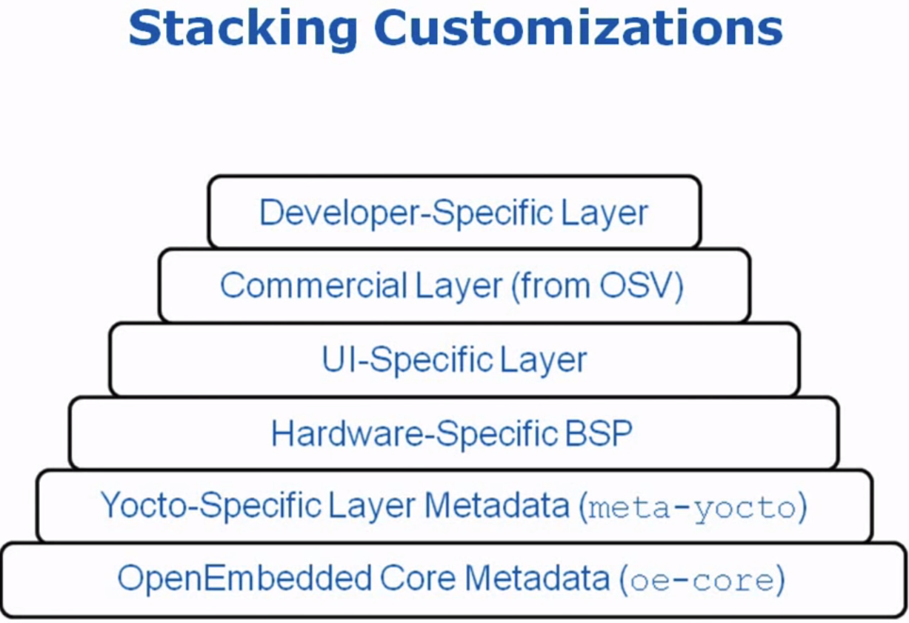

# Yocto
Build you own Linux!
https://www.yoctoproject.org
Based on open-embedded
Has Eclipse-Plugin
## Definitions
### Poky = BitBake + Metadata
1. Poky = build ystem used by yocto
2. BibBake = task executor & scheduler
3. Metadata = task definitions
    1. Configuration (.conf) global definitions of variables
    2. Classes (.bbclass) encapsulation & inheritance of build logic, packaging etc.
    3. Recipes (.bb) the logical units of software/images to build = as set of instructions for building packages, definining:
    - 1. where to obtain the upstream sources and which patches to apply
    - 2. dependencies (on libs or other recipes)
    - 3. configuration/compilation options
    - 4. define what files go into what output packages
### Build Flow = Poky Build
1. Download packages = fetching the sources (tarball from http or git-checkout)
2. extract & apply patches
3. package generation (.deb or .rpm or .ipk)
4. Test execution
5. generate package feeds (can be helpful for update packages)
6. generate root filesystem image (and SDKs are also generated)
## Workflow
1. obtain sources
    1. download poky-edison-6.0.tar.bz2
    2. tar xjf poky-edison-6.0.tar.bz2
    3. cd poky-edison-6.0
        1. ./bitbake
        2. ./documentation
        3. ./meta: contains the
            1. ./recipes* (eg. ./meta/recipes-core/busybox/busybox.1.18.5.bb) and the 
            2. ./classes/*.bbclass, and the
            3. ./conf/*.conf incl subdir /machine/
        4. ./meta*
        5. ./scripts/
        6. ./build/ contains downloaded files, caches, ./tmp,
            1. ./conf with
                1. bblayers.conf : list which bbfiles & bblayers do you want to use
                2. local.conf : define target system, packaging format, etc
2. build a linux image
    1. source oe-init-build-env
    2. MACHINE=qemux86
    3. bitbake core-image-minimal
3. run the image under emulation
    1. runqemu qemux86
## Example flow:
```sh
source oe-init-build-env    # changes into the build dir
# edit local.conf & specify target machine
 vim conf/local.conf
    MACHINE ??= "qemux86"
    BB_NUMBER_THREADS = "2"
    PARALLEL_MAKE = "-j 4"
bitbake core-image-minimal      # takes ca. 1 hour
# ...result is on tmp/deploy/images/*.bin
runqemu qemux86 # boots the created linux (root has by default no pwd, just hit [ENTER])
    $ shutdown -h now   # inside of the new prompt, shuts down the started image
```
## bb file structure
    eg. ethtool_2.6.36.bb or psplash_git.bb (defines the os splash)
```sh
SUMMARY = "..."
DESCRIPTION = "..."
HOMEPAGE = "..."
LICENSE = "GPLv2+"
SRC_URI = "${SOURCEFORGE_MIRROR}/gkernel/ethtool-${PV}.tar.gz \
    file://mypatch.patch"
BBCLASSEXTEND = "native nativesdk"
INITSCRIPT_NAME = "psplash.sh"
INITSCRIPT_PARAMS = "start 0 S . stop 20 0 1 6 ."
inherit autotools gettext
```
    PV = Package Version, is the filename part after the >_<
    Other entries are possible, like DEPENDS, SECTION, ...
    Other part of the file:
    1. do_install() to override standard build step
    2. hooks, eg. do_configure_prepend() (=runs before configure step), or do_install_append()
    like:

```sh
do_install_append() {
    # comment
    oe_libinstall -so -C shlib libhistory ${D}${libidr}
}
do_install() {
    for d in doc extras man lib src: do make -C $d DESTDIR=${D} install; done
}
do_configure_prepend() {
    install -m 0644 ${WORKDIR}/my.m4 ${S}
}
```
    a Subdir of the .bb file can contain patches (.patch; has to be listed in SRC_URI)
## Layers
1. The Yocot build system is composed of layers.
2. A layer is a logical collectins of recipes representing the core, a Board Support Package (BSP), or an applicatin stack
3. All layers have a priority and can override policy and config settings of the layers beneath it
4. eg. a hardware device definition is distributed as a layer
### Handle a layer
1. a layer is to be enabled in the bblayers.conf
2. a layer can sit on top of other layers:

### BSP
1. Board Support Packages (BSP) are layers to enable support for specific hardware platforms
2. defines machine configuration for the board
3. adds machine-specific recipes and customizations, including
    1. kernel config
    2. graphics drivers (eg. Xorg)
    3. additional recipes to support hardware features

#### Obtaining and enabling a BSP

1. search for the BSP under www.yoctoproject.org/download/
2. download *.tar.bz2 file
3. unpack tarball: tar xvjf *.tar.bz2
    1. check README
    2. check conf/layer.conf
4. ´source oe-init-build-env´
5. vim conf/bblayers.conf   # add the ABS PATH of the new BSP!
    BBLAYERS = " \
        /home/yocto/poky-edison-6.0/meta \
        /home/yocto/poky-edison-6.0/meta-yocto \
        /home/yocto/mybsp \
        "
6. set in local.conf the MACHINE variable appropriately
7. ´bitbake core-image-minimal´
