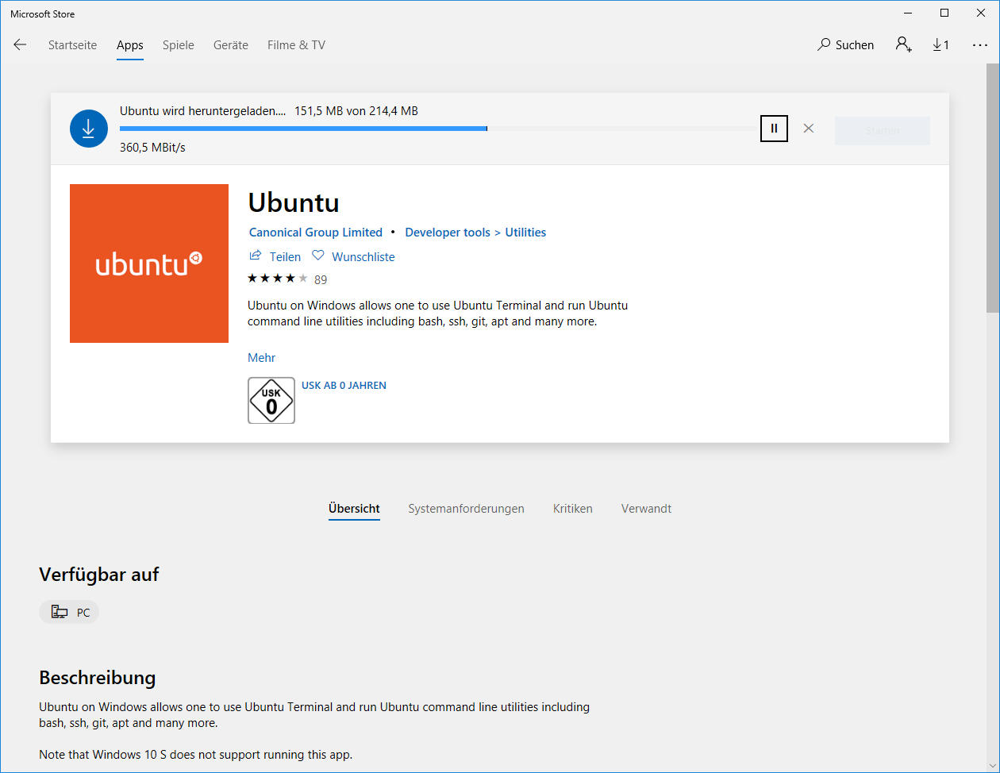
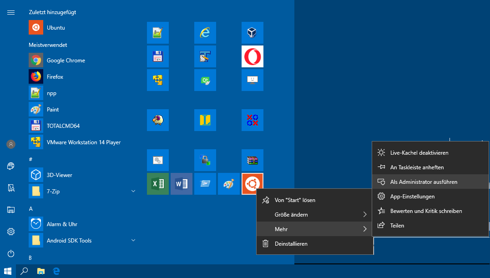
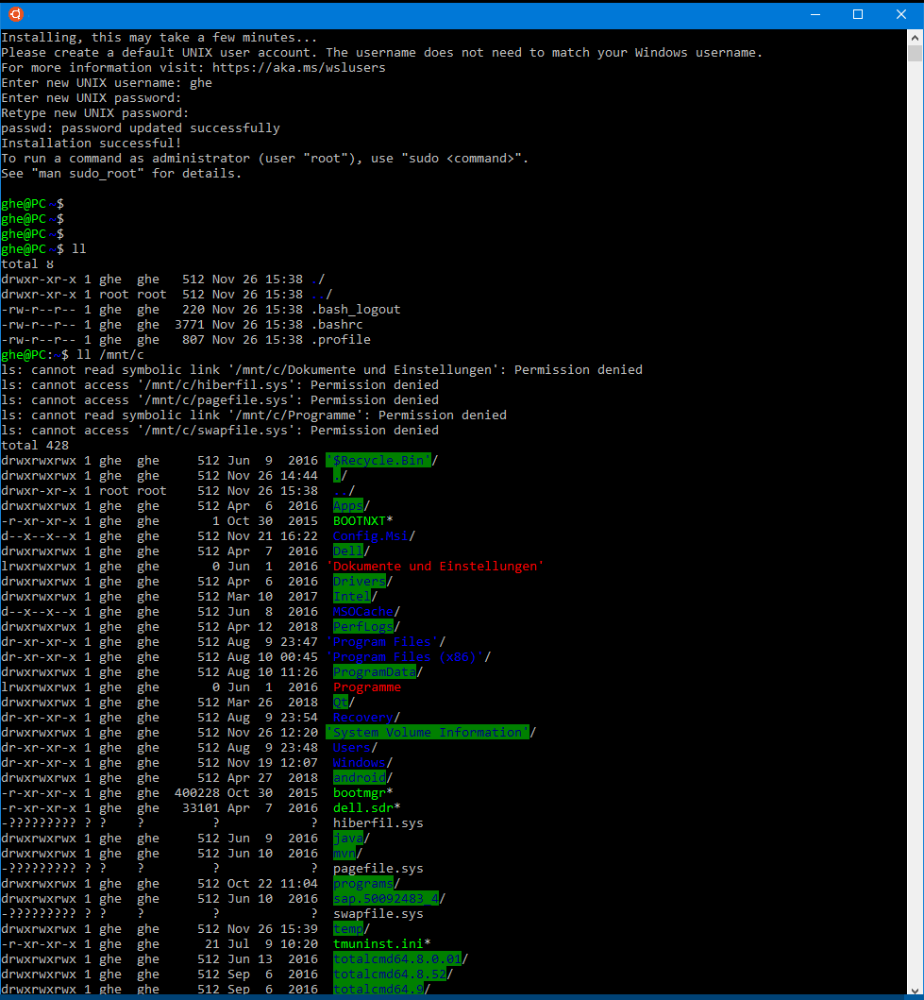
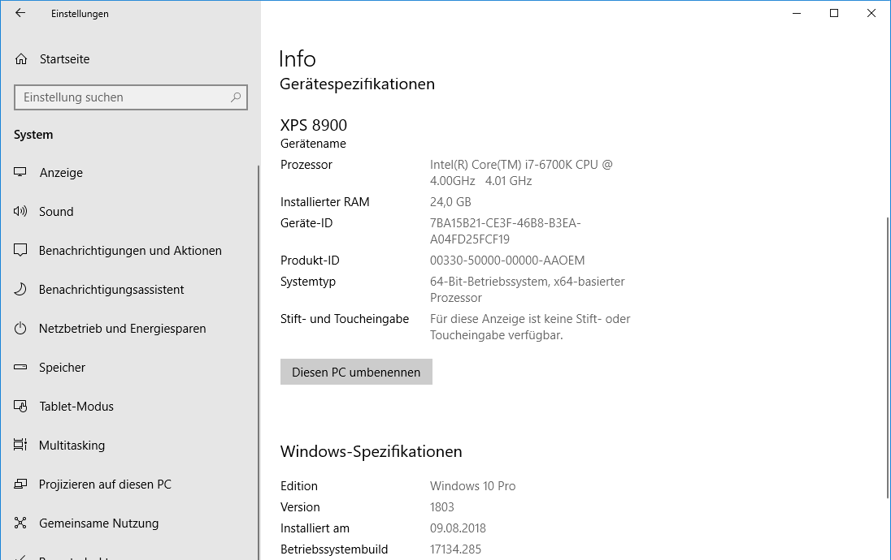
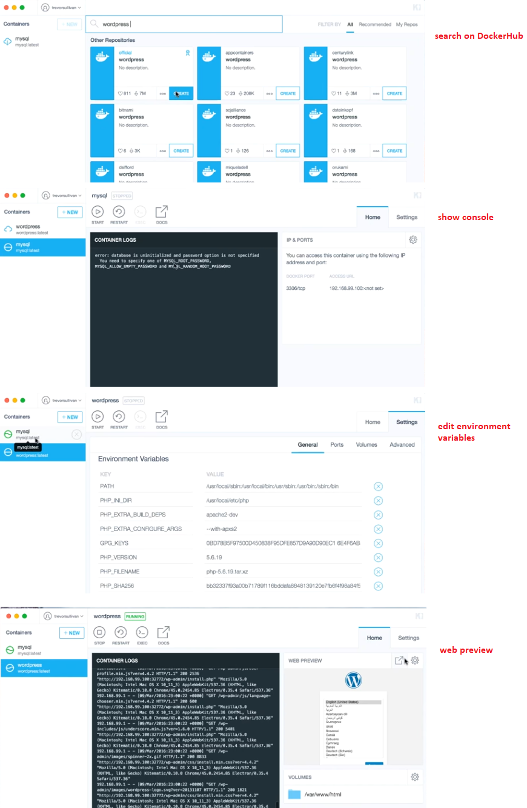
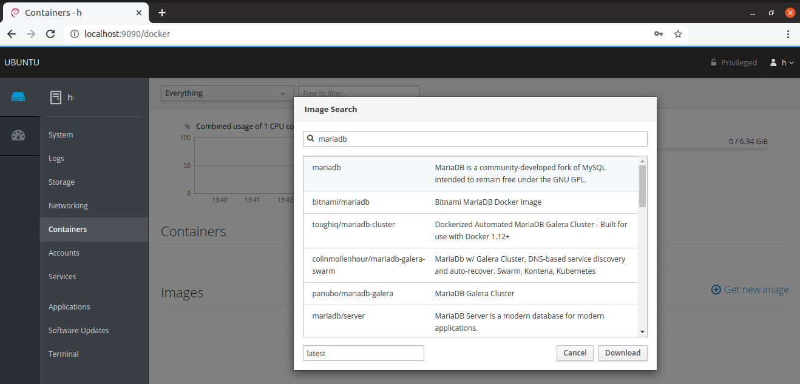
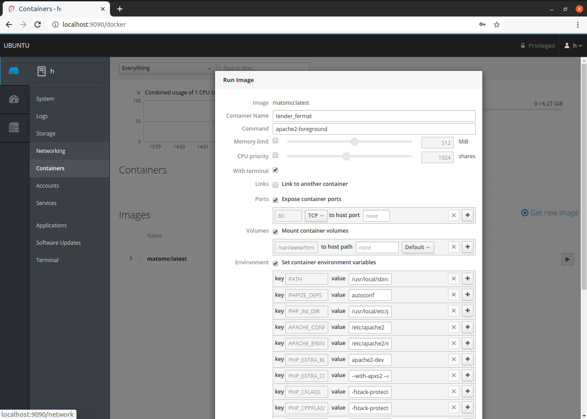

# Docker4Windows:
Enabled by WSL (Windows-Subsystem-Linux) of Windows 10

## Intall with PowerShell:
### Install Optional Windows Feature WSL:
	$ Enable-WindowsOptionalFeature -Online -FeatureName Microsoft-Windows-Subsystem-Linux
	... and reboot
### Check if WSL is installed correctly
	$ Get-WindowsOptionalFeature -Online -FeatureName Microsoft-Windows-Subsystem-Linux
### List your distros
	$ wslconfig /l /all
### Install Linux (e.g. Ubuntu) from the Microsoft Store & launch from the start menu, Version Xenial 16.04 (LTS)
#### list directory contents on the windows partition:
	$ ll /mnt/c
### Install docker
	-> Start Windows-Store App as Admin!!!
	$ sudo apt update
	#$ sudo apt upgrade
	$ sudo apt update
	$ sudo apt install zfsutils-linux  cgroup-bin cgroup-lite cgroup-tools cgroupfs-mount libcgroup1
	$ sudo apt-get install apt-transport-https ca-certificates curl software-properties-common
	$ sudo curl -fsSL https://download.docker.com/linux/ubuntu/gpg | sudo apt-key add -
	$ sudo apt-key fingerprint 0EBFCD88
	$ sudo add-apt-repository "deb [arch=amd64] https://download.docker.com/linux/ubuntu $(lsb_release -cs) stable"
	$ sudo apt-get install linux-image-extra-$(uname -r) linux-image-extra-virtual
#### docker install versions: docker.io, ce, or ce in a certain version = community edition
	$ sudo apt-cache policy docker-ce
	#$ sudo apt-get install docker-ce
	#$ sudo apt install docker.io
	$ sudo apt-get install docker-ce=17.09.0~ce-0~ubuntu	# according to https://www.reddit.com/r/bashonubuntuonwindows/comments/8cvr27/docker_is_running_natively_on_wsl/ , with ubuntu version xenial!

	$ sudo cgroupfs-mount
	$ sudo usermod -aG docker $USER

#### start docker daemon in foreground or as a service
	$ sudo dockerd	# grpc Error starting daemon: Error initializing network controller: Error creating default "bridge" network: operation not permitted
	#$ sudo service docker start
	#$ sudo service docker status

#### run docker
	$ sudo docker run hello-world
	$ docker -H localhost:2375 images #tell the Docker client where the Docker host is
							# you will need to install docker for windows with the switch "expose daemon"

## Remarks

### 1. "Docker for Windows" - the not-native WSL version, cannot work with VirtualBox
The Docker for Windows installer will enable Hyper-V for you, if needed, and restart your machine. After Hyper-V is enabled, VirtualBox will no longer work

Docker for Windows requires a Hyper-V as well as the Hyper-V Module for Windows Powershell to be installed and enabled. The Docker for Windows installer will enable it for you

### 2. uninstall WSL distro
	uninstall wsl distro from the command line
	(more simply: app-right-mouse-button-Deinstall):
	$ lxrun /uninstall /full

### 3. recommended console setting
Open WSL, PowerShell, or Cmd
Right click title bar -> Properties -> Uncheck "Use legacy console"

### 4 ( https://github.com/Microsoft/WSL/issues/2291#issuecomment-383698720 ):
The last docker-ce version that works right now on build 17134 is 17.09.0.

### 5 deinstall docker:
sudo apt-get remove --purge docker-ce

## Pictures of the Ubuntu Installation on Windows 10:

### Download of the Ubuntu from the Microsoft Store

### Start Ubuntu App as Admin

### Ubuntu can access the Windows partition

### Minimum Windows 10 Version

### Docker for Windows without dockerhub account? Use chocolatey:
> choco install docker-desktop
(anyway, Docker only works with hyper-v (which breaks VirtualBox!))

### Docker for Windows with cool UI?
* Basic UI: Docker Desktop >=v.2.2 includes an interactive Dashboard
* Advanced UI: Use **Kitematic** on top of Docker Toolbox
	* Kitematic creates a linux VM for the Docker Host (Boot2Docker) automatically! (prerequisite: installed VirtualBox)
	* Kitematic UI offers available images (from DockerHub) to be [Create]d run as containers
	* of the running container, interactively shows/allows editing the
		* stdout/stderr
		* logs 
		* ip address
		* ports
		* volumes
		* environment variables
		* web preview (cool!)

	
* Web UI on Linux?
> sudo apt-get install cockpit
> sudo apt-get install cockpit-docker
* Attention: kubernetes plugin ('Clusters' tab) only works on fedora distros well

### Docker on Windows without Hyper-V?
(so, you don't break VirtualBox)
1. install Docker Toolbox (deprecated)
1. install Kitematic (deprecated, if not installed above)
1. start Kitematic
	1. if not works, edit "docker-start.cmd" end set your directory to %git%/bin/bash.exe

### kali as docker

> docker run -t -i -d -p 6080:6080 jgamblin/kalibrowser-lxde

1. in VirtualBox, set up the "default" VM > Settings > Network > port forwarding > TCP with ports 6080
1. open http://localhost:6080/ -> you see the VNC output, the kali GUI!
