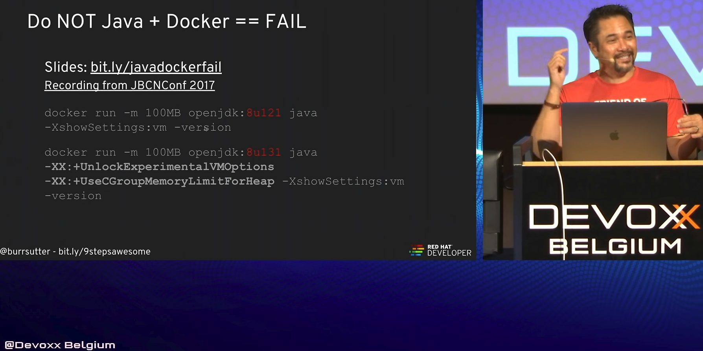

# k8s = kubernetes
	for container orchestration
	incl. define relationships between containers, how they (auto-)scale
	Alternatives: Docker Swarm, AWS ECS, Mesos

	Container: Docker is dominant

	Kubernetes is a container orchestration standard, cloud-agnostic

### Where/How to run?
	Training: minikube (local version of k8s)
	Development: minikube, dev cluster on a cloud provider
	Deployment: cloud provider or bare metal

## on AWS:
	Do it yourself on EC2's
	ECS has its own proprietary orchestration system, not k8s compatible
	use kops, a tool for production grade k8s installation, upgrade management

## on GCP (Google Cloud Platform)
	GKE (Google Container/K8S Engine) speaks k8s, automates cluster setup, maintenance, scaling, healthcheck
	or
	use kops for manual configuration of a k8s cluster on GCE VMs (Google Compute Engine)

## Definitions:
	Deployment = definition of an application
	Deployment = collection of resources & references & exposed ports
		Deployment-Description: in YAML
	Pod = group of instances of a container in a deployment
		= 1+ containers with shared IP/resources
	Service = endpoint that exports a port to the outside world
			= Grouping of pods (acting as one) has stable virtual IP and DNS name
	Label = Key-Value pairs associated with k8s ojbects (eg. app=appname, env=prod, version=1)
	Master = the k8s installation, has APi & etcd & scheduler & controllers

## kubectl & minikube
	runs k8s locally, but does not support load balancers, persistent volumes, ingress
	requires virtualization & hypervisor (kvm, Virtualbox(on linux) or VMWare(macOS or linux))
	install kubectl & minikube
	$ kubectl
	$ kubectl.exe on windows
	download url: see in the docs:
		https://kubernetes.io/docs/tasks/tools/install-kubectl/
		https://github.com/kubernetes/minikube/releases
		(download with curl or manually)

	$ kubectl version
	$ minikube start		# downloads iso & starts local k8s cluster, starts VMs
	$ kubectl run hello-minikube --image=gcr.io/google_containers/echoserver:1.4 --port=8080
		# deployment "hello-minikube" created to our cluster
	$ kubectl expose deployment hello-minikube --type=NodePort
		# service "hello-minikube" exposed
		## creates the service
		## type: NodePort (for one Pod) or LoadBalancer
	$ kubectl get pods --all-namespaces [--show-labels]
		# lists running pods (all-namespaces lists system pods too)
	$ curl $(minikube service hello-minikube --url)
	$ kubectl delete deployment hello-minikube
	$ minikube stop
	$ minikube delete		# & del k8s resources in ~/.. manually
	
	$ kubectl get namespaces
	$ kubectl get pods -n mynamespace
	$ kubectl run myapp --image=myapp:v1 --port=8080
	$ kubectl logs myapp-somecontainerid [-p]
		# -p = get logs of the last failed pod
		# shows sys out by default, can be used by ELK
	$ kubectl expose deployment --port=8080 myapp --type=LoadBalancer
	$ kubectl scale deployment myapp --replicas=3
	$ kubectl set image deployment/myapp myapp=myapp:v1
	$ kubectl get all			# lists all pods
	
	$ minikube docker-env		# prints environment
	$ minikube config view		# prints current config
	$ minikube dashboard 		# starts default dashboard
	$ minikube ssh				# ssh inside of the vm
		$ free -h				# ...and look at the memory usage
								# ATTENTION: can be wrong, if you use limits: !
		$ df -h					# ...and look at the disk space usage
		$ top					# ...list cpu usage tabular form
	$ kubectl get events
	$ kubectl set env deployment/mydeployment MYENVVAR="..."
		# kubectl restarts the pods if env changed
	$ kubectl create cm my-config --from-env-file=cfg/some.properties
		# creates a config map
	$ kubectl get cm [-o yaml] [--export]	# lists ConfigMaps, incl my-config
	$ kubectl describe cm my-config
	$ kubectl patch svc/myapp -p '{"spec":{"selector":{"app":"myappnew"}}}'

## Example: deployment.yaml
------------
	apiVersion: apps/v1beta2
	kind: Deployment
	metadata:
		name: myapp-deployment
	spec:
		selector:
			matchLabels:
				app: myapp-deployment
		replicas: 1
		template:
			metadata:
				labels:
					app: myapp
			spec:
				containers:
				- name: myapp
				  image: myapp:9.0		# default url: dockerhub
				  ports:
				  - containerPort: 8080
				  envFrom:
				  - configMapRef:
					name: my-config
				  resources:
					requests:
						memory: "300Mi"
						cpu: "250m" # 1/4 core
					limits:
						memory: "400Mi"			# hard limit -> restarts pod if limit exceeded (eg. on OOM)
						cpu: "1000m" # 1 core
				  volumeMounts:					# mountPath within the container
				  - name: postgres-pvc
				    mountPath: "/var/lib/postgres/data/"
				volumes:						# mapped to the PVC
				- name: postgres-pvc
				  persistentVolumeClaim:
					claimName: postgres-pvc
------------
	Use: apply & expose the pod to the external world as a service:
	$ kubectl apply -f ./deployment.yaml
	$ kubectl expose deployment myapp-deployment --type=NodePort [--port] [--target-port]
	$ minikube service myapp-deployment --url
		# output: http://127.0.0.1:32723 = the useable deployed service
	$ kubectl get pod
		# lists the running pods, incl name (pod id = dns)
	$ kubectl get services
	$ kubectl delete service <service-name>
	$ kubectl describe pod [pod-name]
	$ kubectl port-forward <pod-name> [local_port:]remote_port]
		# forwards from local machine to the pod
	$ kubectl attach <pod-name> -c <container>
		# attaches to a process that is alread running inside an existing container
		# to see its output
	$ kubectl exec [-it] <pod-name> [-c container] -- command [args..]
		# execute command in a container
		# -i passes stdin to the container
		# -t stdin is a TTY
		## kubectl exec -it mypod bash
		### curl localhost	#curl your own service inside of the pod
		### whoami		# you are now inside of the container, interactively on bash
		#### root		# output of the command, run inside of the container
		
	$ kubectl label pods <pod-name> [--overwrite] <type> mykey1=myval1 ...
	$ kubectl run <name> --image=image [--port]
		# runs an image on the cluser
	# see kubectl ref:
		http://kubernetes.io/docs/user-guide/kubectl/v1.8/
		http://kubernetes.io/docs/user-guide/kubectl/kubectl-cheatsheet/

## Architecture
	Master, manages the nodes, contains:
		API-Server
		Scheduler
		Controller Manager
	Node = Minion = kubelet & kube-proxy & pods & docker
		kubelet = the supervisor of a machine
		kube-proxy = responsible for the network configuration

## Scaling through replication configuration
	replica setting in your deployment definition YAML
		or
	Define a ReplicaSet
		or
	Bare Pods
		or
	Define a Job
		or
	DaemonSet
		or
	$ kubectl scale --replicas=4 deployment/myapp-deployment
		# check with
		$ kubectl get deployments
			or
		$ kubectl describe deployments	# lists new ReplicaSet
		# but: kubectl expose --type=NodePort works only for ONE pod!
		# solution: use
		$ kubectl expose deployment myapp-deployment --type=LoadBalancer --port=8080 --target-port=8080 --name myapp-load-balancer
			and
		$ kubectl describe services myapp-load-balancer
			# see IP address of the created load-balancer service

## Deployment
	Deployment = App & Pod & ReplicaSet
	Possible Tasks:
		Create, Update, Apply rolling updates to Pods running on a cluster
		Rollback to previous version
		Pause & Resume a deployment

	$ kubectl get deployments	#lists running deployments, incl. replicas
	$ kubectl rollout status deployment <name>
		# check status
	$ kubectl set image <deployment> <container-name>=<name>
	$ kubectl set image deployment/myapp-deployment myapp=myapp:9.0.1
		# sets/updates docker image of a deployment
	$ kubectl rollout history <deployment> [--revision={\d+}]
		# view history of a rollout, incl previous versions

## Labels & Selectors
	Label = key-value pair, you can label deployment & service & node
	Selector = select objects based on label
	
	"nodeSelector" is a property on a deployment to choose nodes
	$ kubectl label node <node-name> mykey=myvalue
	set selector in YAML:

## Example Labels & Selectors
------------
	apiVersion: apps/v1beta2
	kind: Deployment
	metadata:
		name: myapp-deployment
	spec:
		selector:
			matchLabels:
				app: myapp
		replicas: 4
		template:
			metadata:
				labels:
					app: myapp
			spec:
				containers:
				- name: myapp
				  image: myapp:9.0
				  ports:
				  - containerPort: 8080
				nodeSelector:
					mykey: myvalue			# use just nodes with this label!
------------
	$ kubectl apply -f ./deployment.yaml	# update configuration!

## Health Check
	Two types:
	Readiness Probe:
		is the Pod ready & started & loaded, the image is ready to take requests
		allows rolling update
	Liveness Proble:
		is the Pod healthy (after it has become ready)

	You can define an HTTP/TCP/CMD in your YAML to check healthiness.
------------
	apiVersion: apps/v1beta2
	kind: Deployment
	metadata:
		name: myapp-deployment
	spec:
		selector:
			matchLabels:
				app: myapp
		replicas: 4
		template:
			metadata:
				labels:
					app: myapp
			spec:
				containers:
				- name: myapp
				  image: myapp:9.0
				  ports:
				  - containerPort: 8080
				  livenessProbe:
					httpGet:
						path: /
						port: 8080
					initialDelaySeconds: 30
					periodSeconds: 30
					timeoutSeconds: 2
				  readinessProbe:			# = everything launched & is up & running & ready to receive load
					httpGet:
						path: /health		# has to return statusCode = 200
						port: 8080
					initialDelaySeconds: 15
					periodSeconds: 3
				- env:
					- name: DBCONN
					  value: myval
------------

## Web Interface = Dashboard UI
	Use
	$ kubectl proxy
	to be able to access the dashboard from outside of the network
	http://localhost:8001/ui	#where loalhost = k8s-master
	Offers the same functions as kubectl, visually view/edit: eg. nodes (incl labels), deployments, pods, ...)
	The dashboard is mostly preinstalled, sometimes needs to be installed extra:
	$ kubectl create -f https://raw.githubusercontent.com/kubernetes/dashboard/master/src/deploy/recommended/kubernetes-dashboard.yaml

## Miscellaneous
	Third party tools:
		Kubernetes package manager
		Jaeger, Istio
		Monitoring: Istio & grafana
		openshift: minishift: oc cluster up
			oc = openshift command line tool, superset of kubectl
				$ oc login ...
			minishift = superset of minikube
				$ minishift dashboard
		$ kubectx
		$ kubens <namespace>	# sets default namespace for kubectl
		maven/gradle plugins: fabric8, jib	# they can build & deploy docker image automatically
		Visual Studio Code with Dockerfile & YML plugin
		advanced pod logs view: kubetail.sh, stern, kail
		Istio = monitor & trace & routes -> ~ELK into jaeger & grafana
			(ELK = Elasticsearch + Logstash + Kibana)
			Extended support for Blue/Green deployment
		Eclipse Che = IDE running in k8s (use it through the browser) = Container Native IDE

## Workflow
	1. find base docker image
	2. bild your Dockerfile
		FROM <baseimage>
		ENV MYENVVAR=value
		EXPOSE 8080
		COPY target/my.jar /deployments/
		CMD java -XX:+PrintFlagsFinal ...
	3. $ docker build -t my/myimage:v1 .
	4. $ kubectl create -f mydeployment.yml [-n namespace-name]
	   $ kubectl edit deployment <deployment-name>
			# starts your default YML editor with current cfg
			# after saving YML with readinessProbe, the pods are restarted & old ones terminated after readinessProbe successful
				= rolling update!
	   $ kubectl replace -f mydeployment.yml		# recreates the deployment
	5. $ kubectl create -f myservice.yml
	6. expose a URL via your k8s distribution's load balancer

## Service Discovery
	just refer to a service by name, it is its DNS (add namespace if different)
	http://mynode.mynamespace.svc.cluster.local:8080/
	
## Rolling or Blue/Green or Canary Updates
### Rolling Update occurs if you have readinessProbe and $ kubectl edit deployment with change of your image
### Blue/Green Deployment
	change app selector with
	$ kubectl patch svc/myapp -p '{"spec":{"selector":{"app":"myappnew"}}}'
	so, the load-balancer service selects another group of pods
### Canary
	Blue/Green Deployment with readinessProbe
	(if readinessProbe fails, k8s does not switch to the new deployment)
	with partial deployment (eg. only testers see the new version)

## Databases
	Become stateful with persistent volumes (=PV) and persistent volume claim (=PVC)
	$ kubectl get pv
	$ kubectl get pvc
	
	App queries (db-)service by service-name
	YML entries:
		volumeMounts: mountPath: ...
		volumes: persistentVolumeClaim: claimName: ...

	pv-definition.yml
------------
	apiVersion: v1
	kind: PersistentVolume
	metadata:
		name: postgres-pv
		labels:
			type: local
	spec:
		storageClassName: mystorage
		accessModes:
		- ReadWriteOnce
		capacity:
			storage: 2Gi
		hostPath:
			path: "/data/postgresdata/"
------------

	pvc-definition.yml
------------
	apiVersion: v1
	kind: PersistentVolumeClaim
	metadata:
		name: postgres-pvc
		labels:
			app: postgres
	spec:
		storageClassName: mystorage
		accessModes:
		- ReadWriteOnce
		resources:
			requests: 2Gi
				storage: 1Gi
------------	
	
## Gotchas
### Take care of JVM params within docker:

